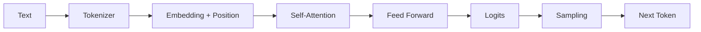

## 1. 다음 Token 확률을 만드는 경로

LLM(Large Language Model, 대규모 언어 모델)은 입력을 Token ID로 바꾸고, 각 위치가 다른 위치에서 가져올 정보를 Attention으로 계산한다. 여러 Transformer Block을 지난 마지막 표현은 Vocabulary(어휘 집합) 확률로 변환된다.



| 구성 | 역할 | 주요 비용·한계 |
|---|---|---|
| Tokenizer | 문자열을 모델 단위로 분해 | 언어·도메인별 Token 효율 차이 |
| Self-Attention | 위치 간 관련 정보를 혼합 | 일반 구현은 길이 `n`에 대해 `O(n²)` |
| Feed Forward | 각 위치 표현을 비선형 변환 | Parameter와 연산량의 큰 비중 |
| Sampling | 다음 Token을 선택 | 다양성과 재현성 Trade-off |

```python
next_token = sample(softmax(logits / temperature), top_p=0.9)
```

> **핵심 구분** — 모델은 문장을 통째로 검색하지 않는다. 현재 Context를 조건으로 다음 Token의 조건부 확률을 반복 계산한다.

## 2. 학습과 생성은 같은 계산을 다르게 사용한다

Pre-training은 대규모 말뭉치에서 다음 Token 예측 오차를 줄인다. Instruction Tuning과 Preference Optimization은 지시 따르기와 응답 성향을 조정하지만, 외부 사실의 최신성을 자동 보장하지 않는다.

참고: [Attention Is All You Need](https://arxiv.org/abs/1706.03762)

> **면접 포인트** — Parameter 수만 비교하지 말고 Context 길이, 학습 데이터, 추론 방식, 지연·메모리 제약을 함께 설명한다.
