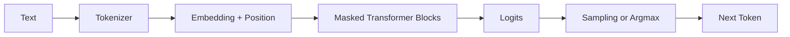

## 1. 다음 Token 확률을 만드는 경로

LLM(Large Language Model, 대규모 언어 모델)은 입력을 Token ID로 바꾸고, Embedding과 위치 정보를 Transformer Block에 넣는다. 각 Block은 Self-Attention으로 다른 위치의 표현을 섞고 Feed Forward로 각 위치를 비선형 변환한다. 마지막 hidden state를 Vocabulary 크기의 logits로 바꾸면 다음 Token 분포를 얻는다.


```mermaid
flowchart LR
    T[Text] --> K[Tokenizer]
    K --> E[Embedding + Position]
    E --> M[Masked Transformer Blocks]
    M --> L[Logits]
    L --> S[Sampling or Argmax]
    S --> N[Next Token]
```

| 구성 | 역할 | 주요 비용·한계 |
|---|---|---|
| Tokenizer | 문자열을 모델 단위로 분해 | 언어·도메인별 Token 효율 차이 |
| Causal Mask | 현재 위치가 미래 Token을 보지 못하게 제한 | 학습 시 위치별 병렬 계산은 가능하지만 정보 누출을 막아야 함 |
| Self-Attention | 위치 간 관련 정보를 가중합으로 혼합 | 표준 full attention의 score 계산은 sequence length `n`에 대해 `O(n²)` |
| Feed Forward | 각 위치 표현을 독립적으로 변환 | Block의 Parameter·연산량에서 큰 비중을 차지할 수 있음 |
| Sampling | 다음 Token을 분포에서 선택 | Temperature·top-p에 따라 재현성과 다양성이 달라짐 |

`O(n²)`는 모든 Transformer 구현의 전체 비용을 뜻하지 않는다. 표준 full self-attention에서 Query와 Key의 모든 쌍을 비교하는 길이 의존성을 말한다. FlashAttention은 같은 수학적 결과를 더 효율적으로 계산하고, local·sparse attention은 비교 범위를 바꾸므로 실제 메모리와 지연은 구현·하드웨어·길이 분포로 측정해야 한다.

```python
def choose_next(logits, temperature=0.7, top_p=0.9):
    scaled = logits / max(temperature, 1e-6)
    probabilities = softmax(scaled)
    return nucleus_sample(probabilities, top_p=top_p)
```

> **핵심 구분** — 모델은 문장을 통째로 검색하지 않는다. 현재 Context를 조건으로 다음 Token의 조건부 확률을 한 단계씩 계산한다. 생성 중 새 Token이 Context에 추가되면 다음 단계의 조건도 바뀐다.

## 2. 학습과 생성은 같은 계산을 다르게 사용한다

Teacher Forcing 학습에서는 정답 이전 Token을 한 번에 입력해 각 위치의 다음 Token loss를 병렬 계산한다. 추론에서는 직전에 생성한 Token을 다시 입력하므로 순차성이 생긴다. 이 차이 때문에 학습 loss가 낮아도 실제 생성에서 오류가 누적될 수 있다.

Pre-training은 다음 Token 예측을 학습하고, Instruction Tuning과 Preference Optimization은 지시 따르기와 응답 성향을 조정한다. 어느 단계도 외부 사실의 최신성이나 업무 권한을 자동으로 보장하지 않으므로 검색·검증·Policy 계층이 별도로 필요하다.

### 실패 입력 → 판단 → 복구

입력에 `내부 규정상 환불은 7일 이내`라는 문장이 있지만 모델의 학습 시점이 오래되었다고 하자. 모델이 그 문장을 기억한다고 가정해 바로 답하면 최신 규정과 다를 수 있다. 애플리케이션은 문서 버전과 권한을 확인한 검색 결과를 Context로 넣고, 인용이 없으면 답변을 보류한다. Context가 잘려 규정의 예외 조항이 사라지면 성공으로 저장하지 말고 검색 범위를 줄이거나 사용자에게 필요한 조건을 되묻는다.

참고: [Attention Is All You Need](https://arxiv.org/abs/1706.03762), [Training language models to follow instructions with human feedback](https://arxiv.org/abs/2203.02155)

> **면접 포인트** — Parameter 수만 비교하지 말고 Context 길이, causal mask, 학습·생성의 순차성, Token 분포, 지연·메모리 제약과 최신 사실의 책임 경계를 함께 설명한다.
