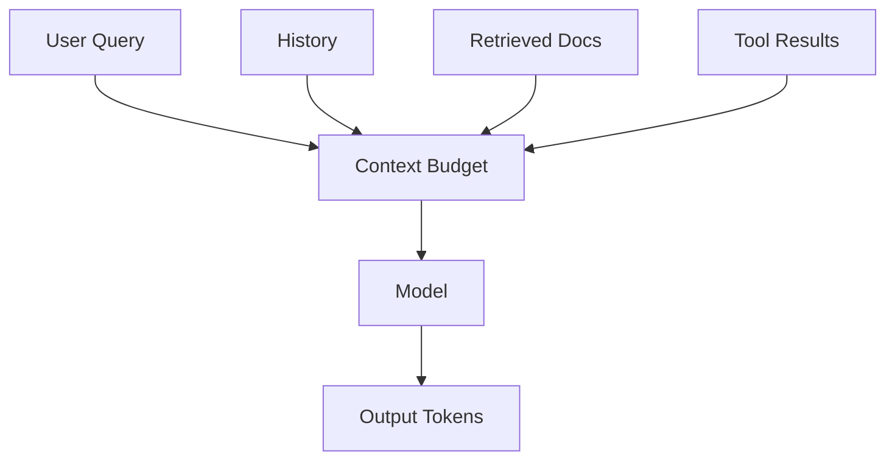

## 1. 글자 수가 아니라 Token 수가 예산이다

Tokenizer는 자주 등장하는 문자열 조각을 Vocabulary ID로 바꾼다. 입력, 도구 결과, 출력이 모두 Context 예산을 공유하므로 긴 시스템 지시와 중복 문서는 응답 공간과 비용을 잠식한다.



| 전략 | 장점 | 위험 |
|---|---|---|
| 전체 원문 투입 | 구현이 단순 | 비용·지연 증가, 중요 정보 희석 |
| 최근 대화만 유지 | 낮은 비용 | 오래된 제약 유실 |
| 요약 메모리 | 장기 맥락 압축 | 요약 오류 누적 |
| 검색 기반 Context | 관련 정보만 선택 | Retrieval 누락·오검색 |

```text
input_budget = window - reserved_output - tool_headroom
documents_fit = floor(input_budget / average_chunk_tokens)
```

> **실무 원칙** — 최대 Context 크기를 목표로 채우지 말고, 답변에 필요한 최소한의 신뢰 가능한 Context를 구성한다.

## 2. 기억은 애플리케이션 책임이다

모델 호출은 기본적으로 상태가 없다. 대화 원문, 구조화된 사용자 설정, 업무 상태, 검색 문서를 저장 목적과 수명에 따라 분리하고 PII(Personal Identifiable Information, 개인식별정보)는 최소화한다.

> **면접 포인트** — “Context가 크니 RAG가 필요 없다”는 결론보다 Recall, 비용, 지연, 최신성, 권한 필터를 수치로 비교한다.
