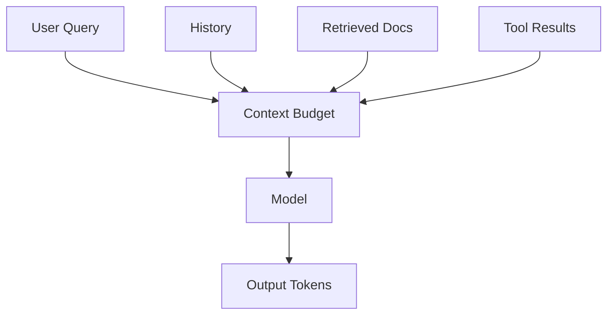

## 1. 글자 수가 아니라 Token 수가 예산이다

Tokenizer는 문자열을 모델이 처리하는 Token 조각으로 바꾸고 각 조각을 Vocabulary ID로 표현한다. 같은 글자 수라도 언어·공백·코드·도메인 용어에 따라 Token 수가 달라질 수 있다. Context Window는 특정 모델 호출에서 처리 가능한 입력과 출력의 총 범위이며, 실제 과금은 Provider가 Input·Output·캐시된 Token을 어떻게 계산하는지에 따라 달라진다.


```mermaid
flowchart TD
    Q[User Query] --> B[Context Budget]
    H[History] --> B
    R[Retrieved Docs] --> B
    T[Tool Results] --> B
    B --> M[Model]
    M --> O[Output Tokens]
```

| 전략 | 장점 | 위험 |
|---|---|---|
| 전체 원문 투입 | 구현이 단순 | 비용·지연 증가, 중요 정보 희석 |
| 최근 대화만 유지 | 낮은 비용 | 오래된 제약 유실 |
| 요약 메모리 | 장기 맥락 압축 | 요약 오류·출처 손실 누적 |
| 검색 기반 Context | 관련 정보만 선택 | Retrieval 누락·오검색·권한 누출 |

```text
input_budget = model_limit - reserved_output - safety_margin
documents_fit = floor(input_budget / measured_chunk_tokens)
```

위 식의 `model_limit`, `reserved_output`, `safety_margin`은 서비스 정책과 모델 문서에서 정하는 값이다. Provider가 입력과 출력을 별도 한도로 관리하거나 도구 결과를 별도 정책으로 자르는 경우에는 하나의 숫자로 단순화하지 않는다.

> **실무 원칙** — 최대 Context 크기를 목표로 채우지 말고, 답변에 필요한 최소한의 신뢰 가능한 Context를 구성한다. Token 예산과 과금 예산은 같지 않을 수 있으므로 실제 계측값으로 비교한다.

## 2. 기억은 애플리케이션 책임이다

모델 Parameter가 사용자별 업무 상태를 저장하는 장기 메모리라는 보장은 없다. 애플리케이션은 대화 원문, 구조화된 사용자 설정, 업무 상태, 검색 문서를 목적·수명·권한별로 저장해야 한다. 서버가 대화 ID나 이전 응답을 보존하는 API를 사용하더라도 그것은 Provider가 제공하는 상태 기능이지 업무 원장의 대체가 아니다.

| 정보 | 저장 형태 | 복구 시 확인할 것 |
|---|---|---|
| 원문 대화 | 암호화된 원문 또는 제한된 보존 로그 | 사용 목적·삭제 요청·PII |
| 사용자 설정 | 버전 있는 구조화 상태 | 최신 버전과 권한 |
| 업무 상태 | 도메인 DB의 원장 | 트랜잭션·감사 이력 |
| 검색 문서 | 문서·Chunk 버전과 ACL | Index freshness·삭제 반영 |

### 실패 입력 → 판단 → 복구

한국어 문의 2,000자와 영어 문의 2,000자는 동일한 Token 수가 아닐 수 있다. 애플리케이션이 문자 수만 보고 8,000자를 허용하면 한국어·코드·표가 섞인 요청에서 Context overflow가 발생할 수 있다. 호출 전 실제 Tokenizer로 입력을 세고 출력 여유를 남긴다. Overflow가 나면 원문을 조용히 자르지 말고, 우선순위가 낮은 History를 요약하거나 문서를 검색 단위로 줄인 뒤 실패 원인을 기록한다.

참고: [SentencePiece: A simple and language independent subword tokenizer](https://arxiv.org/abs/1808.06226)

> **면접 포인트** — “Context가 크니 RAG가 필요 없다”는 결론보다 Token 측정, Recall, 비용, 지연, 최신성, 권한 필터와 원문 복구 가능성을 함께 비교한다.
