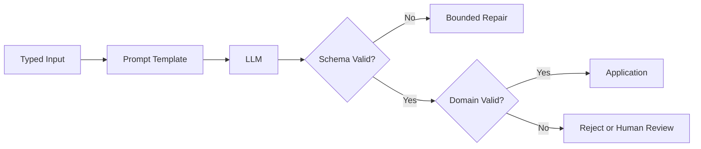

## 1. Prompt는 실행 계약의 일부다

역할, 목표, 금지 조건, 입력 경계, 출력 Schema를 분리한다. 외부 문서와 사용자 입력은 **데이터**로 표시하고 상위 지시처럼 실행하지 않게 한다. 모호한 형용사보다 통과 조건과 반례를 제공한다.



| 계층 | 검증 대상 | 예시 |
|---|---|---|
| JSON Schema | 타입·필수 필드 | `quantity`는 정수 |
| Domain Rule | 업무 불변식 | 재고 수량은 0 이상 |
| Authorization | 실행 권한 | 환불은 승인자만 가능 |
| Human Review | 고위험 판단 | 계약·의료·채용 결정 |

```json
{"type":"object","required":["answer","citations"],"additionalProperties":false}
```

> **실무 함정** — 문법적으로 유효한 JSON은 사실이 정확하거나 작업이 안전하다는 뜻이 아니다.

## 2. 실패를 정상 흐름으로 설계한다

Parsing 실패, 거부, Timeout, 잘림을 구분하고 재시도 횟수를 제한한다. 원본 입력과 모델 출력은 민감정보를 제거한 뒤 추적 ID, Prompt 버전, 모델 버전과 함께 기록한다.

참고: [OpenAI Evals와 Structured Outputs API](https://platform.openai.com/docs/api-reference/evals)

> **면접 포인트** — Prompt 문구보다 Typed Boundary, 검증, 권한, 재시도, 관측성까지 종단 계약으로 설명한다.
