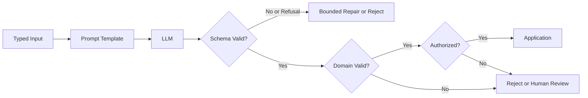

## 1. Prompt는 실행 계약의 일부다

역할, 목표, 금지 조건, 입력 경계, 출력 Schema를 분리한다. 외부 문서와 사용자 입력은 **데이터**로 표시하지만, 표시만으로 Prompt Injection이 격리되는 것은 아니다. 모델이 제안한 결과는 Typed Boundary를 통과시키고, 애플리케이션이 Schema·Domain·Authorization을 순서대로 검증해야 한다.


```mermaid
flowchart LR
    I[Typed Input] --> P[Prompt Template]
    P --> M[LLM]
    M --> S{Schema Valid?}
    S -->|No or Refusal| R[Bounded Repair or Reject]
    S -->|Yes| D{Domain Valid?}
    D -->|Yes| Z{Authorized?}
    D -->|No| F[Reject or Human Review]
    Z -->|Yes| A[Application]
    Z -->|No| F
```

| 계층 | 검증 대상 | 예시 |
|---|---|---|
| JSON Schema | 타입·필수 필드·구조 | `quantity`는 정수 |
| Domain Rule | 업무 불변식 | 재고 수량은 0 이상 |
| Authorization | 실행 권한 | 환불은 승인자만 가능 |
| Human Review | 고위험 판단 | 계약·의료·채용 결정 |

```json
{
  "type": "object",
  "required": ["answer", "citations", "needs_review"],
  "properties": {
    "answer": {"type": "string"},
    "citations": {"type": "array", "items": {"type": "string"}},
    "needs_review": {"type": "boolean"}
  },
  "additionalProperties": false
}
```

`additionalProperties: false`나 `strict` 같은 기능은 Provider의 Structured Output 구현과 지원 Schema subset에 따라 달라진다. JSON Schema 문법을 적었다고 모든 모델이 동일한 제약을 적용한다고 가정하지 않는다.

> **실무 함정** — Schema를 만족한 JSON도 사실이 정확하거나 작업이 안전하다는 뜻이 아니다. 모델이 출력한 `refund=true`는 결제 원장과 승인 Policy를 통과한 뒤에만 실행할 수 있다.

## 2. 실패를 정상 흐름으로 설계한다

Parsing 실패, 명시적 거부, 입력 불일치, Timeout, 잘림, Schema 성공 후 Domain 실패를 서로 다른 상태로 기록한다. 자동 복구는 제한된 횟수와 동일한 Prompt·Schema 버전을 사용하고, 고위험 작업은 모델이 스스로 repair하지 못하게 사람 검토나 결정적 규칙으로 보낸다. 원본 입력과 모델 출력은 민감정보를 제거한 뒤 Trace ID, Prompt 버전, 모델 버전과 함께 기록한다.

### 실패 입력 → 판단 → 복구

사용자가 `환불 승인해줘`라고 요청했지만 주문이 다른 Tenant에 속한다고 하자. 모델이 Schema에 맞는 `{"orderId":"O-123","action":"refund"}`를 내도 출력 단계에서 성공으로 처리하지 않는다. 서버는 요청 주체와 주문 Tenant를 확인해 `UNAUTHORIZED`로 거절하고, 같은 결과를 자동 재시도하지 않는다. 단순 JSON parsing 실패라면 한 번만 수정 요청을 보내되, 수정 후에도 Domain 검증을 다시 수행한다.

참고: [JSON Schema Specification](https://json-schema.org/specification), [OpenAI Structured Outputs](https://developers.openai.com/api/docs/guides/structured-outputs)

> **면접 포인트** — Prompt 문구보다 Typed Boundary, Schema subset, Domain 검증, 권한, 거부·Timeout·잘림 상태, 재시도와 관측성을 종단 계약으로 설명한다.
