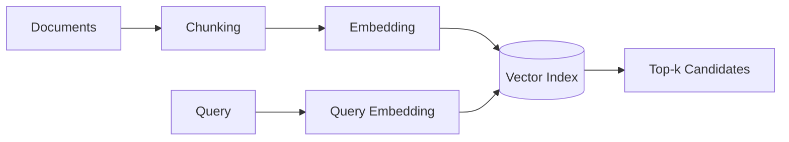

## 1. 의미를 좌표로 바꾸고 근사 탐색한다

Embedding은 문장·문서·이미지를 고정 길이 Vector로 표현한다. 질의 Vector와 가까운 문서를 찾되, 실제 시스템은 ANN(Approximate Nearest Neighbor, 근사 최근접 이웃) Index로 속도와 Recall을 교환한다.



| 방식 | 강점 | 약점 |
|---|---|---|
| Exact Search | 완전한 Recall | 대규모에서 느림 |
| HNSW | 낮은 지연·높은 Recall | 메모리·삽입 비용 |
| IVF 계열 | 압축·대규모 검색 | 학습·Probe 조정 필요 |
| Keyword Search | 고유명사·정확 일치 | 의미적 표현 차이 |

```sql
SELECT id, content
FROM chunks
WHERE tenant_id = :tenant
ORDER BY embedding <=> :query_vector
LIMIT 20;
```

> **보안 원칙** — Vector 유사도 검색 뒤에 권한을 거르면 이미 다른 Tenant의 문서 존재가 노출될 수 있다. 권한 필터를 검색 계획에 포함한다.

## 2. 검색 평가는 생성과 분리한다

Gold Query마다 관련 문서 집합을 만들고 Recall@k, MRR, nDCG와 지연을 측정한다. 답변 품질이 낮을 때 Retriever가 근거를 놓친 것인지 Generator가 근거를 무시한 것인지 분리해야 한다.

> **면접 포인트** — Vector DB 제품 이름보다 Chunk 단위, Filter, Index, 갱신 일관성, Recall·Latency 목표를 먼저 정한다.
