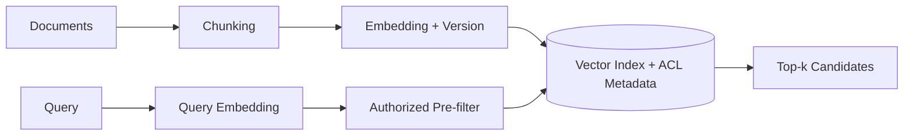

## 1. 의미를 좌표로 바꾸고 근사 탐색한다

Embedding은 한 모델이 정한 차원의 Vector로 문장·문서·이미지의 특징을 표현한다. 차원과 거리의 의미는 모델·정규화 방식에 따라 달라지므로, 서로 다른 모델의 Vector를 같은 Index에서 직접 비교하지 않는다. 질의 Vector와 가까운 문서를 찾되, 실제 시스템은 ANN(Approximate Nearest Neighbor, 근사 최근접 이웃) Index로 속도와 Recall을 교환한다.


```mermaid
flowchart LR
    D[Documents] --> C[Chunking]
    C --> E[Embedding + Version]
    E --> V[(Vector Index + ACL Metadata)]
    Q[Query] --> QE[Query Embedding]
    QE --> F[Authorized Pre-filter]
    F --> V
    V --> K[Top-k Candidates]
```

| 방식 | 강점 | 약점 |
|---|---|---|
| Exact Search | 기준 Recall을 얻기 쉬움 | 대규모에서 계산·I/O 증가 |
| HNSW | 낮은 지연·높은 Recall을 조정 가능 | 메모리·build·삽입 비용 |
| IVF 계열 | 대규모 검색과 압축 | 학습·probe·갱신 정책 필요 |
| Keyword Search | 고유명사·정확 일치 | 의미적 표현 차이 |

```sql
-- <=>는 pgvector의 cosine distance 예시다. 값이 작을수록 가깝다.
SELECT id, content
FROM chunks
WHERE tenant_id = :tenant
  AND acl_scope && :principal_scopes
ORDER BY embedding <=> :query_vector
LIMIT 20;
```

Index가 pre-filter를 지원하지 않으면 post-filter만으로 후보를 줄이는 동안 Recall이 떨어지거나, 허가되지 않은 문서가 후보 단계에서 관측될 수 있다. 권한 필터 기능·누출 가능성·빈 결과 시 동작을 제품별로 검증한다.

> **보안 원칙** — Vector 유사도 검색 뒤에 권한을 거르면 이미 다른 Tenant의 문서 존재가 노출될 수 있다. ACL을 검색 계획과 Cache Key에 포함하고 출력에서도 다시 확인한다.

## 2. 검색 평가는 생성과 분리한다

Gold Query마다 관련 문서 집합을 만들고 Exact Search를 기준선으로 삼아 Recall@k, MRR, nDCG와 p95 지연을 측정한다. HNSW에서는 `M`과 `ef_search`, IVF에서는 probe 같은 파라미터를 한 번에 하나씩 바꾸며 품질·메모리·갱신 시간을 비교한다. Embedding 모델을 바꾸면 Vector 차원과 분포가 달라질 수 있으므로 Index version을 나눠 재색인한다.

### 실패 입력 → 판단 → 복구

질의가 `SKU-100`인데 Dense 검색이 `SKU-1000`을 높은 점수로 반환했다고 하자. 상품 코드처럼 식별자가 중요한 질의는 Keyword exact match와 metadata filter를 먼저 적용하고 Dense 후보를 보조로 사용한다. 후보가 모두 권한 필터에서 제거되면 빈 답변을 성공으로 취급하지 말고, 권한 없는 문서를 암시하지 않는 안내와 재질의 경로를 반환한다. Retriever는 정답 Chunk를 포함했지만 Generator가 인용하지 못한 경우에는 검색 장애가 아니라 Generation 검증 실패로 기록한다.

참고: [Efficient and robust approximate nearest neighbor search using Hierarchical Navigable Small World graphs](https://arxiv.org/abs/1603.09320), [Billion-scale similarity search with GPUs](https://arxiv.org/abs/1702.08734)

> **면접 포인트** — Vector DB 제품 이름보다 Chunk 단위, 모델·Index version, ACL pre-filter, 거리의 방향, 갱신 일관성, Recall·Latency 목표와 복구 경로를 먼저 정한다.
