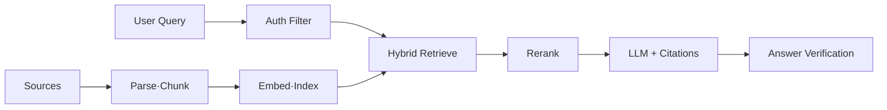

## 1. Offline 수집과 Online 답변을 분리한다

RAG(Retrieval-Augmented Generation, 검색 증강 생성)는 모델 Parameter의 기억과 외부 문서 Index를 결합한다. 수집 파이프라인은 문서 버전·권한·삭제를 보존하고, 온라인 경로는 질의를 변환해 근거 후보를 찾고 인용 가능한 Context만 전달한다.



| 계층 | 핵심 지표 | 실패 대응 |
|---|---|---|
| Ingestion | Freshness Lag·실패율 | 재처리·Dead Letter |
| Retrieval | Recall@k·p95 지연 | Keyword Fallback |
| Generation | 근거 충실도·거절 정확도 | 근거 없으면 답변 보류 |
| Authorization | 누출 0건 | Query 전 강제 Filter |

```text
answer_allowed = retrieved_evidence >= threshold
                 and every_chunk.authorized_for(user)
                 and citation_spans_verified
```

> **설계 원칙** — RAG는 Hallucination을 제거하는 기능이 아니다. 근거가 없을 때 거절하고, 근거와 답변의 연결을 평가할 수 있게 만드는 구조다.

## 2. 갱신과 삭제를 제품 요구사항으로 둔다

문서 Version ID를 Chunk와 답변 로그에 남긴다. 삭제 이벤트는 원문, Keyword Index, Vector Index, Cache까지 전파하며, Indexing 지연 동안 이전 문서를 허용할지 제품 정책으로 정한다.

참고: [Retrieval-Augmented Generation 원 논문](https://arxiv.org/abs/2005.11401)

> **면접 포인트** — “Vector DB + LLM” 그림에서 멈추지 말고 권한, 삭제, 최신성, 검색 평가, 인용 검증, Fallback을 설계한다.
