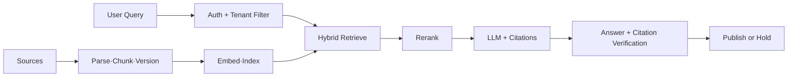

## 1. Offline 수집과 Online 답변을 분리한다

RAG(Retrieval-Augmented Generation, 검색 증강 생성)는 모델 Parameter의 기억과 외부 문서 Index를 결합한다. 수집 파이프라인은 원문·문서 Version·ACL·삭제 상태를 보존하고, 온라인 경로는 요청 주체를 확인한 뒤 질의를 변환해 허가된 근거 후보만 찾는다. Retrieval 결과의 `source_version`을 답변과 함께 보존해야 최신성 판단과 재현이 가능하다.


```mermaid
flowchart LR
    S[Sources] --> P[Parse·Chunk·Version]
    P --> E[Embed·Index]
    U[User Query] --> A[Auth + Tenant Filter]
    A --> H[Hybrid Retrieve]
    E --> H
    H --> R[Rerank]
    R --> G[LLM + Citations]
    G --> V[Answer + Citation Verification]
    V --> O[Publish or Hold]
```

| 계층 | 핵심 지표 | 실패 대응 |
|---|---|---|
| Ingestion | Freshness Lag·실패율·삭제 지연 | 재처리·Dead Letter·보류 상태 |
| Retrieval | Recall@k·ACL 누출·p95 지연 | Keyword Fallback 또는 답변 보류 |
| Generation | 근거 충실도·거절 정확도 | 근거 없으면 추측하지 않음 |
| Authorization | 허가되지 않은 노출 0건 | Query 전 Filter와 출력 재검사 |

```text
answer_allowed = evidence_is_relevant
                 and every_chunk.matches_document_version
                 and every_chunk.authorized_for(user)
                 and citation_spans_verified
```

`evidence_is_relevant`의 threshold는 보편적인 상수가 아니다. 위험도와 평가 세트에 맞춰 캘리브레이션하고, 점수가 낮을 때는 자동으로 답변하지 않는 정책을 둔다. 검색 점수만으로 사실성이나 권한을 증명하지 않는다.

> **설계 원칙** — RAG는 Hallucination을 제거하는 기능이 아니다. 근거가 없을 때 거절하고, 근거와 답변의 연결을 평가할 수 있게 만드는 구조다.

## 2. 갱신과 삭제를 제품 요구사항으로 둔다

문서 `version_id`를 Chunk, Index record, Cache entry, 답변 Trace에 남긴다. 문서 수정은 새 Version을 색인한 뒤 Alias를 전환하거나, 제품이 허용하는 동안 이전 Version을 명시적으로 표시한다. 삭제 이벤트는 원문, Keyword Index, Vector Index, Cache와 답변 재조회 경로에 전파하며, 권한 회수는 삭제보다 빠른 보안 요구로 취급한다.

### 실패 입력 → 판단 → 복구

사용자가 접근 권한을 잃은 문서가 Vector Index와 Cache에 남아 있고, Indexer도 아직 처리 중이라고 하자. 검색 점수가 높다는 이유로 이전 Cache를 반환하지 않는다. 온라인 요청에서 현재 ACL을 다시 확인해 해당 Chunk를 제거하고, 답변이 근거 부족이면 `답변 보류`로 끝낸다. 색인 작업은 삭제 이벤트를 Dead Letter에 남기고 재처리하며, 이미 발행된 답변 Trace에는 사용된 Version과 권한 판정 결과를 남겨 감사한다.

참고: [Retrieval-Augmented Generation 원 논문](https://arxiv.org/abs/2005.11401), [OWASP GenAI Security Project](https://genai.owasp.org/)

> **면접 포인트** — “Vector DB + LLM” 그림에서 멈추지 말고 Version·권한·삭제, 검색 평가, 인용 검증, Index 장애와 답변 보류를 설계한다.
