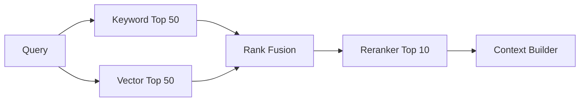

## 1. 후보 생성과 정밀 정렬을 분리한다

Sparse Retrieval은 정확한 단어에 강하고 Dense Retrieval은 의미가 비슷한 표현에 강하다. 두 결과를 RRF(Reciprocal Rank Fusion, 역순위 결합) 등으로 합친 뒤 Cross-Encoder나 작은 LLM Reranker가 상위 후보를 정밀 평가한다.



| 단계 | 최적화 목표 | 비용 특성 |
|---|---|---|
| Candidate Retrieval | Recall | 빠르고 넓게 검색 |
| Fusion | 서로 다른 점수 결합 | 저렴한 순위 계산 |
| Reranking | Precision | 후보 수에 비례한 추론 비용 |
| Context Build | 다양성·Token 예산 | 중복 제거 필요 |

```python
rrf_score = sum(1 / (60 + rank) for rank in source_ranks)
```

> **실무 함정** — 최종 답변 점수만 보면 검색 개선 효과를 알 수 없다. Retriever Recall과 Reranker nDCG를 별도 측정한다.

## 2. Query 유형별 경로를 선택한다

상품 코드·오류 코드는 Keyword 비중을 높이고, 자연어 정책 질문은 Vector 비중을 높일 수 있다. 다만 동적 Routing 자체도 평가 세트와 실패 시 기본 경로가 필요하다.

> **면접 포인트** — Top-k를 고정 상수로 암기하지 말고 후보 수, Context Token, p95 지연, Recall 목표로 실험한다.
