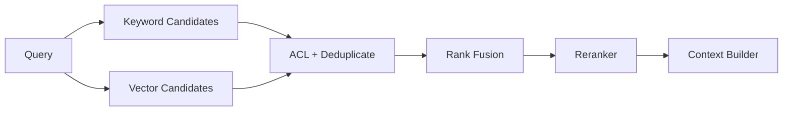

## 1. 후보 생성과 정밀 정렬을 분리한다

Sparse Retrieval은 정확한 단어와 식별자에 강하고 Dense Retrieval은 의미가 비슷한 표현에 강하다. 두 결과를 RRF(Reciprocal Rank Fusion, 역순위 결합) 등으로 합친 뒤 Cross-Encoder나 별도 Reranker가 상위 후보를 정밀 평가한다. 후보 생성은 Recall을, Reranking은 Precision과 Context 품질을 주로 책임지므로 같은 점수로 평가하지 않는다.


```mermaid
flowchart LR
    Q[Query] --> K[Keyword Candidates]
    Q --> V[Vector Candidates]
    K --> A[ACL + Deduplicate]
    V --> A
    A --> F[Rank Fusion]
    F --> R[Reranker]
    R --> C[Context Builder]
```

| 단계 | 최적화 목표 | 비용 특성 |
|---|---|---|
| Candidate Retrieval | Recall | 빠르고 넓게 검색 |
| Fusion | 서로 다른 점수 결합 | 저렴한 순위 계산 |
| Reranking | Precision·nDCG | 후보 수·문서 길이에 비례 |
| Context Build | 다양성·Token 예산 | 중복·권한·버전 제거 필요 |

```python
def rrf_score(rank_by_source, rrf_k=60):
    # 60은 흔히 쓰는 예시값이지 제품 보편 기본값이 아니다.
    return sum(1 / (rrf_k + rank) for rank in rank_by_source)
```

`rank`가 1부터 시작하는지, 동일 문서의 여러 Chunk를 어떻게 합칠지, 결과에 없는 문서의 기여를 0으로 둘지는 구현 계약으로 고정한다. RRF는 서로 다른 점수 범위를 직접 비교하지 않는 장점이 있지만, 점수 간격 정보와 문서의 중요도 차이를 잃을 수 있다.

> **실무 함정** — 최종 답변 점수만 보면 검색 개선 효과를 알 수 없다. Retriever Recall, Fusion 후보 Recall, Reranker nDCG와 최종 근거 충실도를 별도 측정한다.

## 2. Query 유형별 경로를 선택한다

상품 코드·오류 코드는 Keyword 비중을 높이고, 자연어 정책 질문은 Vector 비중을 높일 수 있다. 동적 Routing을 추가하면 Router 오판이라는 새 실패가 생기므로 평가 세트와 기본 경로를 함께 둔다. 후보 수를 늘리면 정답이 Reranker에 들어올 가능성은 커지지만 문서 처리 비용·p95 지연·Context 중복도 증가한다.

### 실패 입력 → 판단 → 복구

질의가 `SKU-100`인데 Dense 후보에 `SKU-1000`만 들어왔다고 하자. Query classifier가 식별자 패턴을 감지하면 exact Keyword 결과를 우선 합치고, ACL과 문서 Version을 확인한 뒤 Reranker에 보낸다. Keyword 검색기가 일시 장애라면 Dense 결과를 그대로 정답으로 확정하지 말고 `검색 불완전` 상태로 기록하거나 재시도한다. 후보에 정답이 없으면 Reranker 모델을 바꿔도 해결되지 않으므로 검색 범위·동의어·색인 상태를 먼저 점검한다.

참고: [Microsoft: Hybrid search ranking with RRF](https://learn.microsoft.com/en-us/azure/search/hybrid-search-ranking)

> **면접 포인트** — Top-k와 RRF `k`를 혼동하지 말고, 후보 수, Context Token, p95 지연, Recall 목표, Router 실패와 복구 경로로 실험한다.
