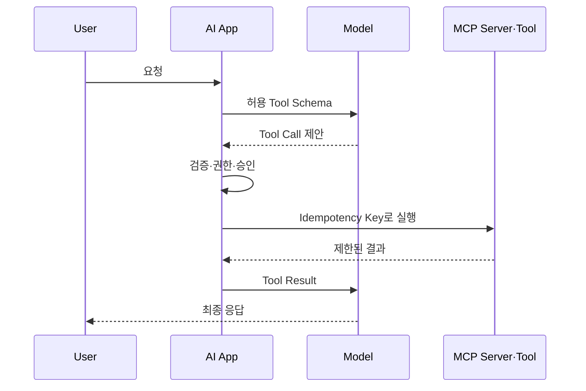

## 1. 모델은 실행자가 아니라 계획 제안자다

Tool Calling에서 모델은 이름과 Argument를 제안한다. 애플리케이션이 Schema 검증, 인증·인가, 정책 검사, 실행, 결과 제한을 담당한다. MCP(Model Context Protocol)는 AI Application과 외부 Data·Tool을 연결하는 표준 경계를 제공한다.



| 경계 | 필요한 통제 | 실패 예시 |
|---|---|---|
| Schema | 타입·범위·필수값 | 음수 환불액 |
| Authorization | 사용자·Tenant 권한 | 타 계정 조회 |
| Confirmation | 고위험 작업 승인 | 삭제·결제 실행 |
| Execution | Timeout·멱등 키 | 중복 주문 |
| Result | 크기·민감정보 제한 | Token·PII 노출 |

```json
{"tool":"cancel_order","arguments":{"orderId":"O-123"},"approval":"required"}
```

> **보안 원칙** — Tool 설명은 보안 경계가 아니다. 서버가 매 호출마다 실제 사용자 권한을 검사해야 한다.

## 2. Protocol과 제품 정책을 분리한다

MCP는 상호운용 형식을 제공하지만 신뢰, 승인, 감사, Tenant 격리를 자동 해결하지 않는다. 원격 Server에는 필요한 최소 정보만 보내고 전송 대상과 보존 정책을 명시한다.

참고: [Model Context Protocol 공식 명세](https://modelcontextprotocol.io/specification/2026-07-28)

> **면접 포인트** — “MCP를 쓴다”보다 Host·Client·Server 책임, 상태 변경 승인, 재시도·감사 로그를 구체화한다.
