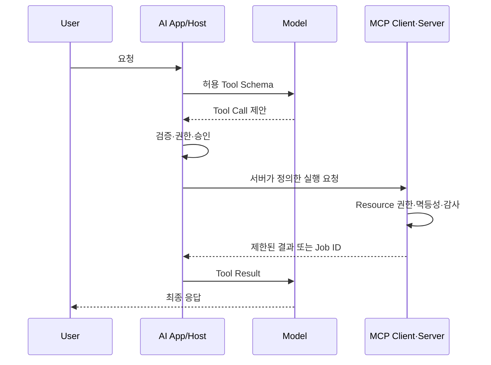

## 1. 모델은 실행자가 아니라 계획 제안자다

Tool Calling에서 모델은 이름과 Argument를 제안한다. 애플리케이션 또는 Tool Server가 Schema 검증, 인증·인가, 정책 검사, 실행, 결과 제한을 담당한다. MCP(Model Context Protocol)는 Host·Client·Server 사이에서 Resource·Prompt·Tool을 교환하는 Protocol 경계를 제공하지만, 업무 승인이나 결제 원장의 정합성을 자동으로 만들어주지는 않는다.


```mermaid
sequenceDiagram
    participant U as User
    participant A as AI App/Host
    participant M as Model
    participant T as MCP Client·Server
    U->>A: 요청
    A->>M: 허용 Tool Schema
    M-->>A: Tool Call 제안
    A->>A: 검증·권한·승인
    A->>T: 서버가 정의한 실행 요청
    T->>T: Resource 권한·멱등성·감사
    T-->>A: 제한된 결과 또는 Job ID
    A->>M: Tool Result
    M-->>U: 최종 응답
```

| 경계 | 필요한 통제 | 실패 예시 |
|---|---|---|
| Schema | 타입·범위·필수값 | 음수 환불액 |
| Authorization | 사용자·Tenant 권한 | 타 계정 조회 |
| Confirmation | 고위험 작업 승인 | 삭제·결제 실행 |
| Execution | Timeout·업무 멱등 키·상태 조회 | 중복 주문 |
| Result | 크기·민감정보·Prompt Injection 제한 | Token·PII 노출 |

```json
{
  "tool": "cancel_order",
  "arguments": {"orderId": "O-123"},
  "approval": "required"
}
```

위 `approval`은 애플리케이션 정책 예시이지 MCP Tool Argument가 자동으로 승인 상태를 보장한다는 뜻이 아니다. `Idempotency Key`도 일반 MCP 호출의 보편 기능으로 가정하지 말고, Tool Server 또는 실행 래퍼가 업무 키와 결과 저장을 정의해야 한다.

> **보안 원칙** — Tool 설명은 보안 경계가 아니다. 서버가 매 호출마다 실제 사용자 권한을 검사해야 한다.

## 2. Protocol과 제품 정책을 분리한다

MCP 명세는 상호운용을 위한 primitive와 transport/authentication 경계를 설명한다. 제품은 별도로 신뢰 모델, 최소 권한, 승인, 감사, Tenant 격리, 결과 보존을 정한다. 원격 Server에는 필요한 최소 정보만 보내고 전송 대상·지역·보존 정책을 명시한다. 명세 버전은 런타임이 사용하는 문서 버전과 SDK 버전으로 고정해 변경점을 검토한다.

### 실패 입력 → 판단 → 복구

모델이 `cancel_order`를 호출했지만 사용자 세션이 만료되었거나 주문이 다른 Tenant에 속한다고 하자. Host는 모델이 만든 Argument를 재사용하지 않고 현재 Principal로 권한을 확인해 실행 전 거절한다. Tool 호출이 성공했는데 응답이 유실되면 무조건 재호출하지 않는다. 먼저 업무 키로 상태 조회를 하고, `SUCCEEDED`, `NOT_FOUND`, `UNKNOWN`을 분리한다. 몇 분 걸리는 작업은 동기 재시도 대신 Job ID를 반환하고 상태 조회와 만료 정책을 둔다.

참고: [Model Context Protocol 공식 개요](https://modelcontextprotocol.io/specification/draft/server/index), [2026-07-28 명세](https://modelcontextprotocol.io/specification/2026-07-28)

> **면접 포인트** — “MCP를 쓴다”보다 Host·Client·Server 책임, Tool과 Resource의 통제 차이, 상태 변경 승인, 결과 유실·재시도·감사 로그를 구체화한다.
