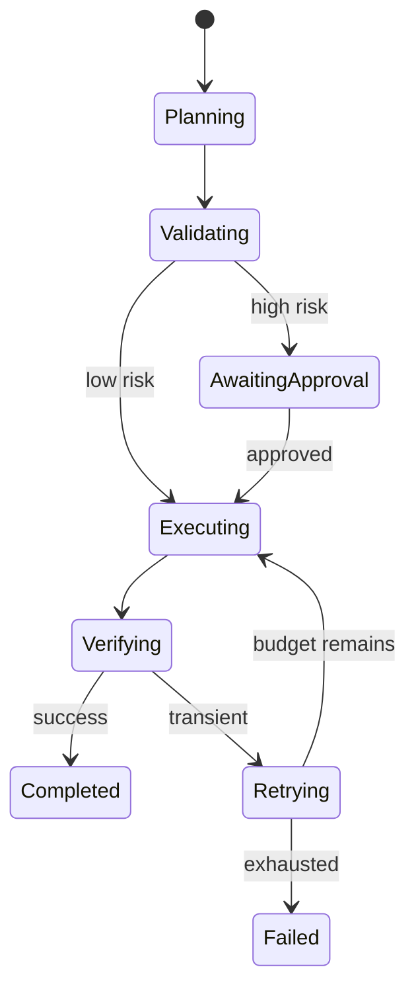

## 1. 자유로운 Loop를 내구성 있는 상태 머신으로 바꾼다

Agent는 목표를 여러 단계로 나누고 Tool을 호출하지만, 운영 시스템은 각 Step의 입력·출력·상태를 외부 저장소에 기록해야 한다. 가능한 경로는 코드가 제한하고 모델은 허용된 전이 안에서 다음 행동을 제안한다.



| 상태 정보 | 저장 이유 | 복구 전략 |
|---|---|---|
| Run·Step ID | 중복 구분 | 멱등 재개 |
| Tool Input·Result | 감사·재현 | 완료 Step 재사용 |
| Budget | 폭주 제한 | 초과 시 중단 |
| Approval | 책임 경계 | 승인 Token 1회 소비 |

```text
allow_next_step = attempts < 3
                  and elapsed < 120s
                  and tool_cost < budget
                  and policy_allows(action)
```

> **설계 원칙** — Autonomy(자율성)를 높이는 것보다 실패했을 때 어디까지 실행됐는지 알고 안전하게 재개하는 것이 먼저다.

## 2. Workflow와 Agent를 선택적으로 섞는다

순서가 알려진 업무는 결정적 Workflow가 싸고 테스트하기 쉽다. 분류·검색·요약처럼 모호한 Step만 모델에 맡기고 결제·삭제·대외 메시지는 명시적 승인과 검증을 통과시킨다.

> **면접 포인트** — Agent Demo가 아니라 중복 실행, 부분 실패, 승인 만료, Prompt Injection, Runaway Cost를 장애 시나리오로 설명한다.
