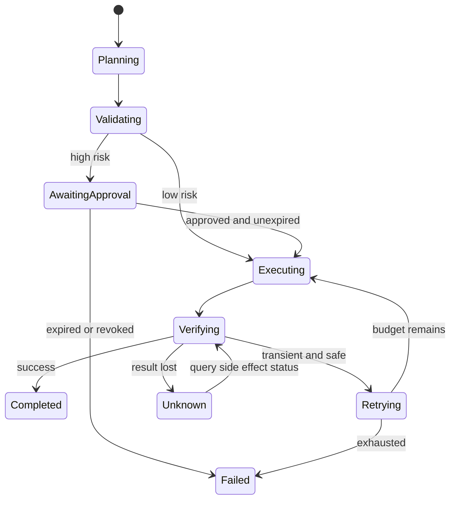

## 1. 자유로운 Loop를 내구성 있는 상태 머신으로 바꾼다

Agent는 목표를 여러 단계로 나누고 Tool을 호출하지만, 운영 시스템은 각 Step의 입력·출력·상태를 외부 저장소에 기록해야 한다. 가능한 경로는 코드가 제한하고 모델은 허용된 전이 안에서 다음 행동을 제안한다. Step을 재시도할 때는 모델 호출을 반복하는 것이 아니라 외부 부작용이 이미 적용됐는지 먼저 확인해야 한다.


```mermaid
stateDiagram-v2
    [*] --> Planning
    Planning --> Validating
    Validating --> AwaitingApproval: high risk
    Validating --> Executing: low risk
    AwaitingApproval --> Executing: approved and unexpired
    AwaitingApproval --> Failed: expired or revoked
    Executing --> Verifying
    Verifying --> Completed: success
    Verifying --> Retrying: transient and safe
    Verifying --> Unknown: result lost
    Unknown --> Verifying: query side effect status
    Retrying --> Executing: budget remains
    Retrying --> Failed: exhausted
```

| 상태 정보 | 저장 이유 | 복구 전략 |
|---|---|---|
| Run·Step ID | 중복 구분 | 멱등 키와 상태 조회 |
| Tool Input·Result | 감사·재현 | 완료 Step 재사용 |
| Step Status | 부분 성공 구분 | `UNKNOWN`은 재실행 전 조회 |
| Budget | 폭주 제한 | 초과 시 중단·보류 |
| Approval | 책임 경계 | 만료·취소·1회 소비 확인 |
| Lease/Fencing | 오래된 Worker 차단 | 세대가 낮은 쓰기 거절 |

```text
allow_next_step = attempts < configured_attempt_limit
                  and elapsed < configured_deadline
                  and tool_cost < remaining_budget
                  and policy_allows(action)
```

`configured_attempt_limit`, `configured_deadline`은 제품의 SLA와 위험도에 따른 설정값이다. `3회`, `120초`를 모든 Agent의 안전한 기본값으로 암기하지 않는다.

> **설계 원칙** — Autonomy(자율성)를 높이는 것보다 실패했을 때 어디까지 실행됐는지 알고 안전하게 재개하는 것이 먼저다. 상태 저장만으로 외부 시스템의 멱등성이 생기지는 않는다.

## 2. Workflow와 Agent를 선택적으로 섞는다

순서가 알려진 업무는 결정적 Workflow가 싸고 관측·복구하기 쉽다. 분류·검색·요약처럼 모호한 Step만 모델에 맡기고 결제·삭제·대외 메시지는 명시적 승인과 검증을 통과시킨다. 승인 이후 정책이나 사용자 권한이 바뀌면 기존 Plan을 그대로 실행하지 않고 다시 평가한다.

### 실패 입력 → 판단 → 복구

Agent가 `cancel_subscription`을 실행한 뒤 네트워크 응답이 끊겼다고 하자. Orchestrator는 `Retrying → Executing`으로 바로 가지 않고 업무 키로 구독 상태를 조회한다. 이미 취소되었으면 같은 Step을 성공 처리하고, 아직 활성이라면 만료되지 않은 승인과 현재 권한을 다시 확인한 뒤 한 번만 재시도한다. 상태가 조회되지 않으면 `UNKNOWN`으로 사람 검토나 보류 Queue에 보낸다.

참고: [Temporal Workflows](https://docs.temporal.io/workflows), [AWS Step Functions error handling](https://docs.aws.amazon.com/step-functions/latest/dg/concepts-error-handling.html)

> **면접 포인트** — Agent Demo가 아니라 중복 실행, 결과 유실, 부분 실패, 승인 만료, Prompt Injection, Runaway Cost, 오래된 Worker의 쓰기까지 장애 시나리오로 설명한다.
