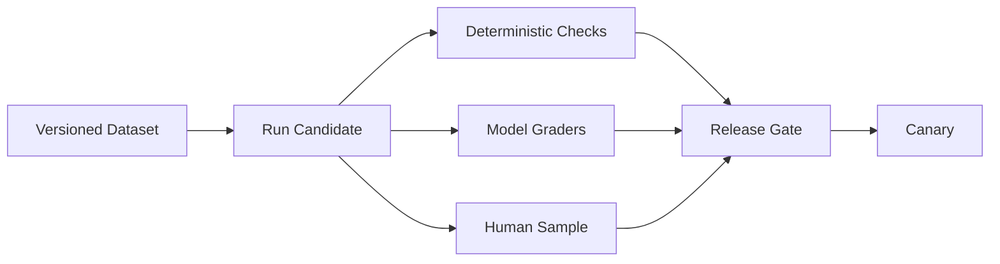

## 1. 품질을 단계별로 측정한다

비결정적 출력은 단위 테스트 하나로 충분하지 않다. 대표·경계·적대 사례를 포함한 Golden Set을 버전 관리하고 Retrieval, Tool Selection, Answer, Safety를 분리 평가한다.



| 계층 | 예시 지표 | 주의점 |
|---|---|---|
| Retrieval | Recall@k·nDCG | 정답 문서 Label 필요 |
| Generation | 정확성·근거 충실도 | 표현 다양성 허용 |
| Tool | 선택·Argument 정확도 | 실행 결과와 분리 |
| Operation | p50/p95·Token·오류율 | 모델별 분포 비교 |
| Safety | 공격 성공률·거절 정확도 | 정상 요청 과잉 거절 확인 |

```yaml
release_gate:
  grounded_answer_rate: ">= 0.92"
  p95_latency_ms: "<= 2500"
  cost_per_success: "<= baseline * 1.05"
```

> **실무 함정** — 평균 점수 상승이 핵심 고객 구간의 회귀를 숨길 수 있다. 언어·업무·난이도별 Slice를 본다.

## 2. 온라인 관측은 원문 수집과 다르다

Trace에는 Prompt 버전, 모델, Retrieval ID, Tool Call, Token, 지연, 정책 결과를 남기되 PII와 비밀은 Redaction한다. 사용자 피드백은 편향된 신호이므로 실패 샘플링과 사람 검수를 함께 사용한다.

참고: [NIST AI 평가·검증 리소스](https://airc.nist.gov/), [OpenAI Evals API](https://platform.openai.com/docs/api-reference/evals)

> **면접 포인트** — “정확도 90%”가 아니라 Dataset 구성, Grader 신뢰도, Slice, Release Gate, 온라인 Drift를 설명한다.
