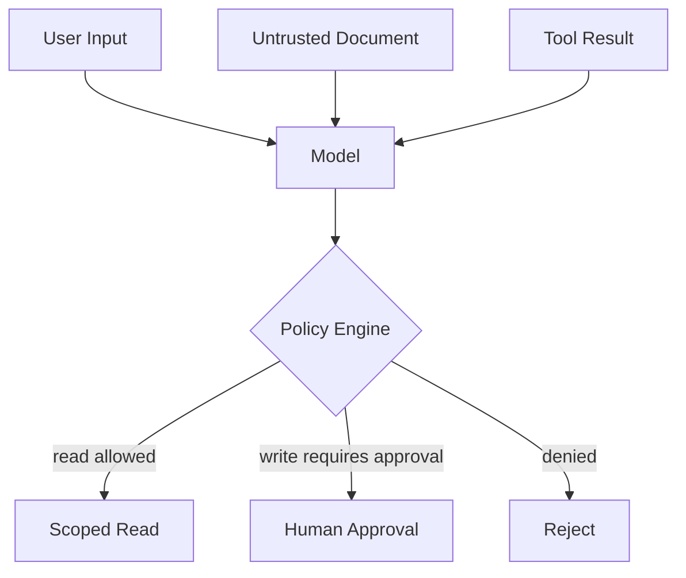

## 1. 신뢰하지 않는 모든 Context가 공격면이다

사용자 Prompt뿐 아니라 웹 페이지, 이메일, RAG 문서, Tool 결과에 모델 행동을 바꾸려는 지시가 포함될 수 있다. 모델에게 “무시하라”고 말하는 것은 완전한 격리가 아니므로 피해 범위를 권한과 실행 정책으로 줄인다.



| 점검 항목 | 취약한 구현 | 안전한 경계 |
|---|---|---|
| Credentials | Prompt에 API Key 포함 | Server-side Secret·Scoped Token |
| Retrieval | 검색 후 권한 필터 | 검색 전 Tenant Filter |
| Tool | 모델 요청 즉시 실행 | Schema·정책·승인 검사 |
| Output | HTML·SQL 직접 실행 | Escape·Parameterize·Sandbox |
| Logging | Prompt 원문 전부 저장 | Redaction·보존 기간 제한 |

```kotlin
require(principal.tenantId == request.tenantId)
require(policy.allows(principal, action, resource))
val safeArgs = schemaValidator.validate(modelSuggestedArgs)
```

> **보안 원칙** — 모델이 공격에 속을 수 있다는 전제에서, 속더라도 접근·변경 가능한 자원을 최소화한다.

## 2. 공격 테스트를 회귀 세트로 만든다

직접·간접 Injection, 권한 상승, 비밀 추출, 도구 Argument 변조, 과도한 거절을 자동·수동 평가한다. 모델이나 Prompt를 바꿀 때 공격 성공률이 배포 Gate를 넘으면 차단한다.

참고: [OWASP GenAI Security Project](https://genai.owasp.org/), [NIST Generative AI Profile](https://www.nist.gov/publications/artificial-intelligence-risk-management-framework-generative-artificial-intelligence)

> **리뷰 포인트** — Prompt 방어 문구보다 Least Privilege, 결정적 Policy Engine, 승인, 감사, Red Team 평가를 먼저 확인한다.
