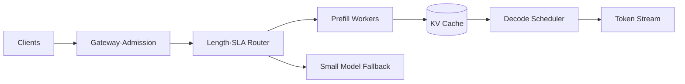

## 1. Prefill과 Decode의 자원 특성이 다르다

Prefill은 입력 Token을 병렬 계산해 Compute 비중이 크고, Decode는 한 번에 다음 Token을 생성하며 KV Cache 읽기와 Memory Bandwidth의 영향을 크게 받는다. 요청 길이를 예측해 Queue와 Batch를 구성한다.



| 기법 | 이점 | Trade-off |
|---|---|---|
| Continuous Batching | GPU 이용률·처리량 증가 | Scheduling 복잡도·꼬리 지연 |
| KV Cache | 이전 Token 재계산 방지 | Context에 비례한 GPU Memory |
| Quantization | Memory·비용 감소 | 품질 저하·Kernel 제약 가능 |
| Prefix Cache | 반복 Prompt 비용 절감 | Hit Rate·격리·무효화 필요 |
| Model Routing | 쉬운 요청 비용 절감 | Router 오판·운영 복잡도 |

```text
tokens_per_second = completed_output_tokens / wall_clock_seconds
cost_per_success = gpu_seconds * gpu_rate / successful_requests
```

> **설계 원칙** — Request QPS보다 Input·Output Token 분포, TTFT(Time To First Token), ITL(Inter-Token Latency), 성공당 비용을 함께 본다.

## 2. 과부하는 입구에서 제어한다

동시 요청·총 Token Budget을 제한하고 Deadline이 지난 요청은 실행 전에 거절한다. Streaming 중 연결 종료를 감지해 불필요한 Decode를 취소하고, GPU 장애 시 무한 Retry 대신 작은 모델이나 비 AI 경로로 Fallback한다.

참고: [vLLM 공식 문서](https://docs.vllm.ai/)

> **면접 포인트** — GPU 수만 계산하지 말고 길이별 Queue, Batch 정책, Cache Memory, Admission, Fallback, 품질 Gate를 설계한다.
