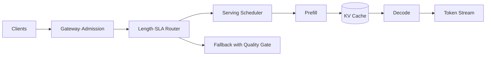

## 1. Prefill과 Decode의 자원 특성이 다르다

Prefill은 입력 Token을 처리해 첫 Token을 만들고, Decode는 이전 KV Cache를 읽으며 다음 Token을 순차 생성한다. 흔히 Prefill은 연산량, Decode는 Memory Bandwidth와 KV Cache 용량의 영향을 크게 받지만, 실제 병목은 모델 구조·GPU·batching·Token 길이 분포로 측정해야 한다. Prefill Worker와 Decode Worker를 반드시 분리해야 한다는 뜻은 아니다.


```mermaid
flowchart LR
    C[Clients] --> G[Gateway·Admission]
    G --> R[Length·SLA Router]
    R --> W[Serving Scheduler]
    W --> P[Prefill]
    P --> K[(KV Cache)]
    K --> D[Decode]
    D --> S[Token Stream]
    R --> F[Fallback with Quality Gate]
```

| 기법 | 이점 | Trade-off |
|---|---|---|
| Continuous Batching | GPU 이용률·처리량 증가 | Scheduling 공정성·꼬리 지연 |
| KV Cache | 이전 Token 재계산 방지 | Context·동시성에 비례한 Memory |
| Quantization | Memory·비용 감소 가능 | 품질·Kernel·하드웨어 제약 |
| Prefix Cache | 반복 Prompt 비용 절감 | Hit Rate·Tenant 격리·무효화 |
| Model Routing | 쉬운 요청 비용 절감 | Router 오판·품질 Gate 필요 |

```text
output_token_throughput = completed_output_tokens / measurement_window
cost_per_success = (gpu_seconds + idle_capacity_cost) * gpu_rate / successful_requests
```

TTFT(Time To First Token), ITL(Inter-Token Latency), end-to-end p95/p99, queue wait, input/output Token throughput을 같은 실험의 별도 지표로 기록한다. `tokens_per_second` 하나로 사용자 체감과 비용을 대표하지 않는다.

> **설계 원칙** — Request QPS보다 Input·Output Token 분포, TTFT, ITL, queue wait, KV Cache memory, 성공당 비용과 품질을 함께 본다.

## 2. 과부하는 입구에서 제어한다

동시 요청·총 Token Budget·사용자별 비용·Deadline을 admission 단계에서 제한한다. 짧은 요청과 긴 요청을 같은 Queue에 넣으면 긴 prefill이나 output이 짧은 요청의 p99를 악화시킬 수 있어 length/SLA class를 기준으로 분리하거나 공정성 정책을 둔다. Streaming 중 연결 종료를 감지해 serving engine이 지원하는 범위에서 Decode cancellation을 전파한다. GPU 장애 시 무한 Retry 대신 제한된 fallback 또는 명시적 보류를 사용하고, fallback의 품질·안전 Gate를 통과하지 못하면 거절한다.

### 실패 입력 → 판단 → 복구

사용자가 32 Token 질문을 보냈지만 같은 Batch에 32,000 Token 문서 생성 요청이 들어왔다고 하자. Gateway는 입력·예상 출력 Budget과 남은 Deadline을 확인해 긴 요청을 별도 Queue로 보내거나 거절한다. 이미 Streaming 중 Client가 연결을 끊으면 서버는 취소를 전파하고 부분 응답을 성공으로 저장하지 않는다. GPU가 장애 난 뒤 작은 모델로 Fallback하려면 동일한 안전·근거 기준을 다시 적용하며, 결과를 품질 저하 없이 제공할 수 없으면 재시도하지 않고 보류한다.

참고: [vLLM 공식 문서](https://docs.vllm.ai/), [NVIDIA GenAI-Perf metrics](https://docs.nvidia.com/deeplearning/triton-inference-server/user-guide/docs/perf_analyzer/genai-perf/README.html)

> **면접 포인트** — GPU 수만 계산하지 말고 길이별 Queue, Batch 정책, KV Cache Memory, TTFT·ITL·p99, Admission, cancellation, Fallback 품질 Gate를 설계한다.
