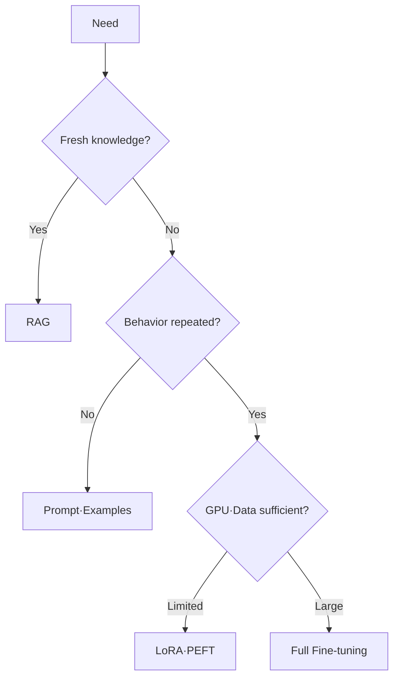

## 1. 바꾸려는 것이 지식인지 행동인지 구분한다

최신 문서·출처가 필요한 사실은 RAG가 갱신과 삭제에 유리하다. 일정한 형식·어조·업무 행동을 반복 학습하려면 SFT(Supervised Fine-Tuning, 지도 미세조정)를 검토한다. LoRA는 Base Weight를 고정하고 작은 Low-rank Adapter만 학습한다.



| 방법 | 바꾸는 것 | 장점 | 위험 |
|---|---|---|---|
| Prompt | 호출 Context | 빠른 반복 | Token 비용·취약성 |
| RAG | 외부 지식 | 최신성·인용 | 검색 품질 의존 |
| LoRA | Adapter Weight | 적은 학습 Memory | Base Model 의존 |
| Full FT | 전체 Weight | 높은 적응 자유도 | 데이터·GPU·망각 위험 |
| Quantization | 수치 정밀도 | Memory·서빙 비용 감소 | 품질·호환성 저하 가능 |

```python
trainable_parameters = lora_rank * (input_dim + output_dim)
# base weights remain frozen
```

> **실무 함정** — Fine-tuning은 출처 추적, 권한 필터, 최신 지식 갱신 문제를 해결하지 않는다.

## 2. 같은 평가 세트로 비교한다

Base, Prompt, RAG, Adapter, Quantized Variant를 업무 Golden Set에서 비교한다. 정확도뿐 아니라 TTFT, Token/s, GPU Memory, 안전성, 언어별 품질을 같은 조건으로 측정한다.

참고: [Hugging Face PEFT](https://huggingface.co/docs/transformers/peft), [Quantization 가이드](https://huggingface.co/docs/peft/developer_guides/quantization)

> **면접 포인트** — LoRA 공식을 설명한 뒤 데이터 품질, 회귀 평가, Adapter Versioning, 서빙 방식까지 연결한다.
