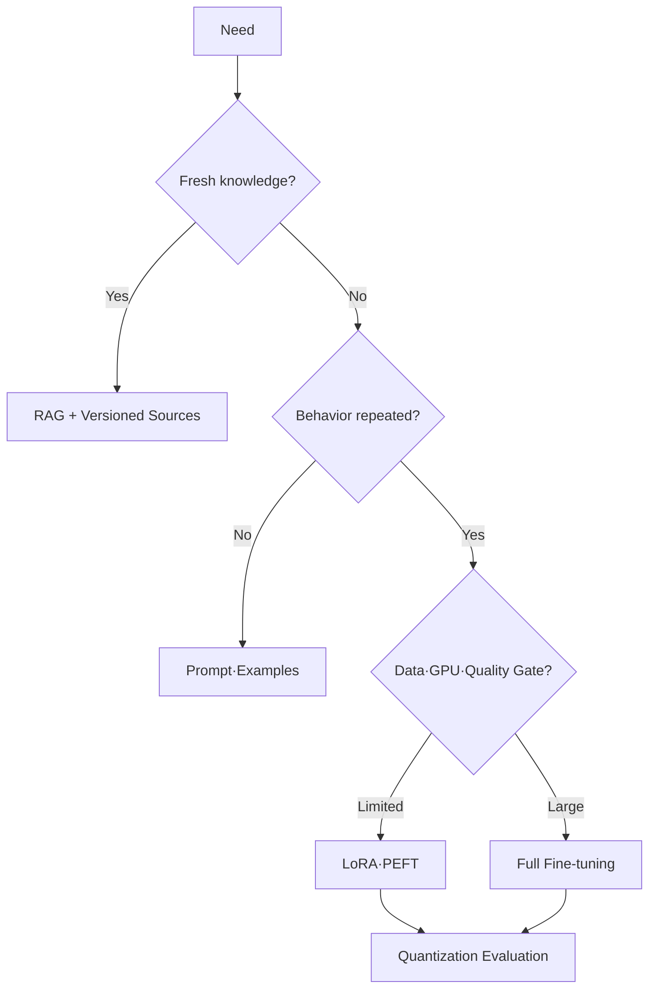

## 1. 바꾸려는 것이 지식인지 행동인지 구분한다

최신 문서·출처가 필요한 사실은 RAG가 갱신과 삭제에 유리하다. 일정한 형식·어조·업무 행동을 반복 학습하려면 SFT(Supervised Fine-Tuning, 지도 미세조정)를 검토한다. LoRA는 Base Weight를 고정하고 일부 Linear Layer 등에 Low-rank Adapter를 추가하는 PEFT 방식이다. 무엇을 바꿀지 먼저 정하지 않으면 Fine-tuning으로 권한·최신성 문제를 해결하려는 잘못된 설계가 된다.


```mermaid
flowchart TD
    N[Need] --> K{Fresh knowledge?}
    K -->|Yes| R[RAG + Versioned Sources]
    K -->|No| B{Behavior repeated?}
    B -->|No| P[Prompt·Examples]
    B -->|Yes| D{Data·GPU·Quality Gate?}
    D -->|Limited| L[LoRA·PEFT]
    D -->|Large| F[Full Fine-tuning]
    L --> Q[Quantization Evaluation]
    F --> Q
```

| 방법 | 바꾸는 것 | 장점 | 위험 |
|---|---|---|---|
| Prompt | 호출 Context | 빠른 반복 | Token 비용·취약성 |
| RAG | 외부 지식 | 최신성·인용 | 검색 품질·권한 의존 |
| LoRA | Adapter Weight | 적은 학습 Memory | Base Model·target layer 의존 |
| Full FT | 전체 Weight | 높은 적응 자유도 | 데이터·GPU·망각 위험 |
| Quantization | 수치 정밀도 | Memory·서빙 비용 감소 가능 | 품질·Kernel 호환성 저하 |

```python
# 하나의 d_out x d_in Linear layer에 A(d_out x r), B(r x d_in)를 붙인 단순화
trainable_parameters_one_layer = rank * (input_dim + output_dim)
# 실제 합계는 target module 수, bias, adapter 설정을 곱해 계산한다.
```

> **실무 함정** — Fine-tuning은 출처 추적, 권한 필터, 최신 지식 갱신 문제를 해결하지 않는다. LoRA의 학습 Parameter가 작아져도 Base Model 추론 비용과 Adapter 실행 비용이 자동으로 사라지지 않는다.

## 2. 같은 평가 세트로 비교한다

Base, Prompt, RAG, Adapter, Quantized Variant를 같은 업무 Golden Set에서 비교한다. 정확도뿐 아니라 근거 충실도, 거절·안전성, TTFT, Token/s, GPU Memory, Peak Memory, 언어별 품질과 데이터 누출을 같은 조건으로 측정한다. Quantization은 4-bit라는 숫자만으로 품질을 예측하지 말고 target model·kernel·calibration 데이터와 함께 평가한다.

### 실패 입력 → 판단 → 복구

최신 사내 휴가 규정을 LoRA 데이터로 학습했지만 다음 달 규정이 바뀌었다고 하자. Adapter 재학습 없이 기존 모델에 답을 맡기면 낡은 근거를 자신 있게 제시할 수 있다. 규정은 Versioned RAG로 검색하고, 모델의 형식·행동 적응만 Adapter가 담당하게 한다. Quantization 후 특정 한국어 분류 Slice의 정확도가 하락하면 해당 Variant를 배포하지 않고 이전 Adapter/Base 조합으로 Rollback한다.

참고: [LoRA: Low-Rank Adaptation of Large Language Models](https://arxiv.org/abs/2106.09685), [QLoRA](https://arxiv.org/abs/2305.14314), [Hugging Face PEFT Quantization](https://huggingface.co/docs/peft/developer_guides/quantization)

> **면접 포인트** — LoRA 수식을 단일 계층의 단순화로 설명한 뒤 데이터 품질, 망각·누출, 회귀 평가, Adapter Versioning, 양자화 서빙과 Rollback까지 연결한다.
