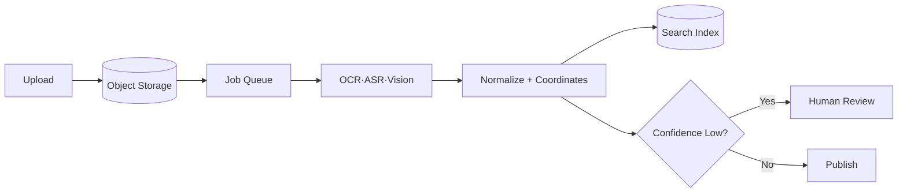

## 1. 원본과 파생 결과의 연결을 보존한다

Multimodal 입력은 크고 처리 시간이 길다. 원본을 Object Storage에 두고 Virus Scan, OCR·ASR, Layout 분석, Chunk·Embedding을 비동기로 실행한다. 모든 파생 결과에 원본 Version과 Page·Timecode·Bounding Box를 연결한다.



| 단계 | 보존할 Metadata | 실패 처리 |
|---|---|---|
| Upload | Hash·MIME·Owner | 격리·중복 제거 |
| Extract | 모델·Version·좌표 | Page 단위 재시도 |
| Normalize | 언어·표 구조·단위 | Validation Queue |
| Publish | Source Version·권한 | 원자적 Alias 전환 |

```json
{"source":"invoice.pdf","page":3,"bbox":[120,80,420,160],"confidence":0.93}
```

> **설계 원칙** — 생성된 요약만 저장하지 않는다. 사용자가 원본의 정확한 위치로 돌아가 검증할 수 있어야 한다.

## 2. 비용과 위험에 따라 모델을 계층화한다

간단한 분류·OCR은 작은 전용 모델로 먼저 처리하고 낮은 신뢰도만 큰 Multimodal LLM에 보낸다. 얼굴·음성·문서는 민감정보이므로 보존 기간, 지역, 외부 Provider 전송 범위를 정책으로 제한한다.

> **면접 포인트** — 모델 이름보다 대용량 Upload, 비동기 Job, 부분 재처리, Provenance, Human Review, 개인정보 경계를 설계한다.
