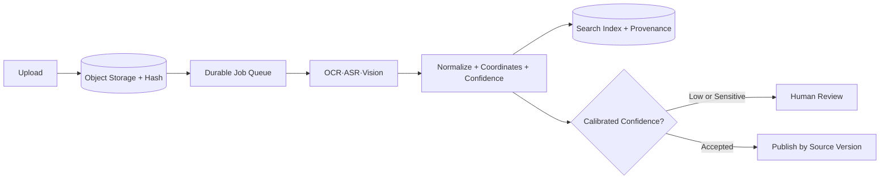

## 1. 원본과 파생 결과의 연결을 보존한다

Multimodal 입력은 크고 처리 시간이 길다. 원본을 Object Storage에 두고 Virus Scan, OCR·ASR, Layout 분석, Chunk·Embedding을 비동기로 실행한다. 모든 파생 결과에 원본 Version과 Page·Timecode·Bounding Box를 연결하고, 회전·DPI·리사이즈 변환을 기록해 사용자가 원본 위치로 돌아갈 수 있게 한다.


```mermaid
flowchart LR
    U[Upload] --> O[(Object Storage + Hash)]
    O --> Q[Durable Job Queue]
    Q --> X[OCR·ASR·Vision]
    X --> N[Normalize + Coordinates + Confidence]
    N --> I[(Search Index + Provenance)]
    N --> H{Calibrated Confidence?}
    H -->|Low or Sensitive| R[Human Review]
    H -->|Accepted| P[Publish by Source Version]
```

| 단계 | 보존할 Metadata | 실패 처리 |
|---|---|---|
| Upload | Hash·MIME·Owner·Region | 격리·중복 제거 |
| Extract | 모델·Version·Locale·좌표계 | Page/segment 단위 재시도 |
| Normalize | 언어·표 구조·단위·calibration | Validation Queue |
| Review | 원본 위치·수정자·수정 이유 | 새 derived Version |
| Publish | Source Version·권한·Alias | 원자적 Alias 전환 |

```json
{
  "source": "invoice.pdf",
  "sourceVersion": "sha256:abc...",
  "page": 3,
  "bbox": [120, 80, 420, 160],
  "coordinateSpace": "page-pixels-after-rotation",
  "model": "ocr-model@version",
  "confidence": 0.93
}
```

`confidence`는 OCR·ASR·Vision 모델마다 의미와 calibration이 다를 수 있다. 전역 `0.9` 같은 값을 업계 기본값으로 두지 말고 업무별 검증 세트에서 threshold를 정한다.

> **설계 원칙** — 생성된 요약만 저장하지 않는다. 사용자가 원본의 정확한 위치와 모델 Version으로 돌아가 검증할 수 있어야 한다.

## 2. 비용과 위험에 따라 모델을 계층화한다

간단한 분류·OCR은 작은 전용 모델로 먼저 처리하고, 낮은 confidence·민감한 문서·표 구조 실패만 큰 Multimodal LLM 또는 사람 검수로 보낸다. 얼굴·음성·문서는 민감정보일 수 있으므로 보존 기간, 지역, 외부 Provider 전송 범위와 접근 로그를 정책으로 제한한다. 원본과 파생 결과의 권한이 다르면 파생 결과에도 원본 ACL을 상속하거나 더 엄격하게 적용한다.

### 실패 입력 → 판단 → 복구

스캔 PDF 10쪽 중 3쪽만 회전되어 OCR 결과의 좌표가 원본과 어긋났다고 하자. 전체 Job을 성공 처리하지 않고 해당 Page의 좌표 검증을 실패로 기록해 Page 단위 재처리를 실행한다. 재처리가 끝날 때까지 Search Index의 Source Version을 Publish하지 않으며, 자동 threshold를 넘더라도 서명·금액 같은 고위험 필드는 사람 검수 Queue로 보낸다. 중복 Job이 도착하면 `sourceVersion + stage + page` 업무 키로 하나의 결과만 Publish한다.

참고: [W3C PROV: Provenance data model](https://www.w3.org/TR/prov-overview/), [Tesseract OCR 공식 문서](https://tesseract-ocr.github.io/)

> **면접 포인트** — 모델 이름보다 대용량 Upload, 내구성 있는 Job, 부분 재처리, 좌표·Provenance, confidence calibration, Human Review, 개인정보 경계를 설계한다.
