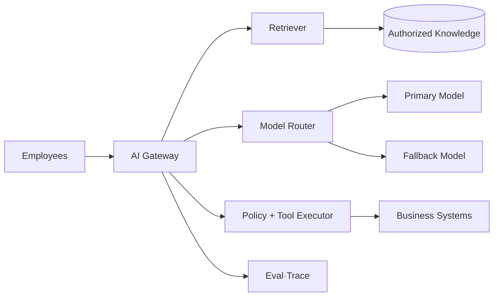

## 1. 면접 문제

“회사 전체 문서와 업무 시스템을 연결해 질문에 답하고, 사용자의 승인 아래 일부 작업도 수행하는 AI Assistant를 설계해보세요.” 요구사항을 먼저 좁히고 숫자를 가정한다.



| 압박 축 | 반드시 답할 질문 | 약한 답변 |
|---|---|---|
| 품질 | Grounded Answer를 어떻게 측정하는가 | “좋은 모델을 쓴다” |
| 용량 | Token/s·p95·동시성은 얼마인가 | Request QPS만 제시 |
| 비용 | 성공 답변당 비용과 Budget은 | Token 단가만 비교 |
| 보안 | 문서·Tool 권한은 어디서 검사하는가 | Prompt에만 규칙 작성 |
| 장애 | Provider·Index 장애 시 무엇을 제공하는가 | 무한 재시도 |

```text
peak_output_tokens_per_second = peak_concurrency * average_decode_rate
monthly_cost = successful_requests * cost_per_success
```

> **면접 포인트** — 기능 목록보다 SLO, 평가 Gate, 권한 경계, 데이터 Freshness, Fallback 품질을 먼저 합의한다.

## 2. 좋은 답변의 흐름

요구사항·위험도 → 데이터와 권한 → Offline Indexing → Online Retrieval·Generation → 평가 → 서빙·비용 → Tool 승인 → 장애 복구 순으로 전개한다. 제품이 답을 모를 때 “모른다”고 말하는 조건도 명세한다.

> **압박 질문** — 트래픽 10배, Provider 전면 장애, 악성 문서 유입, 직원 퇴사 직후 권한 회수, 모델 교체 회귀를 차례로 방어한다.
