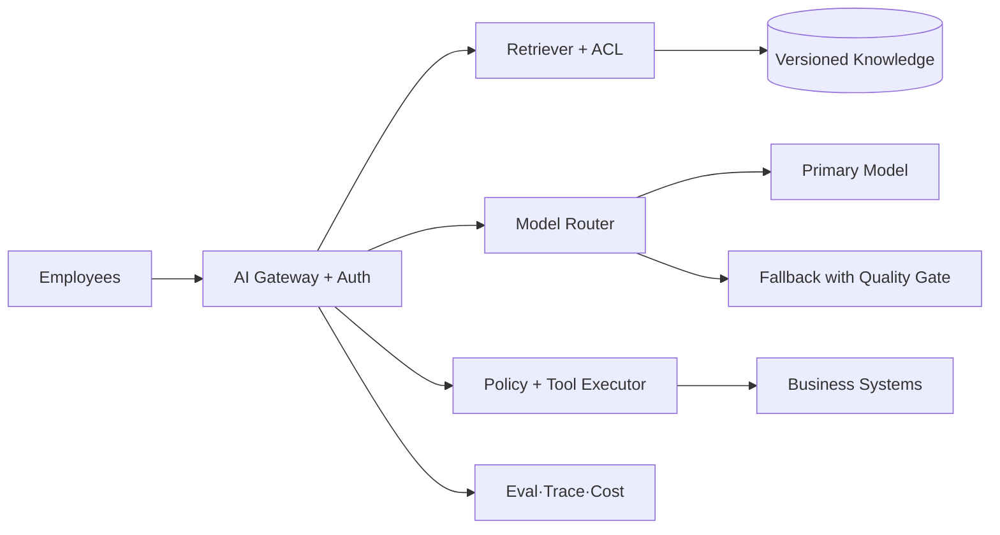

## 1. 면접 문제

“회사 전체 문서와 업무 시스템을 연결해 질문에 답하고, 사용자의 승인 아래 일부 작업도 수행하는 AI Assistant를 설계해보세요.” 요구사항을 먼저 좁히고 숫자는 반드시 가정으로 선언한다. 예를 들어 문서 1천만 개·DAU 10만만으로는 QPS를 계산할 수 없으므로 사용자당 질문 수, 피크 배율, 평균 Input/Output Token, 문서 변경률, p95 SLO를 추가로 정한다.


```mermaid
flowchart LR
    U[Employees] --> G[AI Gateway + Auth]
    G --> R[Retriever + ACL]
    R --> D[(Versioned Knowledge)]
    G --> M[Model Router]
    M --> P[Primary Model]
    M --> F[Fallback with Quality Gate]
    G --> T[Policy + Tool Executor]
    T --> B[Business Systems]
    G --> E[Eval·Trace·Cost]
```

| 압박 축 | 반드시 답할 질문 | 약한 답변 |
|---|---|---|
| 품질 | Grounded Answer·거절을 어떻게 측정하는가 | “좋은 모델을 쓴다” |
| 용량 | Input/Output Token/s·p95·동시성은 얼마인가 | Request QPS만 제시 |
| 비용 | 성공 답변당 비용·Idle·실패 비용은 | Token 단가만 비교 |
| 보안 | 문서·Tool 권한은 어디서 검사하는가 | Prompt에만 규칙 작성 |
| 최신성 | 수정·삭제·권한 회수를 얼마나 빨리 반영하는가 | Index만 주기적으로 갱신 |
| 장애 | Provider·Index·Tool 장애 시 무엇을 제공하는가 | 무한 재시도 |

```text
daily_queries = DAU * queries_per_user_per_day
peak_qps = daily_queries / 86400 * peak_factor
peak_output_tokens_per_second = peak_concurrency * average_decode_rate
monthly_cost = input_cost + output_cost + indexing_cost + idle_capacity_cost
```

위 식은 입력 가정이 붙은 추정식이다. 모든 동시 요청이 같은 Decode 단계에 있다고 가정하면 안 되며, Queue·Prefill·Output length distribution·Cache hit를 별도로 설명한다.

> **면접 포인트** — 기능 목록보다 SLO, 평가 Slice와 Gate, 권한 경계, 데이터 Freshness, Token·Queue 용량, Fallback 품질과 비용을 먼저 합의한다.

## 2. 좋은 답변의 흐름

요구사항·위험도 → 데이터와 권한 → Offline Indexing → Online Retrieval·Generation → 평가 → 서빙·비용 → Tool 승인 → 장애 복구 순으로 전개한다. 제품이 답을 모를 때 `근거 부족`으로 말하는 조건과, 문서에 접근할 권한이 없을 때 아무것도 추론하지 않는 조건도 명세한다.

### 실패 입력 → 판단 → 복구

Provider가 전면 장애이고 동시에 악성 문서가 유입되었다고 하자. Gateway는 무한 Retry를 하지 않고 예산과 Deadline을 소진한 요청을 보류한다. Retriever는 현재 ACL과 문서 Version을 확인하고 악성 문서가 제안한 Tool을 Policy에서 거절한다. 품질 Gate를 통과한 작은 Fallback 모델이나 캐시된 읽기 전용 결과만 제공하고, 근거를 만들 수 없으면 답변을 보류한다. 직원이 퇴사해 권한이 회수된 경우에는 기존 Cache와 Trace를 그대로 재사용하지 않고 현재 Principal로 다시 필터링한다.

참고: [Retrieval-Augmented Generation 원 논문](https://arxiv.org/abs/2005.11401), [NIST Generative AI Profile](https://nvlpubs.nist.gov/nistpubs/ai/NIST.AI.600-1.pdf), [NVIDIA GenAI-Perf metrics](https://docs.nvidia.com/deeplearning/triton-inference-server/user-guide/docs/perf_analyzer/genai-perf/README.html)

> **압박 질문** — 트래픽 10배, Provider 전면 장애, 악성 문서 유입, 직원 퇴사 직후 권한 회수, 모델 교체 회귀를 각각 숫자·권한·복구 상태로 방어한다.
