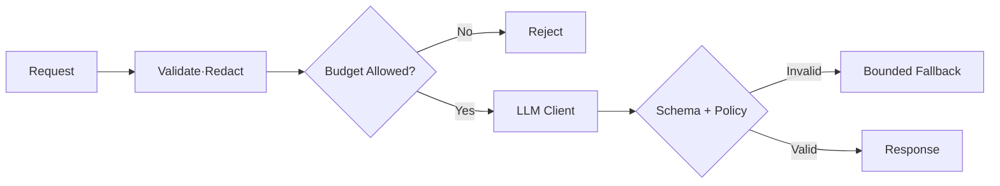

## 1. 외부 호출의 기본 안전장치를 확인한다

모델 호출에는 연결·응답·전체 Deadline을 두고 재시도는 멱등 요청과 일시 오류에만 제한한다. 최대 Input·Output Token, 동시성, 사용자별 Budget을 서버에서 강제하고 Client 취소를 Provider 호출까지 전파한다.



| 리뷰 항목 | 위험 신호 | 권장 구현 |
|---|---|---|
| Timeout | SDK 기본값 의존 | 전체 Deadline·취소 전파 |
| Retry | 모든 오류 무한 재시도 | 상태별 Backoff·Retry Budget |
| Output | 문자열 바로 실행 | Schema·Domain·권한 검증 |
| Secret | Prompt·브라우저에 Key | Server Secret Manager |
| Logging | 원문 전체 기록 | ID·Version·Metric + Redaction |
| Cost | 요청 수만 제한 | Input·Output Token·동시성 제한 |

```kotlin
withTimeout(totalDeadlineMs) {
    client.generate(request.copy(maxOutputTokens = policy.maxOutputTokens))
        .also(schemaValidator::validate)
}
```

> **리뷰 원칙** — 모델 출력은 외부 사용자가 보낸 입력과 같은 신뢰 수준으로 취급한다.

## 2. 재현성과 Provider 독립성을 과장하지 않는다

요청에는 Prompt·Model·Schema Version과 Trace ID를 남기고 민감정보 원문은 최소화한다. Provider 추상화는 공통 Retry·Metric에는 유용하지만 Tool·Streaming·Safety 기능의 차이를 최소 공통분모로 숨기면 품질이 떨어질 수 있다.

> **리뷰 포인트** — 정상 응답 예제보다 Timeout, Rate Limit, Partial Stream, Schema 위반, 취소, Provider 장애 테스트가 있는지 확인한다.
