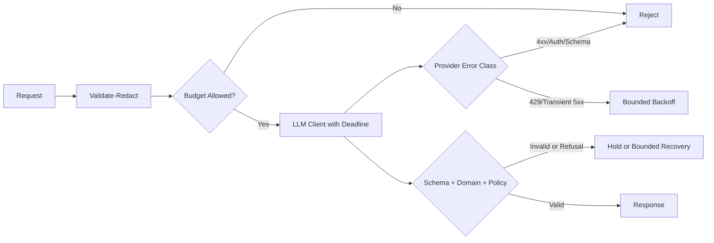

## 1. 외부 호출의 기본 안전장치를 확인한다

모델 호출에는 연결·응답·전체 Deadline을 두고, 재시도는 실제 오류가 일시적인지와 업무 부작용이 없는지를 확인한 뒤 제한한다. 모델 생성 자체는 같은 입력을 다시 보내도 같은 출력이 보장되지 않으므로, Tool·결제처럼 부작용이 있는 작업은 결과 조회와 멱등 업무 키를 먼저 사용한다. 최대 Input·Output Token, 동시성, 사용자별 Budget을 서버에서 강제하고 Client 취소를 Provider 호출까지 전파한다.


```mermaid
flowchart LR
    A[Request] --> V[Validate·Redact]
    V --> B{Budget Allowed?}
    B -->|No| X[Reject]
    B -->|Yes| C[LLM Client with Deadline]
    C --> E{Provider Error Class}
    E -->|429/Transient 5xx| R[Bounded Backoff]
    E -->|4xx/Auth/Schema| X
    C --> S{Schema + Domain + Policy}
    S -->|Invalid or Refusal| F[Hold or Bounded Recovery]
    S -->|Valid| O[Response]
```

| 리뷰 항목 | 위험 신호 | 권장 구현 |
|---|---|---|
| Timeout | SDK 기본값 의존 | connect/read/total Deadline·취소 전파 |
| Retry | 모든 오류 무한 재시도 | 429 Retry-After·일시 5xx만 제한 Backoff |
| Output | 문자열 바로 실행 | Schema·Domain·권한 검증 |
| Streaming | 부분 응답을 성공 저장 | 완료 이벤트 전까지 임시 버퍼·취소 |
| Secret | Prompt·브라우저에 Key | Server Secret Manager |
| Logging | 원문 전체 기록 | ID·Version·Metric + Redaction |
| Cost | 요청 수만 제한 | Input·Output Token·동시성·사용자 Budget |

```kotlin
withTimeout(totalDeadlineMs) {
    val response = client.generate(request.copy(maxOutputTokens = policy.maxOutputTokens))
    val parsed = schemaValidator.validate(response)
    domainValidator.validate(parsed)
    policy.authorize(principal, parsed)
    parsed
}
```

`schemaValidator`가 통과해도 Domain과 Authorization은 별도로 수행한다. 429와 5xx의 재시도 가능성, 4xx의 수정 필요성은 Provider 계약과 `Retry-After`를 확인해 분류한다.

> **리뷰 원칙** — 모델 출력은 외부 사용자가 보낸 입력과 같은 신뢰 수준으로 취급한다. Provider 응답이 성공으로 보이는지보다 업무 원장에 실제 부작용이 적용됐는지를 별도로 확인한다.

## 2. 재현성과 Provider 독립성을 과장하지 않는다

요청에는 Prompt·Model·Schema Version, Provider request ID와 Trace ID를 남기고 민감정보 원문은 최소화한다. 완전한 재현이 필요하면 입력·설정·검색 문서 Version·Tool 결과를 안전하게 보존하되, 비밀과 PII는 Redaction하고 접근·삭제 정책을 적용한다. Provider 추상화는 공통 Retry·Metric에는 유용하지만 Tool·Streaming·Safety·오류 Schema의 차이를 최소 공통분모로 숨기면 품질이 떨어질 수 있다.

### 실패 입력 → 판단 → 복구

Streaming 중 사용자가 연결을 끊었는데 서버가 이미 첫 100 Token을 받았다고 하자. 서버는 부분 텍스트를 최종 답변으로 저장하지 않고 Provider cancellation을 전파한 뒤 Trace에 `CLIENT_CANCELLED`와 사용 Token을 남긴다. 429이면 Retry-After와 전체 Deadline 안에서 한 번만 재시도할 수 있지만, 400 Schema 오류는 같은 요청을 반복하지 않고 입력·Schema 버전을 수정하거나 사용자에게 거절한다. Tool 호출 결과가 유실되면 모델을 재호출하기보다 업무 키로 실행 상태를 조회한다.

참고: [RFC 6585: Additional HTTP Status Codes](https://www.rfc-editor.org/rfc/rfc6585), [RFC 9110: HTTP Semantics](https://www.rfc-editor.org/rfc/rfc9110), [OpenAI Structured Outputs](https://developers.openai.com/api/docs/guides/structured-outputs)

> **리뷰 포인트** — 정상 응답 예제보다 Timeout, 429·5xx·4xx, Partial Stream, Schema·Domain 위반, 취소, Provider 장애, PII 로그와 업무 부작용 중복을 확인한다.
