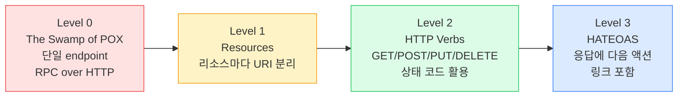
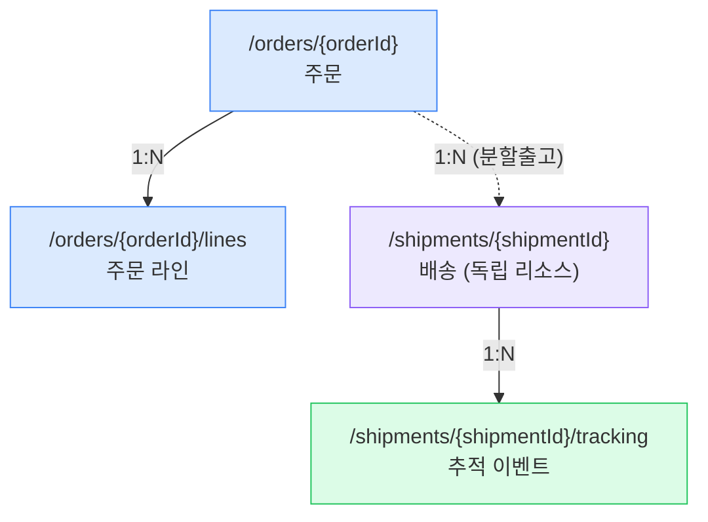
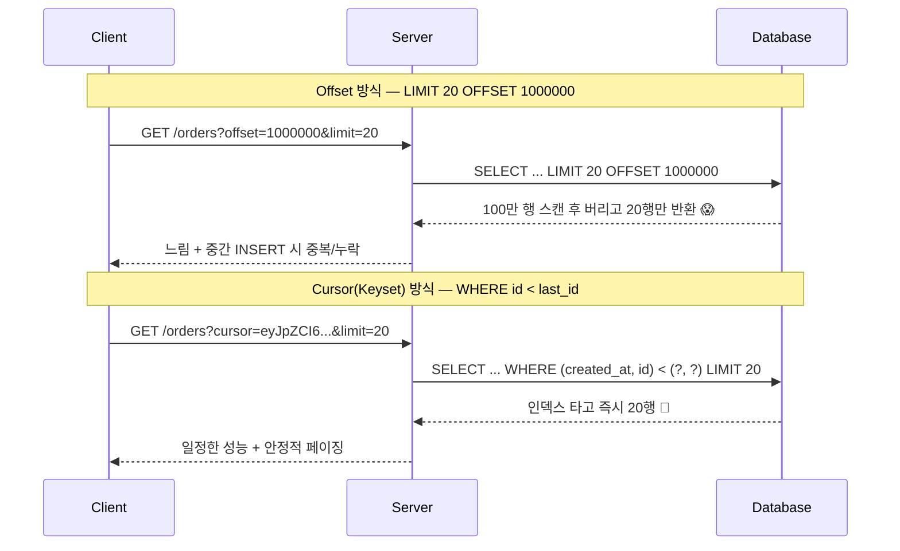
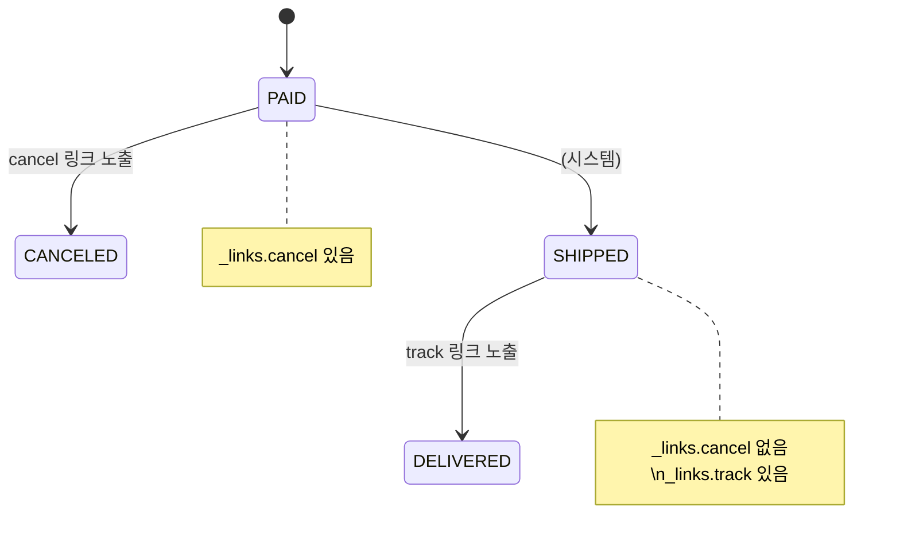

## 1. REST 제약과 Richardson 성숙도 모델

`REST(Representational State Transfer, 표현 상태 전이)`는 프로토콜이 아니라 **아키텍처 제약(Constraints)의 집합**이다. 핵심 6개 제약 중 면접에서 자주 묻는 것은 **Stateless(무상태)**와 **Uniform Interface(균일 인터페이스)**다.



*Richardson Maturity Model — 실무 대부분은 Level 2에서 멈춘다. Level 3는 비용 대비 효용 논쟁이 있음*

> **💡 현실적 목표**
>
> 국내 대부분 서비스(토스·배민·쿠팡 내부 API)는 **Level 2** 를 표준으로 둔다. Level 3(HATEOAS)는 공개 API나 장기 진화가 중요한 경우 부분 채택. "우리는 Level 2를 기본으로 하되, 결제 흐름처럼 상태 전이가 복잡한 곳은 next-action 링크를 제공한다"가 시니어다운 답변.

## 2. 리소스 모델링 — 명사로 쪼개기

리소스는 **명사(Noun)**로, 행위는 **HTTP 메서드(Verb)**로 표현한다. `/getOrders`, `/createOrder` 같은 동사형 URI는 RPC 사고방식의 잔재다.

| 안티패턴 (동사형) | 권장 (리소스 + 메서드) | 의미 |
| --- | --- | --- |
| `POST /createOrder` | `POST /orders` | 주문 생성 |
| `GET /getOrder?id=42` | `GET /orders/42` | 단건 조회 |
| `POST /cancelOrder?id=42` | `POST /orders/42/cancellation` 또는 `PATCH /orders/42` (status 변경) | 취소 — 상태 전이 |
| `GET /orderLines?orderId=42` | `GET /orders/42/lines` | 하위 리소스 (Sub-resource) |

### 물류 도메인 예시 — 주문·배송 리소스 계층



*Order ↔ Shipment는 분할출고로 1:N. Shipment를 Order 하위가 아닌 **독립 리소스**로 둬야 라이프사이클이 분리됨*

> **⚠️ 실무 함정 — 중첩 깊이**
>
> `/orders/42/lines/3/items/7/...` 처럼 3단계 이상 중첩하면 URI가 깨지기 쉽다. 식별자가 전역 유일하면 **최상위 리소스로 평탄화** ( `/shipments/{id}` )하고, 관계는 쿼리 파라미터나 링크로 표현하는 게 진화에 유리.

### 컬렉션 vs 단일 리소스 규칙

- **컬렉션**: 복수형 명사 — `/orders`, `/shipments`
- **필터·정렬·검색**은 쿼리 파라미터 — `/orders?status=PAID&sort=-createdAt`
- **표현형(Representation) 협상**은 `Accept` 헤더 — URI에 `.json` 박지 않기

## 3. HTTP 메서드 · 안전성 · 멱등성

면접 단골: **"PUT과 POST의 차이?"** → 단순히 "수정/생성"이 아니라 `Idempotency(멱등성)`로 답해야 한다. 멱등성은 *같은 요청을 N번 보내도 서버 상태가 1번 보낸 것과 동일*한 성질이다.

| 메서드 | Safe (안전·읽기전용) | Idempotent (멱등) | 용도 |
| --- | --- | --- | --- |
| `GET` | ✅ | ✅ | 조회 |
| `HEAD` | ✅ | ✅ | 메타데이터만 |
| `PUT` | ❌ | ✅ | 전체 교체 (Upsert) |
| `DELETE` | ❌ | ✅ | 삭제 (이미 없어도 결과 동일) |
| `PATCH` | ❌ | ⚠️ 보통 비멱등 | 부분 수정 |
| `POST` | ❌ | ❌ | 생성 — N번 보내면 N개 생성 위험 |

> **🎯 면접 포인트 — POST 중복 방지**
>
> "결제 API에 네트워크 타임아웃 후 클라이언트가 재시도하면 이중 결제가 나는데 어떻게 막나요?" → **비멱등 POST를 멱등하게 만드는 Idempotency-Key 헤더** 를 설명해야 한다. 자세한 구현은 [04. 복원력·멱등성](04-resilience-idempotency.html) 페이지에서 다룸. 🔥(Deep-dive)

### 왜 PATCH는 보통 비멱등인가

`{ "balance": "+100" }` 처럼 **상대적 변경**을 표현하면 N번 호출 시 N번 증가 → 비멱등. 반면 `{ "balance": 100 }` 같은 **절대값 교체**는 멱등하다. PATCH의 멱등성은 페이로드 설계에 달려 있다.

## 4. HTTP 상태 코드 — 정확하게 쓰기

| 상황 | 코드 | 흔한 실수 |
| --- | --- | --- |
| 리소스 생성 성공 | `201 Created` + `Location` 헤더 | 200으로 퉁치기 |
| 비동기 접수 (처리 진행 중) | `202 Accepted` | 처리 끝나지도 않았는데 200 |
| 본문 없는 성공 (DELETE) | `204 No Content` | 빈 body + 200 |
| 입력 검증 실패 | `400 Bad Request` / `422 Unprocessable` | 모든 에러를 500으로 |
| 인증 안 됨 / 권한 없음 | `401` / `403` | 401과 403 혼동 |
| 버전 충돌 (낙관적 락) | `409 Conflict` | 500으로 던지기 |
| 멱등 키 처리 중 | `409` 또는 원래 결과 반환 | 재처리 후 중복 생성 |
| Rate limit 초과 | `429 Too Many Requests` + `Retry-After` | 503으로 던져 재시도 폭주 유발 |

> **⚠️ 실무 함정 — 200 OK + body에 에러**
>
> "항상 200을 주고 body의 `{"success": false}` 로 판단" 패턴은 **관측성을 망친다** . APM·로드밸런서·재시도 미들웨어는 상태 코드로 에러율을 집계하는데, 전부 200이면 5xx 알람이 절대 안 울린다. 실제 장애가 대시보드에서 초록불로 보이는 참사가 발생.

## 5. API 버저닝 — 진화 전략

| 방식 | 예시 | 장점 | 단점 |
| --- | --- | --- | --- |
| **URI 경로** | `/v1/orders` | 명확·캐시 친화·디버깅 쉬움 | URI가 리소스 정체성 위반(같은 리소스 다른 URI) |
| **헤더** | `Accept: application/vnd.api.v2+json` | URI 깔끔·콘텐츠 협상 정석 | 브라우저 테스트 어려움·캐시 키 복잡 |
| **쿼리 파라미터** | `/orders?version=2` | 도입 쉬움 | 기본값 누락 시 혼란·캐시 오염 |

> **💡 실무 합의**
>
> 논쟁은 많지만 **실무 다수는 URI 경로 버저닝** 을 택한다(Stripe·GitHub은 변형 사용). 이유: 운영·디버깅·CDN 캐싱·문서화가 압도적으로 쉽다. 순수주의보다 운영성이 이긴 사례. 단, **버전을 남발하지 않는 것** 이 핵심 — 하위 호환(Backward compatible) 변경(필드 추가)은 버전을 올리지 않는다.

### 하위 호환 변경 vs 깨는 변경

- **호환(버전 유지)**: 선택 필드 추가, 새 엔드포인트 추가, 응답에 필드 추가
- **깨짐(버전 올림)**: 필드 삭제·이름 변경, 타입 변경, 필수 파라미터 추가, 의미 변경

클라이언트는 **Tolerant Reader(관대한 파서)** 원칙 — 모르는 필드는 무시 — 를 지켜야 서버 진화가 자유로워진다.

## 6. 페이지네이션 — Offset vs Cursor

면접에서 **"수천만 건 목록을 페이징하라"**는 거의 항상 나온다. Offset 기반의 함정을 모르면 감점이다.



*Offset은 뒤로 갈수록 느려지고(O(offset)), 데이터 변경 시 중복·누락. Cursor는 인덱스 범위 스캔으로 일정*

| 관점 | Offset 기반 | Cursor (Keyset) 기반 |
| --- | --- | --- |
| 깊은 페이지 성능 | O(offset) — 뒤로 갈수록 급격히 느림 | O(limit) — 일정 |
| 임의 페이지 점프 | 가능 (5페이지로 바로) | 불가 (다음/이전만) |
| 실시간 데이터 안정성 | 중간 INSERT/DELETE 시 중복·누락 | 안정적 |
| 전체 개수 | 쉬움 | 비싸거나 근사치 |
| 적합 케이스 | 관리자 페이지·소규모·페이지 번호 필요 | 무한스크롤·피드·대용량 (배민 가게목록, 토스 거래내역) |

#### Cursor 페이지네이션 응답 형태

```
// 커서는 정렬 키를 base64 인코딩 — 내부 구조 노출 방지
{
  "items": [ ... ],
  "pageInfo": {
    "nextCursor": "eyJjcmVhdGVkQXQiOiIyMDI2LTA3LTAxVDEyOjAwOjAwWiIsImlkIjo0Mn0=",
    "hasNext": true
  }
}
```

> **⚠️ 실무 함정 — 정렬 키 유일성**
>
> Cursor 정렬 키가 `created_at` 하나면 같은 시각 행에서 누락 발생. 반드시 **(created_at, id)** 같은 **유일성 보장 복합 키** 로 정렬하고 커서를 구성해야 한다.

## 7. 에러 모델 — RFC 7807 Problem Details

제각각인 에러 포맷(`{"msg":...}`, `{"error":...}`, `{"code":...}`)은 클라이언트를 괴롭힌다. `RFC 7807(Problem Details for HTTP APIs, HTTP API 문제 상세)`은 표준 에러 바디를 정의한다.

```
// Content-Type: application/problem+json
{
  "type":     "https://api.shop.com/problems/insufficient-stock",
  "title":    "재고 부족",
  "status":   409,
  "detail":   "SKU-1234의 가용 재고가 2개인데 5개를 요청했습니다.",
  "instance": "/orders/42",
  // 확장 필드 — 도메인 고유 정보
  "sku":        "SKU-1234",
  "available":  2,
  "requested":  5,
  "traceId":    "4bf92f3577b34da6a3ce929d0e0e4736"
}
```

*필드: type(문제 종류 URI)·title(요약)·status·detail(이번 발생 상세)·instance(발생 위치) + 확장*

#### Spring Boot 구현 — @RestControllerAdvice

```kotlin
@RestControllerAdvice
class GlobalExceptionHandler {

    @ExceptionHandler(InsufficientStockException::class)
    fun handleStock(e: InsufficientStockException): ResponseEntity<ProblemDetail> {
        val pd = ProblemDetail.forStatusAndDetail(HttpStatus.CONFLICT, e.message)
        pd.type = URI.create("https://api.shop.com/problems/insufficient-stock")
        pd.title = "재고 부족"
        pd.setProperty("sku", e.sku)
        pd.setProperty("available", e.available)
        pd.setProperty("traceId", MDC.get("traceId"))   // 추적 연결
        return ResponseEntity.status(HttpStatus.CONFLICT).body(pd)
    }
}
```

*Spring 6 / Boot 3는 `ProblemDetail`을 기본 제공. traceId를 넣어 로그·추적과 연결하는 게 핵심*

> **💡 에러 분류 체계**
>
> 에러는 **(1) 클라이언트 잘못(4xx, 재시도 무의미)** 과 **(2) 서버/일시적(5xx·429, 재시도 가능)** 으로 명확히 나눠야 한다. 클라이언트가 `type` URI로 분기하고, `status` 로 재시도 여부를 판단하게 만들면 양쪽 코드가 단순해진다.

## 8. HATEOAS 개요 — 상태 기반 액션 노출

`HATEOAS(Hypermedia As The Engine Of Application State, 애플리케이션 상태 엔진으로서의 하이퍼미디어)`는 응답에 **"지금 이 리소스에서 가능한 다음 액션"**을 링크로 담는다. 클라이언트가 상태 전이 규칙을 하드코딩하지 않아도 된다.

```
// 결제 완료(PAID) 상태의 주문 — 가능한 액션만 링크로 제공
{
  "orderId": 42,
  "status": "PAID",
  "_links": {
    "self":   { "href": "/orders/42" },
    "cancel": { "href": "/orders/42/cancellation", "method": "POST" }
    // SHIPPED 상태였다면 cancel 링크는 사라지고 track 링크가 등장
  }
}
```



*상태에 따라 노출 링크가 달라짐 — 클라이언트가 "취소 가능 여부"를 직접 판단하지 않게 함*

> **🎯 면접 포인트 — HATEOAS 채택 Trade-off**
>
> "왜 대부분 HATEOAS를 안 쓰나요?" → **(1) 페이로드 비대화, (2) 클라이언트가 실제로 링크를 따라가도록 구현하는 비용, (3) 모바일 앱은 어차피 화면 흐름을 하드코딩** . 반대로 채택 가치가 큰 곳은 **장기 진화하는 공개 API, 워크플로 엔진, 결제 같은 복잡 상태 전이** . "무조건 좋다/나쁘다"가 아니라 맥락으로 답하는 게 핵심.
