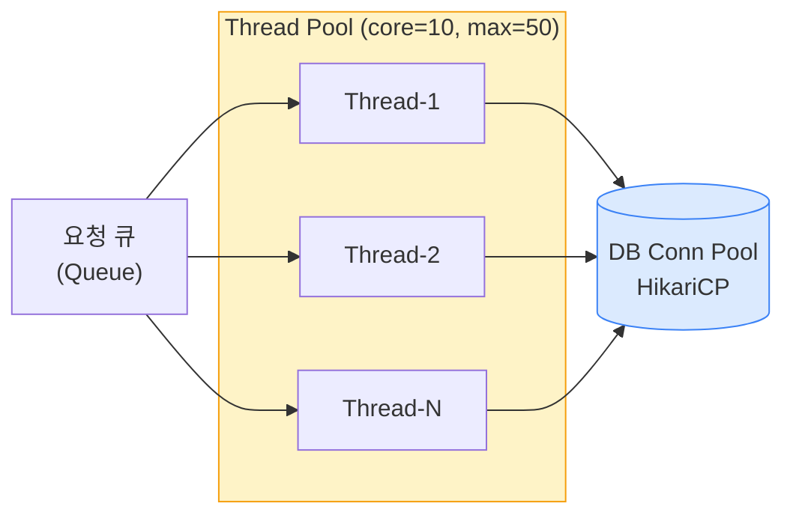
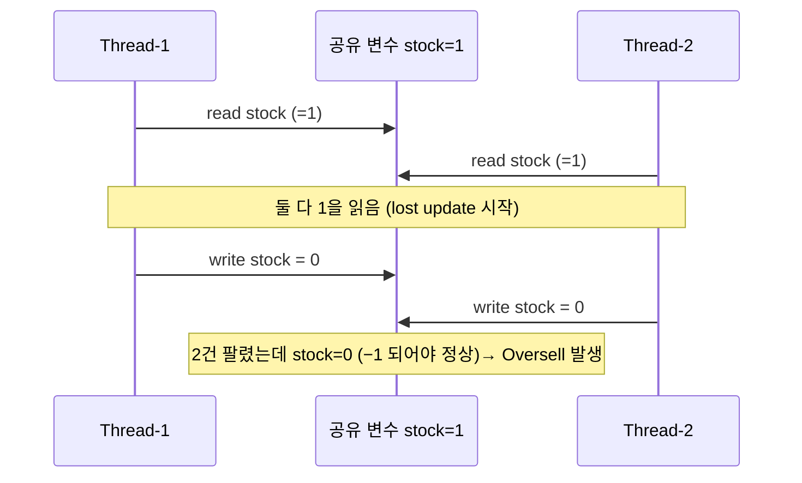
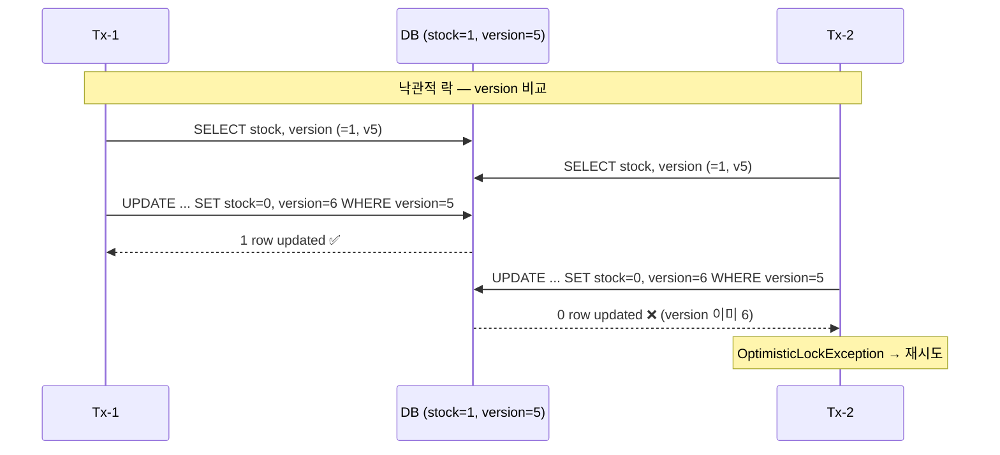
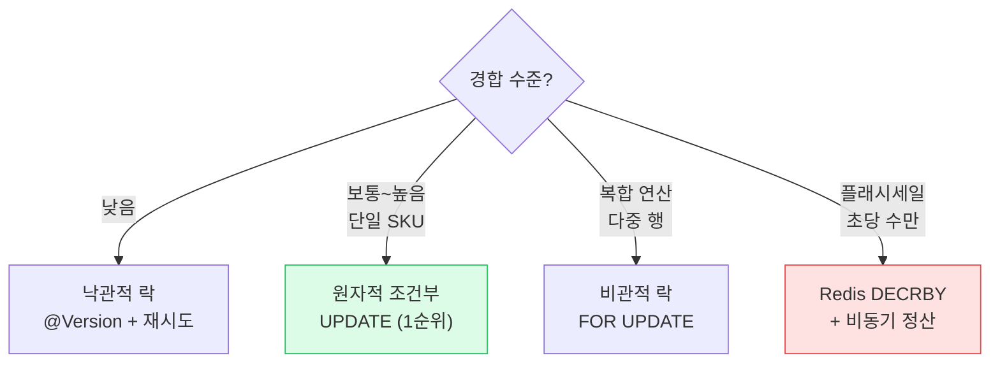

## 1. 스레드 · 스레드풀

JVM에서 요청 1건은 보통 스레드 1개가 처리한다(Servlet의 thread-per-request 모델). 스레드는 비싸므로 **스레드풀(Thread Pool)**로 재사용한다.



*스레드풀 ↔ 커넥션풀은 함께 사이징해야 함. 스레드 200개가 커넥션 10개를 두고 경쟁하면 대기 폭증*

> **⚠️ 실무 함정 — 풀 사이징 불균형**
>
> Tomcat 스레드 200개인데 HikariCP 커넥션 10개면, 190개 스레드가 커넥션을 기다리며 블로킹된다. 커넥션풀 권장 공식: `connections ≈ (core_count × 2) + effective_spindle_count` . 무작정 키우면 DB가 죽는다. 스레드풀과 커넥션풀, 다운스트림 타임아웃을 **한 세트로** 설계해야 함.

## 2. Race Condition — 경쟁 상태

`Race Condition(경쟁 상태)`은 둘 이상의 스레드가 공유 자원에 접근할 때, **실행 순서(interleaving)**에 따라 결과가 달라지는 버그다. 대표는 `read-modify-write`가 원자적이지 않을 때.



*Lost Update — 두 스레드가 같은 값을 읽고 각자 덮어쓰면 한 번의 갱신이 사라짐*

```sql
// 동시성 버그가 있는 코드 — 절대 이렇게 하지 말 것
fun decreaseStock(productId: Long) {
    val product = repository.findById(productId)   // read
    product.stock = product.stock - 1               // modify
    repository.save(product)                         // write
    // 두 스레드가 동시에 read 하면 둘 다 같은 stock 으로 -1 → lost update
}
```

## 3. JMM · 메모리 가시성

`JMM(Java Memory Model, 자바 메모리 모델)`은 "한 스레드의 쓰기가 다른 스레드에 언제 보이는가"를 정의한다. 각 스레드는 변수를 **CPU 캐시/레지스터에 복사**해서 쓰기 때문에, 동기화 없이는 다른 스레드의 변경이 영원히 안 보일 수 있다(가시성 문제).

```java
// volatile 없으면 worker가 stop 변경을 영영 못 볼 수 있음 (무한루프)
private volatile boolean stop = false;   // 가시성 보장

void worker() { while (!stop) { doWork(); } }   // 다른 스레드
void shutdown() { stop = true; }              // 메인 스레드
```

*`volatile`은 **가시성**과 **순서(happens-before)**는 보장하지만 **원자성**은 보장하지 않음 — `count++` 에는 부족*

| 도구 | 가시성 | 원자성 | 용도 |
| --- | --- | --- | --- |
| `volatile` | ✅ | ❌ | 플래그·상태 신호 (단일 쓰기) |
| `AtomicLong` / CAS | ✅ | ✅ | 카운터·증감 (lock-free) |
| `synchronized` / Lock | ✅ | ✅ (구간) | 복합 연산 보호 |

> **💡 happens-before**
>
> `synchronized` unlock → 다음 lock, `volatile` write → 다음 read 사이에 **happens-before 관계** 가 성립해, 그 이전의 모든 쓰기가 보이도록 보장된다. 동시성 코드의 정합성은 이 관계를 만족시키느냐로 판단.

## 4. 락 — 비관적 락 vs 낙관적 락

| 관점 | Pessimistic Lock (비관적 락) | Optimistic Lock (낙관적 락) |
| --- | --- | --- |
| 가정 | 충돌이 자주 난다 | 충돌이 드물다 |
| 구현 | `SELECT ... FOR UPDATE` (DB 행 잠금) | `@Version` 컬럼 비교 후 UPDATE |
| 충돌 시 | 대기 (블로킹) | 실패 → 재시도 (`OptimisticLockException`) |
| 장점 | 확실·재시도 불필요 | 락 대기 없음·읽기 성능 좋음 |
| 단점 | 락 경합·데드락·처리량 저하 | 경합 심하면 재시도 폭증 |
| 적합 | 인기 상품 한정 수량 (경합 심함) | 일반 상품 재고 (경합 낮음) |



*낙관적 락 — version이 안 맞으면 0 row 갱신 → 예외 → 애플리케이션이 재시도*

> **🎯 면접 포인트 — synchronized로는 왜 안 되나**
>
> "재고 차감을 `synchronized` 로 막으면 되지 않나요?" → **서버가 2대 이상이면 JVM 락은 무력** 하다(프로세스 경계를 못 넘음). 분산 환경에선 **DB 락 / Redis 분산락 / DB 원자 연산** 중 하나여야 한다. 단일 인스턴스 가정을 깨는 후속 질문이 반드시 온다. 🔥(Deep-dive)

## 5. Async · Non-blocking · 코루틴

블로킹 I/O는 스레드를 점유한 채 대기한다. 다운스트림 호출이 느리면 스레드풀이 고갈된다. 해법은 **Non-blocking I/O** 또는 **경량 동시성**이다.

- **CompletableFuture** — 콜백 체이닝, 블로킹 스레드 절약(별도 풀 필요)
- **WebFlux / Reactor** — 이벤트 루프 기반 Non-blocking, 적은 스레드로 높은 동시성. 단 학습·디버깅 비용 큼
- **Kotlin Coroutine** — `suspend` 함수로 동기 코드처럼 작성, 구조적 동시성. **코루틴 안에서 블로킹 호출 금지**(이벤트 루프 막힘)
- **Java 21 Virtual Thread** — 블로킹 코드 그대로 두고 경량 스레드로 확장(Project Loom)

```kotlin
// Kotlin Coroutine — 구조적 동시성. 두 호출을 병렬로
suspend fun getOrderDetail(id: Long): OrderDetail = coroutineScope {
    val order   = async { orderClient.fetch(id) }      // 병렬 시작
    val payment = async { paymentClient.fetch(id) }
    OrderDetail(order.await(), payment.await())          // 둘 다 완료 대기
    // scope 안에서 하나라도 실패하면 나머지도 자동 취소 (구조적 동시성)
}
```

> **⚠️ 실무 함정 — suspend에서 블로킹**
>
> 코루틴 `suspend` 함수 안에서 JDBC·RestTemplate 같은 블로킹 호출을 그대로 부르면, 한정된 디스패처 스레드를 막아 전체 처리량이 붕괴한다. 블로킹이 불가피하면 `withContext(Dispatchers.IO)` 로 격리해야 한다.

## 6. ⭐ 재고 차감 동시성 — 실전 4가지 해법

> **WMS / OMS 핵심 문제** — 동시에 1만 명이 한정 수량 상품을 주문할 때, *Oversell(초과판매)* 없이 정확히 차감하기

### 해법 1 — DB 원자적 조건부 UPDATE (1순위 추천)

```sql
// 가장 단순·강력. 락을 DB에 위임하고 race 자체를 제거
@Modifying
@Query("""
    UPDATE product
    SET stock = stock - :qty
    WHERE id = :id AND stock >= :qty
""")
fun decreaseStock(id: Long, qty: Int): Int   // 영향받은 행 수 반환

// 호출부 — 0이면 재고 부족
val updated = repository.decreaseStock(id, qty)
if (updated == 0) throw InsufficientStockException(id)
```

*`stock >= qty` 조건이 원자적으로 평가·갱신되어 Lost Update·Oversell 불가. 단일 SKU 경합에 가장 효율적*

### 해법 2 — 낙관적 락 (@Version)

```sql
@Entity
class Product(
    @Id val id: Long,
    var stock: Int,
    @Version var version: Long = 0   // JPA가 UPDATE 시 자동 비교
)

@Retryable(value = [OptimisticLockException::class], maxAttempts = 3,
           backoff = Backoff(delay = 50, multiplier = 2.0))   // 재시도 + backoff
@Transactional
fun decrease(id: Long, qty: Int) {
    val p = repository.findById(id).orElseThrow()
    if (p.stock < qty) throw InsufficientStockException(id)
    p.stock -= qty   // 커밋 시 version 안 맞으면 예외 → 재시도
}
```

*경합 낮을 때 좋음. 경합 심하면 재시도 폭증하므로 인기상품엔 부적합*

### 해법 3 — 비관적 락 (SELECT … FOR UPDATE)

```sql
@Lock(LockModeType.PESSIMISTIC_WRITE)
@Query("SELECT p FROM Product p WHERE p.id = :id")
fun findByIdForUpdate(id: Long): Product
// 락 타임아웃 필수 — 안 걸면 데드락/대기 폭주로 스레드풀 고갈
```

### 해법 4 — Redis 원자 연산 (분산락 대안, 초고경합)

```kotlin
// 플래시세일처럼 DB가 못 버틸 때 — Redis DECRBY로 선차감 후 비동기 정산
val remain = redisTemplate.opsForValue().decrement("stock:$id", qty.toLong())
if (remain != null && remain < 0) {
    redisTemplate.opsForValue().increment("stock:$id", qty.toLong())  // 보상
    throw InsufficientStockException(id)
}
// 차감 성공 → 주문 이벤트 발행 → DB는 비동기로 최종 정산 (eventual consistency)
```



*경합 수준에 따른 선택 트리 — 면접에서는 "상황에 따라 다르다"를 이 트리로 구체화*

> **🎯 면접 포인트 — 정답은 하나가 아니다**
>
> "재고 차감 어떻게 하시겠어요?"의 만점 답: **(1) 단일 SKU·일반 경합 → 원자적 조건부 UPDATE, (2) 멀티 라인 복합 → 비관적 락, (3) 플래시세일 → Redis 선차감 + 최종 일관성** . 그리고 "예약(Reserve)·만료(TTL)·확정(Commit) 3단계로 Oversell을 막는다"까지 연결하면 도메인 깊이가 드러난다. 🔥(Deep-dive)
