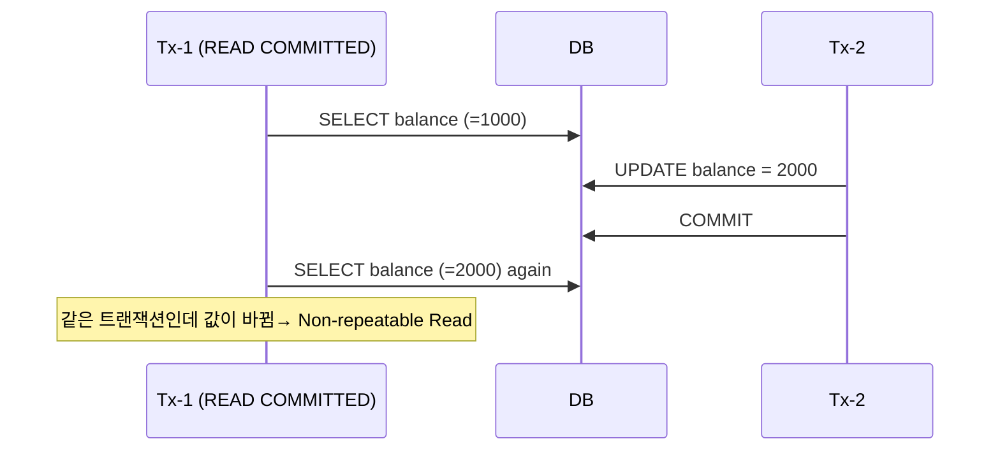
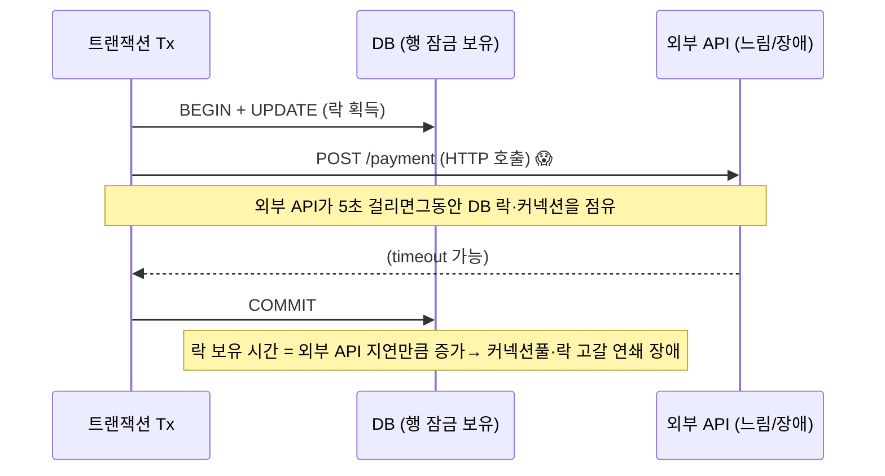
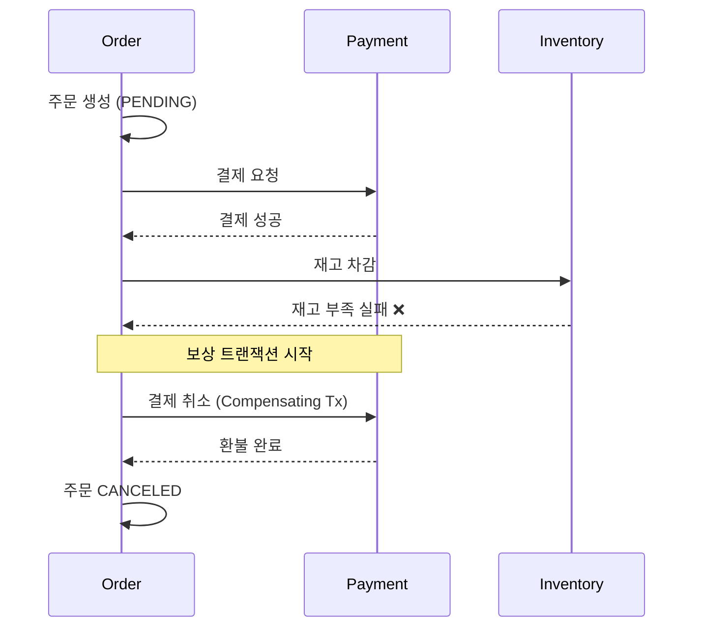

## 1. ACID

| 속성 | 의미 | 보장 주체 |
| --- | --- | --- |
| **Atomicity** (원자성) | 전부 성공 or 전부 롤백 — 부분 반영 없음 | Undo log |
| **Consistency** (일관성) | 제약조건·불변식이 트랜잭션 전후로 유지 | DB 제약 + 애플리케이션 |
| **Isolation** (격리성) | 동시 트랜잭션이 서로 간섭하지 않는 정도 | Lock / MVCC |
| **Durability** (지속성) | 커밋된 결과는 장애에도 보존 | Redo log / WAL |

> **💡 Isolation은 "정도(degree)"의 문제**
>
> A·C·D는 보통 보장 여부가 명확하지만, **Isolation은 격리수준에 따라 단계적으로 약해진다** . 성능과 정합성을 맞바꾸는 다이얼이며, 면접의 핵심도 여기다.

## 2. 격리수준과 이상현상(Anomaly)

| 격리수준 | Dirty Read | Non-repeatable Read | Phantom Read |
| --- | --- | --- | --- |
| READ UNCOMMITTED | 발생 | 발생 | 발생 |
| READ COMMITTED *(PostgreSQL 기본)* | 방지 | 발생 | 발생 |
| REPEATABLE READ *(MySQL InnoDB 기본)* | 방지 | 방지 | 발생* |
| SERIALIZABLE | 방지 | 방지 | 방지 |

* MySQL InnoDB는 REPEATABLE READ에서도 Next-Key Lock으로 Phantom을 상당 부분 방지한다(표준과 차이).

#### 이상현상 정의

- **Dirty Read**: 커밋 안 된 데이터를 읽음 → 롤백되면 유령 데이터
- **Non-repeatable Read**: 같은 행을 두 번 읽었는데 값이 다름(중간에 다른 Tx가 UPDATE·커밋)
- **Phantom Read**: 같은 조건 범위 조회를 두 번 했는데 행 개수가 다름(다른 Tx가 INSERT)



*Non-repeatable Read — REPEATABLE READ로 올리면 T1은 스냅샷(MVCC)으로 계속 1000을 본다*

> **⚠️ 실무 함정 — DB마다 기본값이 다르다**
>
> **MySQL InnoDB = REPEATABLE READ, PostgreSQL/Oracle = READ COMMITTED.** 같은 코드도 DB가 다르면 정합성 동작이 달라진다. 테스트를 H2로만 돌리면 이 차이를 못 잡는다 → [Testcontainers로 실제 DB 테스트](05-testing.html) 필요. 🔥(Deep-dive)

> **🎯 면접 포인트 — 격리수준은 동시성 버그를 다 막지 못한다**
>
> "재고 차감은 격리수준 올리면 안전한가요?" → **아니다.** SERIALIZABLE도 처리량을 크게 떨어뜨리고, 일반적으로는 **낙관적 락·원자적 UPDATE** (02번 페이지)가 정답이다. 격리수준과 락은 서로 보완하는 다른 도구임을 구분해야 한다.

## 3. 트랜잭션 전파 (Propagation)

이미 트랜잭션이 진행 중일 때, 새 `@Transactional` 메서드를 만나면 어떻게 할지 정하는 규칙이다.

| 전파 속성 | 기존 Tx 있을 때 | 대표 용도 |
| --- | --- | --- |
| **REQUIRED** (기본) | 참여 (같은 Tx) | 대부분의 비즈니스 로직 |
| **REQUIRES_NEW** | 기존 Tx 일시정지 후 새 Tx 시작 | 로그·이력은 실패해도 본 작업 롤백 안 되게 |
| **NESTED** | Savepoint로 부분 롤백 가능 | 일부만 되돌리고 싶을 때 (JDBC 한정) |
| **SUPPORTS** | 있으면 참여, 없으면 비트랜잭션 | 조회성 메서드 |
| **MANDATORY** | 없으면 예외 | 반드시 Tx 안에서만 호출돼야 하는 내부 메서드 |

```kotlin
// REQUIRES_NEW — 주문은 실패해도 "감사 로그"는 남기고 싶을 때
@Service
class OrderService(private val auditService: AuditService) {

    @Transactional   // REQUIRED
    fun placeOrder(cmd: PlaceOrder) {
        auditService.log("order attempt")   // 별도 Tx로 커밋됨
        validateAndSave(cmd)                  // 여기서 실패해도 위 로그는 살아있음
    }
}

@Service
class AuditService {
    @Transactional(propagation = Propagation.REQUIRES_NEW)
    fun log(msg: String) { auditRepo.save(AuditLog(msg)) }
}
```

*REQUIRES_NEW는 별도 커넥션을 쓴다 → 남발하면 커넥션풀 고갈. 의도가 명확할 때만 사용*

## 4. 트랜잭션 경계 안티패턴

### 안티패턴 1 — @Transactional 자기 호출 (Self-invocation)

```kotlin
@Service
class OrderService {
    fun outer() {
        inner()   // ❌ 프록시를 거치지 않는 직접 호출 → @Transactional 무시됨
    }
    @Transactional
    fun inner() { ... }   // 트랜잭션이 안 열린다!
}
```

*Spring AOP는 프록시 기반 — 같은 객체 내부 호출은 프록시를 안 거쳐 어드바이스가 적용 안 됨. 별도 빈으로 분리하거나 self-injection으로 해결*

### 안티패턴 2 — 트랜잭션 안에서 외부 호출 (가장 중요)



*트랜잭션 내 HTTP/Kafka 호출 — 외부 지연이 DB 락 보유 시간으로 전이되어 전체 장애로 번짐*

> **⚠️ 핵심 — 트랜잭션은 짧고, 외부 호출은 밖에서**
>
> 트랜잭션 안에서 **HTTP 호출·메시지 발행** 을 하면 (1) DB 락 점유 시간 폭증, (2) 외부 성공·DB 롤백 시 분산 불일치(메시지는 나갔는데 주문은 롤백). 해법은 **Transactional Outbox 패턴** — 같은 Tx로 outbox 테이블에 이벤트를 INSERT하고, 별도 프로세스가 발행. 🔥(Deep-dive)

### 안티패턴 3 — 경계가 너무 넓음 + readOnly 누락

```kotlin
// ✅ 조회 전용엔 readOnly=true — 더티체킹 비활성·DB 최적화·복제본 라우팅 가능
@Transactional(readOnly = true)
fun getOrder(id: Long): OrderView = ...

// ❌ 컨트롤러 전체를 한 트랜잭션으로 감싸 외부호출·연산까지 포함 → long transaction
```

### 안티패턴 4 — @Async / @Scheduled 에 @Transactional 기대

`@Async` 메서드는 **다른 스레드**에서 실행되므로 호출자 트랜잭션이 전파되지 않는다. 트랜잭션이 필요하면 비동기 메서드 내부에서 새로 열어야 한다. 자기 호출 문제와 마찬가지로 프록시 경계를 이해해야 한다.

## 5. 분산 트랜잭션 개요

> **OMS 현실** — 주문·결제·재고가 *서로 다른 서비스/DB*에 있으면 단일 `@Transactional`로 묶을 수 없다

| 방식 | 일관성 | 가용성 | 현실 채택 |
| --- | --- | --- | --- |
| **2PC** (Two-Phase Commit) | 강함 (강한 일관성) | 낮음 (코디네이터 SPOF·블로킹) | MSA에선 기피 |
| **Saga** (보상 트랜잭션) | 최종 일관성 | 높음 | MSA 표준 |
| **Outbox + CDC** | 최종 일관성 (메시지 유실 방지) | 높음 | 이벤트 발행 신뢰성 확보 |



*Saga — 각 단계는 로컬 트랜잭션. 실패하면 이전 단계를 보상(취소)으로 되돌림. 자세한 설계는 architecture 영역*

> **🎯 면접 포인트 — 2PC를 왜 안 쓰나**
>
> "분산 트랜잭션이면 2PC 쓰면 되지 않나요?" → **코디네이터 장애 시 참여자들이 락을 잡은 채 블로킹** 되고, 가용성·확장성이 무너진다. MSA에선 **Saga + 최종 일관성** 으로 가고, 멱등성·보상·타임아웃을 설계하는 게 정석. 상세는 `backend-architecture-coach` 영역(Saga·Outbox·Idempotency).
