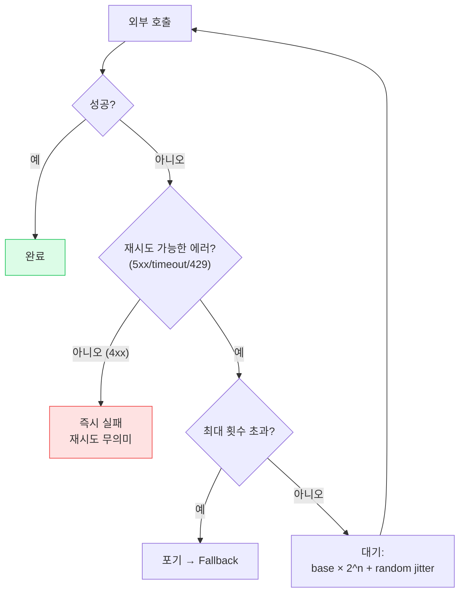
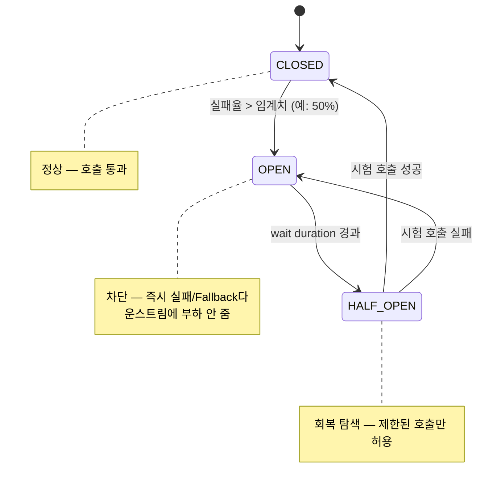
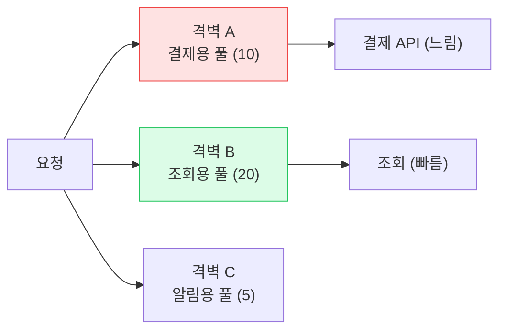
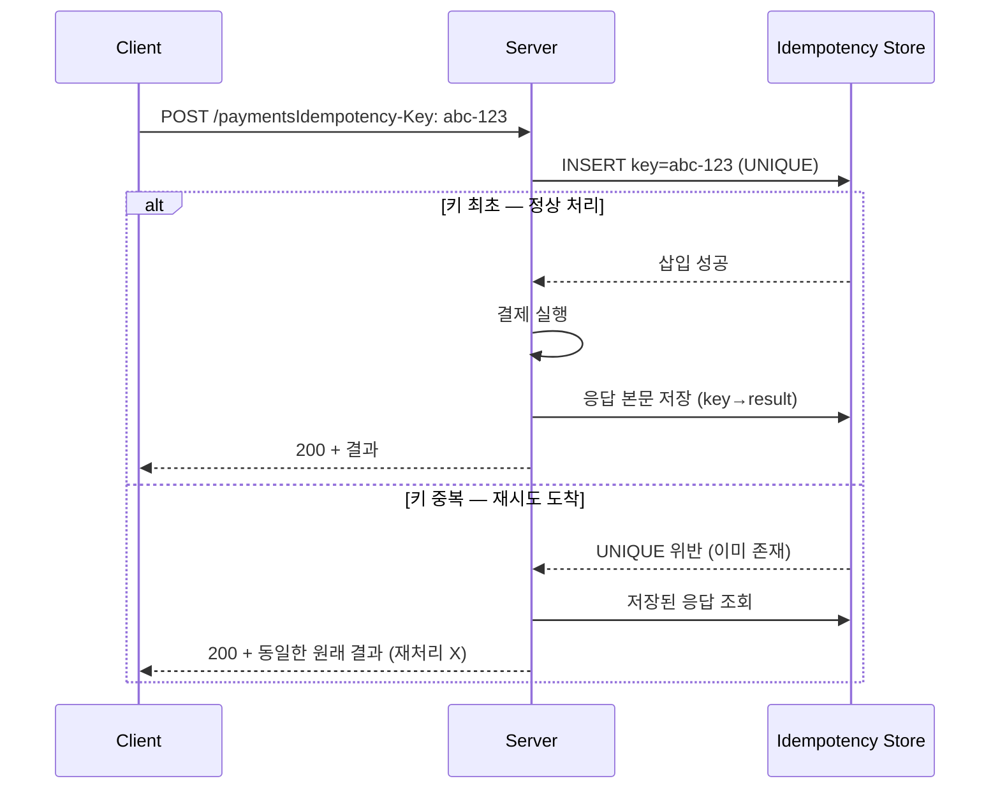

## 1. Timeout — 모든 복원력의 출발점

Timeout이 없으면 다른 모든 패턴이 의미 없다. 응답 없는 호출이 스레드를 무한 점유하면 **스레드풀 고갈 → 캐스케이딩 장애(Cascading Failure)**로 번진다.

> **⚠️ 실무 함정 — 기본 타임아웃 무한대**
>
> RestTemplate·일부 HTTP 클라이언트는 기본 타임아웃이 **무한대(0)** 다. 연결(connect)·읽기(read) 타임아웃을 반드시 명시해야 한다. 또한 **다운스트림 타임아웃 < 업스트림 타임아웃** 규칙을 지켜야 안쪽이 먼저 끊겨 자원을 회수한다.

```kotlin
// WebClient — connect/response 타임아웃 명시
val client = WebClient.builder()
    .clientConnector(ReactorClientHttpConnector(
        HttpClient.create()
            .responseTimeout(Duration.ofSeconds(2))          // 읽기 타임아웃
            .option(ChannelOption.CONNECT_TIMEOUT_MILLIS, 500) // 연결 타임아웃
    )).build()
```

## 2. Retry · Backoff · Jitter

일시적(transient) 장애는 재시도로 회복된다. 단 **(1) 멱등 연산만, (2) 지수 백오프 + 지터, (3) 최대 횟수** 세 조건을 지켜야 한다.



*재시도 결정 트리 — 4xx는 재시도 금지, 지수 백오프에 지터를 더해 동시 재시도 충돌 방지*

#### 왜 Jitter(지터)가 필요한가

장애 후 모든 클라이언트가 *정확히 같은 간격*으로 재시도하면 **Thundering Herd(동시 재시도 폭주)**가 발생해 막 회복한 서버를 다시 죽인다. 각 클라이언트의 대기 시간에 랜덤성을 더해 분산시킨다.

```kotlin
// Resilience4j — 지수 백오프 + 지터 + 재시도 대상 한정
val config = RetryConfig.custom<Any>()
    .maxAttempts(3)
    .intervalFunction(IntervalFunction.ofExponentialRandomBackoff(
        Duration.ofMillis(100),  // initial
        2.0,                     // multiplier
        0.5))                    // jitter factor (±50%)
    .retryExceptions(IOException::class.java, TimeoutException::class.java)
    .ignoreExceptions(BadRequestException::class.java)  // 4xx는 재시도 안 함
    .build()
```

> **⚠️ 실무 함정 — 다층 재시도 곱셈**
>
> 클라이언트 3회 × 게이트웨이 3회 × 서비스 3회 = **최대 27배 트래픽** . 재시도는 **한 레이어에서만** 하거나, 안쪽 레이어는 재시도하지 않도록 설계해야 한다. 비멱등 연산(POST)을 재시도하면 중복 생성 — 그래서 멱등성(5절)이 필수.

## 3. Circuit Breaker — 회로 차단기

다운스트림이 계속 실패하는데 재시도를 반복하면 자원만 낭비한다. `Circuit Breaker(회로 차단기)`는 실패율이 임계치를 넘으면 **회로를 열어 즉시 실패(Fail-fast)**시키고, 일정 시간 후 시험 호출로 회복을 탐지한다.



*Circuit Breaker 상태 머신 — OPEN 상태에서 다운스트림을 쉬게 해 회복을 돕는다*

```kotlin
@CircuitBreaker(name = "paymentService", fallbackMethod = "payFallback")
@Retry(name = "paymentService")
fun pay(cmd: PayCommand): PayResult = paymentClient.call(cmd)

// Fallback — 회로가 열렸을 때 호출됨 (큐잉·캐시·대체 응답)
fun payFallback(cmd: PayCommand, e: Throwable): PayResult {
    log.warn("payment circuit open, queueing: {}", cmd.orderId)
    return PayResult.deferred(cmd.orderId)   // 나중에 재처리
}
```

*Resilience4j 적용 순서: Retry가 CircuitBreaker를 감싼다(재시도 후에도 실패하면 회로 카운트 반영)*

> **💡 Netflix Hystrix → Resilience4j**
>
> Netflix가 Hystrix로 대중화한 패턴. 지금은 Hystrix가 유지보수 종료되어 **Resilience4j** 가 사실상 표준이다. 함수형·경량이고 Retry/CB/Bulkhead/RateLimiter를 모듈로 조합한다.

## 4. Bulkhead — 격벽 격리

배의 격벽처럼, 한 다운스트림 호출이 **전체 스레드풀을 독점**하지 못하게 자원을 칸막이로 나눈다. 느린 결제 API가 주문 조회 스레드까지 잡아먹는 사태를 막는다.



*Bulkhead — 결제용 풀이 고갈돼도 조회용 풀은 멀쩡 → 장애 격리*

| 패턴 | 막는 문제 | 핵심 파라미터 |
| --- | --- | --- |
| Timeout | 무한 대기 | connect / read timeout |
| Retry | 일시적 실패 | maxAttempts, backoff, jitter |
| Circuit Breaker | 지속 실패에 자원 낭비 | failureRate, waitDuration |
| Bulkhead | 한 호출의 자원 독점 | maxConcurrentCalls |
| Rate Limiter | 과부하·다운스트림 보호 | limitForPeriod |

## 5. ⭐ Idempotency-Key 설계 — 비멱등 POST 길들이기

> **결제 · 주문 핵심** — 네트워크 타임아웃 후 클라이언트가 재시도해도 *이중 결제·중복 주문*이 안 나게

클라이언트가 요청마다 **고유 키(UUID)**를 `Idempotency-Key` 헤더로 보낸다. 서버는 이 키로 "이미 처리한 요청인지"를 판별하고, 처리했다면 **저장해둔 원래 응답**을 그대로 반환한다(재처리 안 함). 토스·Stripe 결제 API의 표준 방식.



*Idempotency-Key 흐름 — UNIQUE 제약으로 동시 중복까지 원자적으로 차단*

```kotlin
@Transactional
fun pay(key: String, cmd: PayCommand): PayResult {
    // 1) UNIQUE 제약으로 선점 시도 — 동시 중복도 DB가 막아줌
    val claimed = idempotencyRepo.tryInsert(key, status = PROCESSING)
    if (!claimed) {
        val existing = idempotencyRepo.find(key)
        return when (existing.status) {
            DONE       -> existing.toResult()        // 저장된 응답 재반환
            PROCESSING -> throw RequestInProgressException()  // 409
        }
    }
    // 2) 실제 결제 (최초 1회만)
    val result = paymentGateway.charge(cmd)
    idempotencyRepo.complete(key, result)            // status=DONE + 응답 저장
    return result
}
```

> **⚠️ 실무 함정 — 키의 TTL과 요청 본문 일치 검증**
>
> (1) 멱등 키 저장에 **TTL(24h 등)** 을 두지 않으면 테이블이 무한 증가한다. (2) 같은 키로 **다른 본문** 이 오면 `422` 로 거부해야 한다(키 재사용 공격·버그 방지). Stripe는 키+요청 해시를 함께 검증한다.

> **🎯 면접 포인트 — 멱등성 ≠ 재시도 안전**
>
> "재시도하면 중복 안 나게 하려면?" → 단순 "키 저장"이 아니라 **동시에 같은 키 2개가 들어올 때** 를 어떻게 막느냐가 핵심. `UNIQUE 제약 + 원자적 선점` 으로 답해야 한다. 분산락보다 DB UNIQUE가 단순·견고. 🔥(Deep-dive)

## 6. 멱등 소비자 — Kafka At-least-once 다루기

> **TMS / Last-mile** — TrackingEvent가 *중복 수신*돼도 상태가 망가지지 않게

Kafka는 기본 **At-least-once(최소 1회)** 전달이다. 리밸런싱·재처리로 같은 메시지가 두 번 올 수 있다. 소비자는 **멱등하게** 처리하거나, **처리 이력(dedup)**을 둬야 한다.

```kotlin
@KafkaListener(topics = ["tracking-events"])
fun onEvent(event: TrackingEvent, ack: Acknowledgment) {
    // 1) 이벤트 고유 ID로 중복 판별 (UNIQUE)
    if (processedRepo.existsById(event.eventId)) {
        ack.acknowledge(); return   // 이미 처리 — skip
    }
    // 2) 비즈니스 처리 + 처리 마킹을 같은 트랜잭션으로
    shipmentService.applyTracking(event)
    processedRepo.save(ProcessedEvent(event.eventId))
    ack.acknowledge()   // 수동 커밋 — 처리 성공 후에만
}
```

*자동 커밋(enable.auto.commit=true)은 처리 전에 오프셋이 커밋돼 유실 위험 → 수동 커밋 + dedup 권장*

> **⚠️ 실무 함정 — 자동 커밋 + 비멱등 처리 = 유실/중복**
>
> Kafka 자동 커밋이 켜진 채 처리 중 죽으면, 오프셋은 이미 넘어가 **유실** 되거나 재시작 후 **중복** 처리된다. "Exactly-once"는 트랜잭션·idempotent producer로 가능하지만 비용·제약이 크다. 실무는 보통 **At-least-once + 멱등 소비자** 로 푼다.
