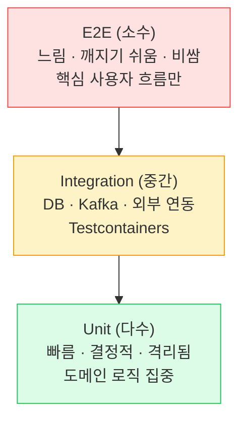
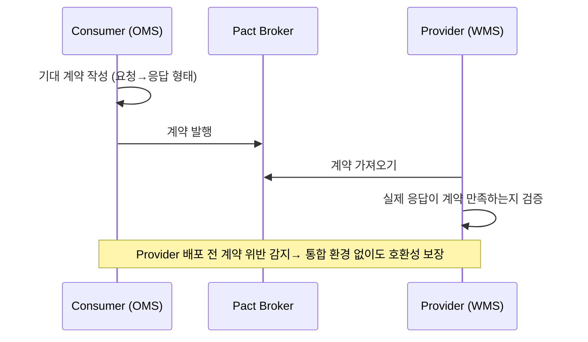

## 1. 테스트 피라미드



*아래로 갈수록 많고 빠르게. E2E를 너무 많이 쌓으면 "아이스크림 콘 안티패턴" — 느리고 불안정*

> **⚠️ 안티패턴 — Ice Cream Cone**
>
> Unit이 적고 E2E·수동 테스트가 많은 역피라미드. 빌드가 30분씩 걸리고 Flaky(불안정) 테스트로 신뢰를 잃는다. 도메인 로직은 **빠른 Unit으로 두텁게** , 연동 지점만 Integration으로 검증하는 게 원칙.

## 2. 테스트 더블 (Test Doubles)

| 종류 | 역할 | 예시 |
| --- | --- | --- |
| **Dummy** | 전달만 되고 안 쓰임 | 채우기용 인자 |
| **Stub** | 정해진 값 반환 | `when(repo.find()).thenReturn(x)` |
| **Mock** | 호출 여부·횟수 검증 | `verify(client).send(...)` |
| **Spy** | 실제 객체 일부만 가로채기 | 실 객체 + 특정 메서드 stub |
| **Fake** | 가벼운 실제 구현 | 인메모리 Repository |

> **💡 Mock 남용 경계**
>
> 모든 의존을 Mock하면 "구현을 테스트"하게 되어 리팩터링마다 깨진다. **경계(외부 시스템)는 Mock/Fake, 도메인 내부는 실제 객체** 로 두는 게 견고한 테스트의 핵심. "Mockist vs Classicist" 논쟁의 실용적 절충.

## 3. Unit 테스트 — 도메인 로직

```kotlin
// 테스트 이름: 메서드_상황_기대결과
class StockTest {
    @Test
    fun `decrease_재고보다많이차감_예외발생`() {
        val stock = Stock(quantity = 3)
        assertThrows<InsufficientStockException> {
            stock.decrease(5)
        }
    }

    @Test
    fun `decrease_정상차감_수량감소`() {
        val stock = Stock(quantity = 3)
        stock.decrease(2)
        assertThat(stock.quantity).isEqualTo(1)
    }
}
```

*도메인 불변식(재고는 음수 불가)을 객체 자체가 강제하는지 검증 — DB·스프링 없이 즉시 실행*

> **💡 좋은 Unit 테스트 — F.I.R.S.T**
>
> **F** ast(빠름)· **I** solated(독립)· **R** epeatable(반복 가능)· **S** elf-validating(자가 검증)· **T** imely(적시). 시간( `now()` )·랜덤·순서 의존을 주입 가능하게 만들면 Flaky가 사라진다.

## 4. ⭐ Integration 테스트 — Testcontainers

> **핵심 메시지** — 통합 테스트는 *진짜 DB·Kafka*로 — H2로는 잡을 수 없는 버그가 있다

```kotlin
@SpringBootTest
@Testcontainers
class OrderRepositoryTest {

    companion object {
        @Container
        val postgres = PostgreSQLContainer("postgres:16")   // 운영과 동일 엔진

        @JvmStatic @DynamicPropertySource
        fun props(registry: DynamicPropertyRegistry) {
            registry.add("spring.datasource.url", postgres::getJdbcUrl)
            registry.add("spring.datasource.username", postgres::getUsername)
            registry.add("spring.datasource.password", postgres::getPassword)
        }
    }

    @Test
    fun `재고차감_조건부UPDATE_부족시0행`() {
        val updated = repository.decreaseStock(id = 1L, qty = 999)
        assertThat(updated).isEqualTo(0)   // 실제 PostgreSQL에서 검증
    }
}
```

*Docker로 실제 PostgreSQL 컨테이너를 띄워 테스트. 배민·토스 등 다수 기업이 표준으로 사용*

> **🎯 면접 포인트 — 왜 H2로 통합 테스트하면 안 되나**
>
> **(1) SQL 방언 차이** ( `FOR UPDATE` , upsert, JSON 함수가 다르게 동작), **(2) 격리수준 기본값 차이** (03번 페이지), **(3) 시퀀스·인덱스·제약 동작 차이** . H2에서 통과한 테스트가 운영 MySQL/PostgreSQL에서 깨지는 일이 흔하다. Testcontainers로 **운영과 같은 엔진** 을 써야 진짜 검증이 된다. 🔥(Deep-dive)

#### 슬라이스 테스트 — 필요한 만큼만

- `@DataJpaTest` — JPA 레이어만 (단, 기본 H2 → Testcontainers로 교체 권장)
- `@WebMvcTest` — 컨트롤러·직렬화·검증만, 서비스는 Mock
- `@SpringBootTest` — 전체 컨텍스트 (느림, 핵심 흐름만)

## 5. Contract 테스트 — 서비스 간 계약

MSA에서 OMS와 WMS가 각자 배포된다. WMS가 응답 필드를 바꾸면 OMS가 깨진다. `Contract(계약) 테스트`는 **"이 API는 이런 형태로 응답한다"**는 계약을 양쪽이 공유·검증한다(Pact, Spring Cloud Contract).



*Consumer-Driven Contract — 소비자가 정의한 기대를 제공자가 CI에서 검증. E2E 없이 호환성 확보*

> **💡 Contract 테스트의 가치**
>
> 전체 환경을 띄우는 E2E보다 **훨씬 빠르고 안정적** 으로 "API 깨짐"을 잡는다. MSA가 많아질수록 E2E는 조합 폭발하므로, Contract가 그 빈틈을 메운다. 단, 비즈니스 로직 자체는 검증 안 함(형태/호환성만).

## 6. 동시성 테스트 — 재고 차감 검증

02번에서 만든 재고 차감이 정말 동시성 안전한지, **여러 스레드로 동시에 때려서** 검증한다. 단일 스레드 테스트로는 Race Condition을 절대 못 잡는다.

```kotlin
@Test
fun `재고100_100명동시주문_정확히0`() {
    val threads = 100
    val latch = CountDownLatch(threads)
    val pool = Executors.newFixedThreadPool(32)

    repeat(threads) {
        pool.submit {
            try { stockService.decrease(productId = 1L, qty = 1) }
            catch (e: Exception) { /* 부족 예외 카운트 */ }
            finally { latch.countDown() }
        }
    }
    latch.await(10, TimeUnit.SECONDS)   // 모든 스레드 완료 대기

    val remaining = repository.findById(1L).stock
    assertThat(remaining).isEqualTo(0)  // Oversell 없으면 정확히 0
    // 버그 있으면(naive read-modify-write) remaining > 0 으로 깨짐
}
```

*`CountDownLatch`로 모든 스레드를 동시 출발·완료 대기. 동시성 버그가 있으면 이 테스트가 실패*

> **⚠️ 실무 함정 — Flaky 동시성 테스트**
>
> 동시성 테스트는 타이밍 의존이라 가끔 통과/실패할 수 있다. (1) 충분한 스레드 수·반복, (2) 명확한 동기화(latch), (3) `@DirtiesContext` 로 상태 격리. 그래도 불안정하면 부하 테스트(Gatling/JMeter)로 보완. **Testcontainers + 실제 DB** 에서 돌려야 락 동작까지 검증된다.
