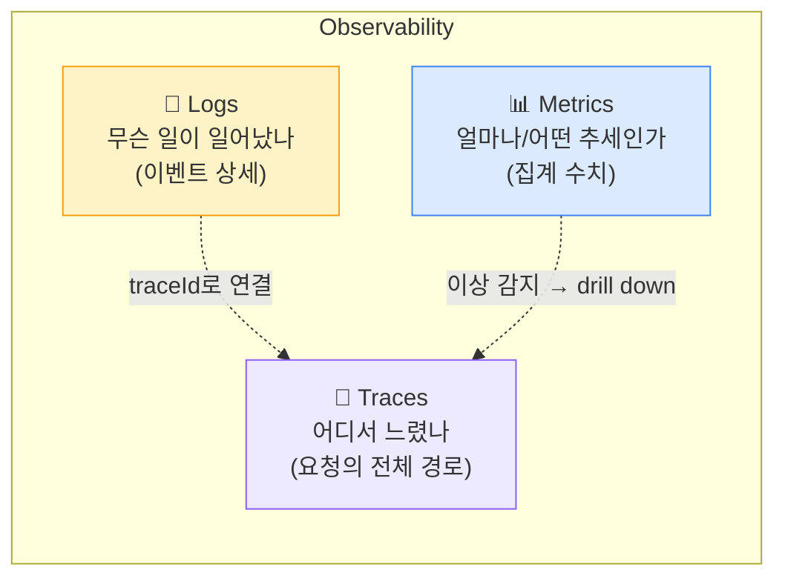
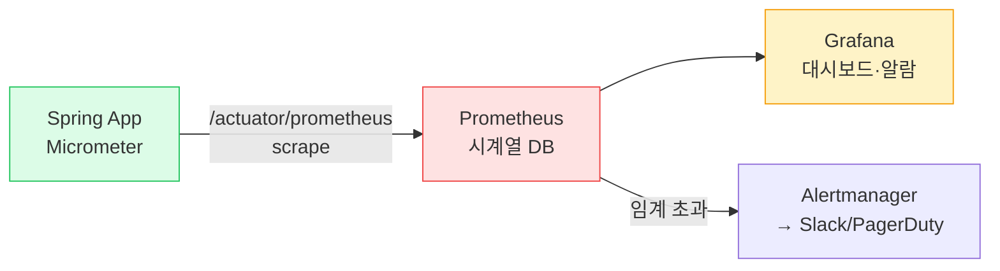
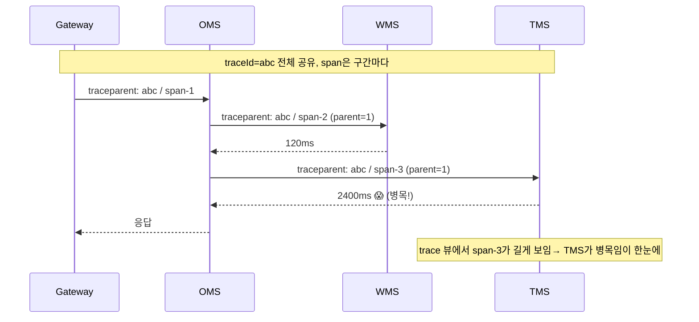
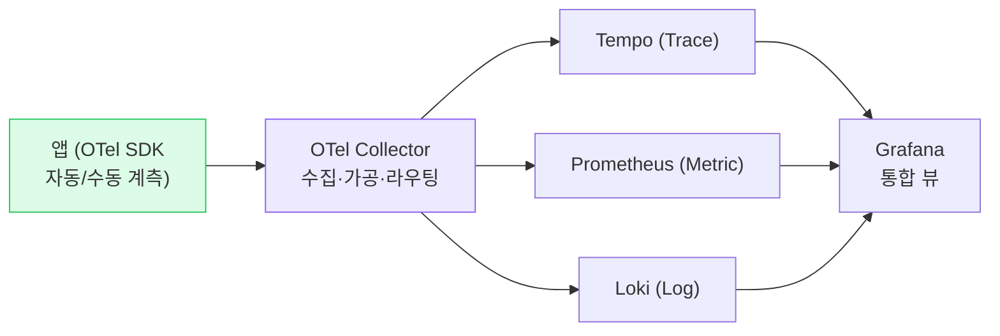

## 1. 관측성의 세 기둥



*Logs·Metrics·Traces는 따로가 아니라 traceId로 묶여야 진짜 가치 — "메트릭에서 이상 → 트레이스로 추적 → 로그로 원인"*

> **💡 Monitoring vs Observability**
>
> **모니터링** 은 "미리 정한 질문에 답"(CPU 80% 넘으면 알람). **관측성** 은 "예상 못한 질문에 답"(왜 특정 사용자만 느린가). 세 기둥을 잘 엮으면 새 대시보드 없이도 새로운 질문에 답할 수 있다.

## 2. 구조적 로깅 (Structured Logging)

문자열 로그는 사람만 읽는다. **JSON 구조적 로그**는 기계가 파싱·검색·집계한다. Loki·ELK에서 필드로 쿼리하려면 필수다.

```
// ❌ 비구조적 — 파싱 불가, traceId 없음
log.info("order created for user kim, id=42")

// ✅ 구조적 — MDC로 traceId·userId를 모든 로그에 자동 부착
MDC.put("traceId", traceId)
MDC.put("orderId", "42")
log.info("order created")   // → {"msg":"order created","traceId":"...","orderId":"42","level":"INFO"}
```

> **⚠️ 실무 함정 — PII / 토큰 로깅 + 예외 삼키기**
>
> **(1) PII 마스킹** : 주민번호·카드번호·토큰을 로그에 찍으면 보안 사고·법규 위반. 직렬화 단계에서 마스킹. **(2) 예외 삼키기 금지** : `catch (e) {}` 로 삼키면 장애가 사일런트로 사라진다. 반드시 컨텍스트와 함께 로깅하거나 다시 던질 것.

#### 로그 레벨 규율

- `ERROR` — 즉시 조치 필요(알람 연결). 남발하면 알람 피로
- `WARN` — 잠재 문제(재시도 발생, 폴백 동작)
- `INFO` — 비즈니스 이벤트(주문 생성)
- `DEBUG` — 개발용 상세, 운영에선 끔

## 3. 메트릭 — RED / USE 방법론

| 방법론 | 대상 | 지표 |
| --- | --- | --- |
| **RED** (요청 중심) | 서비스·API (트래픽 받는 것) | **R**ate(처리율)·**E**rrors(에러율)·**D**uration(지연) |
| **USE** (자원 중심) | 리소스 (CPU·메모리·디스크·풀) | **U**tilization(사용률)·**S**aturation(포화)·**E**rrors |

```kotlin
// Micrometer — RED 지표를 Prometheus로 노출
@Timed(value = "order.place", percentiles = [0.5, 0.95, 0.99])  // Duration
fun placeOrder(cmd: PlaceOrder): Order { ... }

// Rate·Errors — 카운터
meterRegistry.counter("order.placed", "channel", cmd.channel).increment()
meterRegistry.counter("order.failed", "reason", e.code).increment()
```

> **🎯 면접 포인트 — 평균(avg)이 아니라 백분위(percentile)**
>
> "응답시간 어떻게 봐요?" → **평균은 거짓말** . avg 100ms여도 p99가 3초면 1%의 사용자가 끔찍한 경험을 한다. **p50·p95·p99** 로 봐야 한다(특히 꼬리 지연 Tail latency). 그리고 여러 서버 p99를 단순 평균하면 안 되고 히스토그램으로 집계해야 한다. 🔥(Deep-dive)



*Micrometer → Prometheus → Grafana 표준 스택. Prometheus가 주기적으로 scrape(pull)*

## 4. ⭐ 분산 추적 · 상관관계 ID

> **MSA 디버깅 핵심** — 한 요청이 OMS→WMS→TMS 5개 서비스를 거칠 때, *어디서 느렸는지*를 하나의 trace로 추적

`TraceId(추적 ID)`는 요청 전체에 하나, `SpanId(스팬 ID)`는 각 서비스 구간마다 부여된다. 서비스 간 호출 시 HTTP 헤더(**W3C Trace Context** 표준 `traceparent`)로 전파된다.



*분산 추적 — 같은 traceId로 묶인 span들의 길이를 비교해 병목 서비스를 즉시 식별(Jaeger/Tempo 워터폴 뷰)*

```
// Spring Boot 3 + Micrometer Tracing — traceId/spanId가 MDC에 자동 주입
// logback 패턴에 %X{traceId} 추가하면 모든 로그에 traceId가 박힘
<pattern>%d %-5level [%X{traceId:-},%X{spanId:-}] %logger - %msg%n</pattern>

// 그러면 에러 로그의 traceId를 Jaeger에 넣어 전체 요청 흐름을 본다
// → 로그(원인) ↔ 트레이스(경로) ↔ 메트릭(추세) 삼각 연결 완성
```

> **⚠️ 실무 함정 — 컨텍스트 전파 끊김**
>
> 비동기(@Async)·스레드풀·Kafka 경계에서 **traceId가 안 넘어가** trace가 끊긴다. 메시지 헤더에 trace context를 실어 보내고, 컨슈머에서 복원해야 한다. 비동기에서 MDC가 사라지는 문제는 `TaskDecorator` 로 컨텍스트를 복사해 해결.

> **🎯 면접 단골 — Last-mile TrackingEvent 추적**
>
> "수천만 TrackingEvent가 흐르는데 특정 운송장이 어디서 막혔는지 어떻게 찾나요?" → **운송장 번호를 상관관계 ID로 모든 로그·이벤트에 부착** + 분산 추적. 단, 전수 trace는 비싸므로 **Sampling(샘플링)** 으로 일부만 수집하되 에러는 100% 수집(tail-based sampling).

## 5. OpenTelemetry (OTel)

`OpenTelemetry(OTel)`는 Logs·Metrics·Traces를 **벤더 중립 표준**으로 수집·내보내는 프레임워크다. 계측 코드를 한 번 작성하면 Jaeger·Tempo·Datadog 어디로든 보낼 수 있다(백엔드 종속 제거).



*OTel Collector가 중앙 허브 — 앱은 표준 형식으로만 보내고, 백엔드 교체는 Collector 설정만 바꾸면 됨*

> **💡 왜 OTel이 표준이 됐나**
>
> 과거엔 APM 벤더마다 에이전트가 달라 종속(lock-in)됐다. OTel(CNCF 프로젝트)은 **계측과 백엔드를 분리** 해 종속을 끊었다. Spring Boot는 Micrometer Observation API로 OTel과 연동된다. 신규 시스템 설계 시 "OTel 기반으로 간다"가 무난한 답.

## 6. SLI / SLO / SLA

| 용어 | 의미 | 예시 |
| --- | --- | --- |
| **SLI** (Indicator, 지표) | 측정하는 실제 수치 | 최근 5분 성공 요청 비율 = 99.95% |
| **SLO** (Objective, 목표) | SLI가 만족해야 할 내부 목표 | "가용성 99.9% 이상" |
| **SLA** (Agreement, 협약) | 고객과의 계약 + 위반 시 보상 | "99.5% 미만 시 요금 10% 환불" |

> **💡 Error Budget(에러 예산)**
>
> SLO가 99.9%면 0.1%는 "실패해도 되는 예산"이다. 예산이 남으면 **배포·실험을 공격적으로** , 예산을 다 쓰면 **안정화에 집중** . 신뢰성과 개발 속도를 정량적으로 조율하는 SRE 핵심 도구. SLA는 SLO보다 느슨하게 잡아 버퍼를 둔다.
