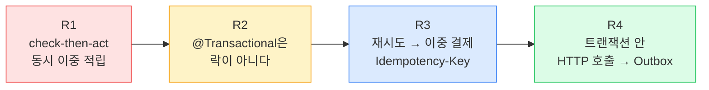
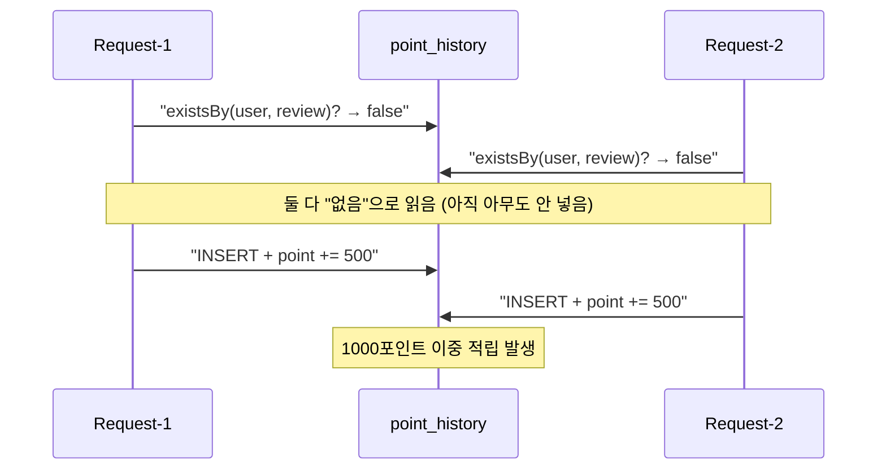
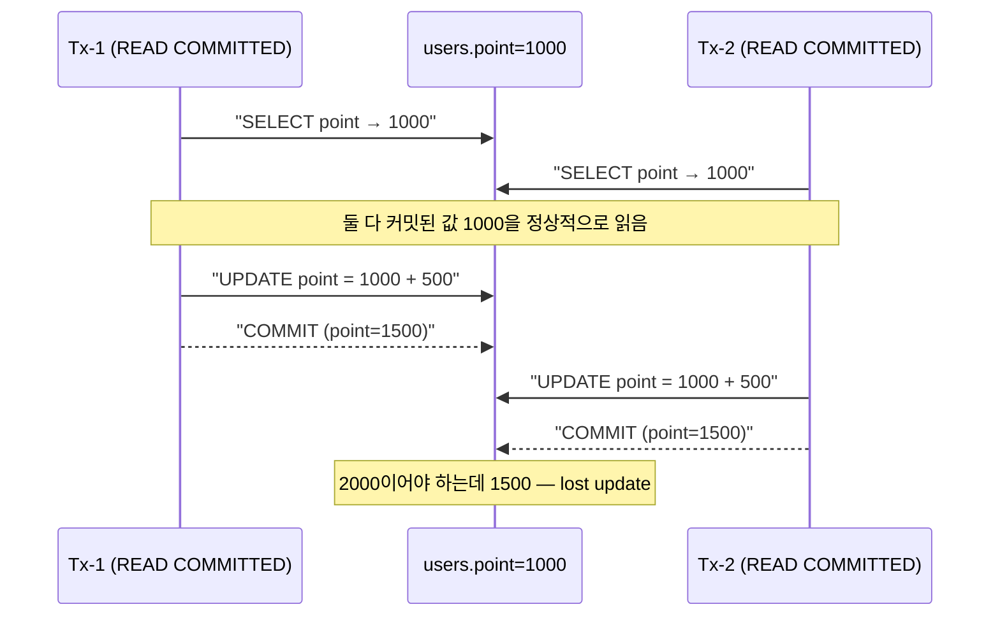
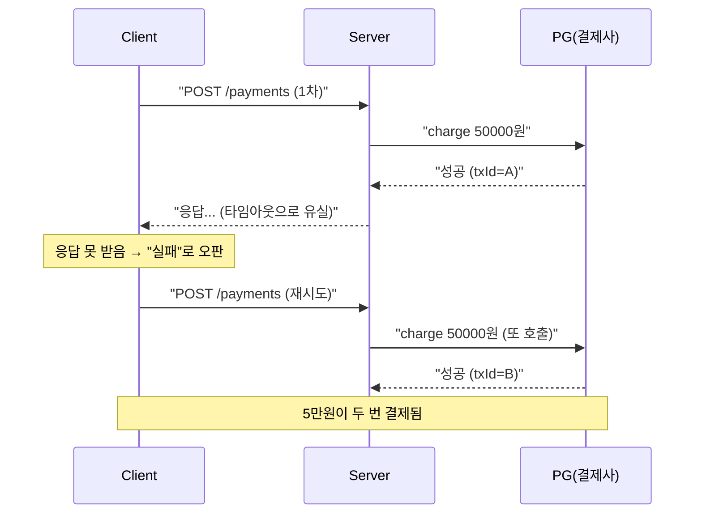
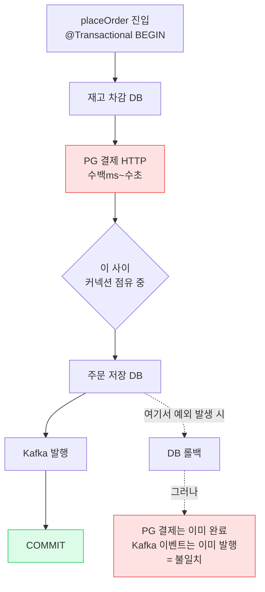
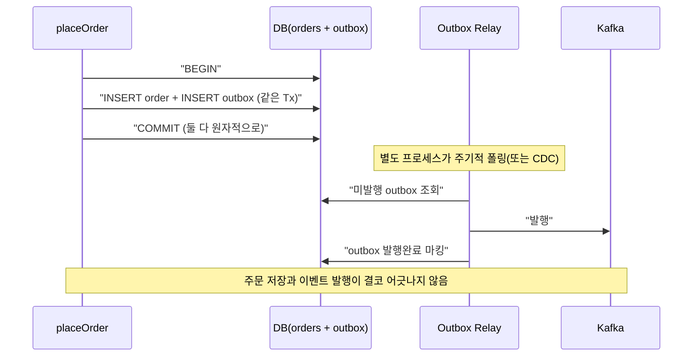
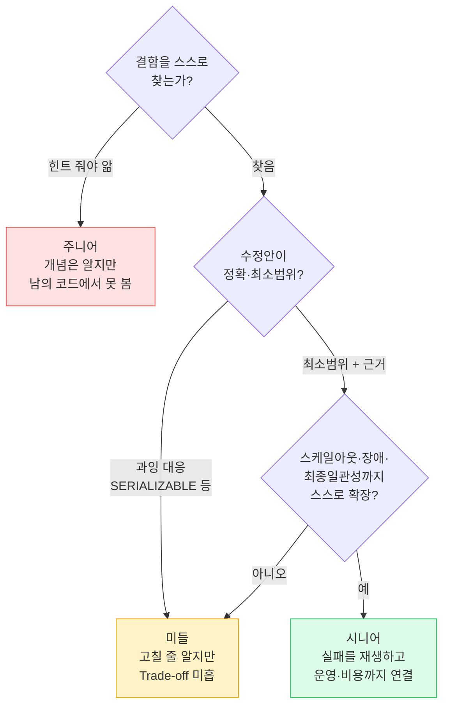

## 면접 시나리오 개요

이 카드는 **라이브 코드 리뷰형 면접(Live Code Review, 30분)** 을 재현한다. 면접관이 "동작은 하는" Kotlin 코드를 화면에 띄우고 묻는다.

> "이 코드, 프로덕션에서 QPS(Queries Per Second, 초당 쿼리 수) 3000 받으면 어떤 일이 나나요? 어디가 터지죠?"

핵심은 **문법 지식이 아니라 실패 시나리오를 머릿속에서 재생하는 능력**이다. 6년차 이상에게 기대하는 건 "이 코드는 `check-then-act` race가 있고, 격리수준이 REPEATABLE READ여도 phantom은 남고, 재시도가 붙으면 멱등성이 필요해진다"까지 **한 호흡에 연결하는 서사**다.



*4라운드는 독립 문제가 아니라 하나의 결함 코드를 단계적으로 고쳐가는 서사다. 앞 라운드의 "수정"이 다음 라운드의 "새 문제"를 부른다.*

> **🎯 면접 포인트 — 이 카드가 개념 카드와 다른 점**
>
> `backend-02-concurrency`, `backend-04-resilience-idempotency` 는 개념을 **가르친다**. 이 카드는 그 개념을 **면접장에서 코드 결함으로 되묻는다**. 정답을 아는 것과, 남의 코드에서 15초 안에 결함을 짚어내는 것은 다른 능력이다. 후자가 시니어 판별선이다.

---

## R1 — "이 포인트 적립 API, 동시에 두 번 호출되면?"

면접관이 토스 스타일의 포인트 적립 코드를 보여준다.

```kotlin
// 면접관: "리뷰 이벤트 참여 시 1회만 500포인트 적립. 이 코드 어떤가요?"
@Transactional
fun earnReviewPoint(userId: Long, reviewId: Long) {
    // 이미 적립했는지 확인 (check)
    val already = pointHistoryRepo.existsByUserIdAndReviewId(userId, reviewId)
    if (already) return
    // 없으면 적립 (act)
    val user = userRepo.findById(userId).orElseThrow()
    user.point += 500
    pointHistoryRepo.save(PointHistory(userId, reviewId, 500))
}
```

**결함**: `existsBy...`(check)와 `save`(act) 사이가 원자적이지 않은 전형적인 `check-then-act` race다. 유저가 "적립" 버튼을 따닥 두 번 누르거나(더블 클릭), 클라이언트 재시도가 겹치면 두 스레드가 모두 `already == false`를 읽고 둘 다 적립한다.



*check와 act 사이에 다른 트랜잭션이 끼어드는 순간(interleaving) 조건 검사는 무효가 된다.*

> **⚠️ 실무 함정 — "existsBy로 막았는데요?"**
>
> 신입~미들이 가장 많이 하는 답. `existsBy`는 **읽기**일 뿐 다른 트랜잭션의 쓰기를 막지 못한다. 애플리케이션 레벨 조건 검사는 동시성 방어가 **절대** 아니다. 방어는 반드시 DB의 원자적 연산이나 제약(constraint)에 위임해야 한다.

**모범 답변 (수정본):** `(user_id, review_id)`에 **UNIQUE 제약**을 걸고, 중복 INSERT는 DB가 튕기게 만든다. 조건 검사를 DB로 내린다.

```kotlin
// 수정: UNIQUE 제약으로 이중 적립을 DB가 원자적으로 차단
// DDL: ALTER TABLE point_history ADD CONSTRAINT uq_user_review UNIQUE (user_id, review_id)
@Transactional
fun earnReviewPoint(userId: Long, reviewId: Long) {
    try {
        pointHistoryRepo.save(PointHistory(userId, reviewId, 500))  // 먼저 선점 시도
    } catch (e: DataIntegrityViolationException) {
        return  // UNIQUE 위반 = 이미 적립됨 → 조용히 종료 (멱등)
    }
    // point 증가도 원자적 UPDATE로 (엔티티 read-modify-write 금지)
    userRepo.addPoint(userId, 500)  // UPDATE users SET point = point + 500 WHERE id = ?
}
```

*포인트 증가도 `user.point += 500` 같은 read-modify-write가 아니라 `point = point + 500` 원자적 UPDATE여야 lost update가 안 난다.*

| | 나쁜 답변 | 좋은 답변 |
| --- | --- | --- |
| 방어 위치 | 애플리케이션 `existsBy` 검사 | DB UNIQUE 제약 |
| 포인트 증가 | `user.point += 500` (엔티티) | `SET point = point + 500` (원자 UPDATE) |
| 동시 2건 | 둘 다 통과 → 이중 적립 | 하나는 UNIQUE 위반 → 차단 |
| 근거 | "코드로 막았다" | "check-then-act은 원자적이지 않다" |

---

## R2 — "@Transactional을 붙였는데 왜 못 막나?"

지원자가 R1에서 "트랜잭션으로 감싸면 되지 않나요?"라고 답했다고 하자. 면접관이 파고든다.

> "좋아요. `@Transactional` 붙이면 R1 코드가 안전해지나요? **트랜잭션과 락은 같은 건가요?**"

**핵심 명제: 트랜잭션은 락이 아니다.** `@Transactional`은 원자성(Atomicity, 전부 커밋 또는 전부 롤백)과 격리수준(Isolation)을 제공할 뿐, 그 자체로 다른 트랜잭션의 동시 읽기·쓰기를 배타적으로 막아주지 않는다. 방어 강도는 **격리수준**에 달렸고, 대부분의 서비스 기본값인 `READ COMMITTED`에서는 R1의 lost update가 **그대로 발생한다**.



*READ COMMITTED는 "커밋된 값만 읽는다"를 보장할 뿐, 내가 읽은 값이 쓸 때까지 안 변한다는 보장은 안 준다.*

| 격리수준 | Dirty Read | Non-repeatable Read | Phantom | Lost Update(R1) |
| --- | --- | --- | --- | --- |
| READ UNCOMMITTED | 발생 | 발생 | 발생 | 발생 |
| READ COMMITTED (대부분 기본) | 차단 | 발생 | 발생 | **발생** |
| REPEATABLE READ (MySQL 기본) | 차단 | 차단 | 대부분 차단 | 여전히 앱 레벨 R-M-W면 발생 |
| SERIALIZABLE | 차단 | 차단 | 차단 | 차단(단 성능·데드락 대가) |

**모범 답변:** "트랜잭션 어노테이션만으로는 못 막습니다. 방법은 세 가지:
1. **비관적 락** — `SELECT ... FOR UPDATE`로 행을 잠그고 read-modify-write. 확실하지만 경합 시 처리량 저하.
2. **낙관적 락** — `@Version`으로 커밋 시점에 충돌 감지 후 재시도. 경합 낮을 때 유리.
3. **원자적 조건부 UPDATE** — 애초에 read-modify-write를 없애고 `SET point = point + 500`. 단일 행 카운터엔 이게 최선."

```kotlin
// 흔한 오답: 격리수준만 올리면 된다고 생각
@Transactional(isolation = Isolation.SERIALIZABLE)  // 성능 붕괴 + 데드락 폭증
fun earnReviewPoint(userId: Long, reviewId: Long) { /* ... */ }

// 모범: 원자적 UPDATE로 애초에 race를 제거 (락 대기 없음)
@Modifying
@Query("UPDATE users u SET u.point = u.point + :amount WHERE u.id = :id")
fun addPoint(id: Long, amount: Int): Int
```

> **⚠️ 실무 함정 — SERIALIZABLE로 도망가기**
>
> "그럼 SERIALIZABLE 쓰면 되잖아요"는 함정 답이다. 전 구간을 직렬화하면 처리량이 급락하고 데드락·롤백이 폭증한다. 문제 지점(단일 카운터)만 원자적 UPDATE로 좁게 푸는 게 정석이다. **락의 범위는 최소로**가 시니어의 감각.

> **💡 팁 — "그런데 서버가 2대라면?"에 미리 답하라**
>
> R2에서 지원자가 `synchronized`나 애플리케이션 `ReentrantLock`을 언급하면 면접관은 반드시 "인스턴스 2대로 스케일아웃하면?"을 묻는다. JVM 락은 프로세스 경계를 못 넘는다. 먼저 "이건 DB 제약/락에 위임해야 분산 환경에서도 유효합니다"라고 선제적으로 말하면 크게 가점된다.

---

## R3 — "재시도를 붙였더니 중복 결제가 났다"

면접관이 결제 코드와 장애 리포트를 함께 보여준다.

> "타임아웃 대응으로 클라이언트에 재시도를 붙였습니다. 그 뒤 이중 결제 CS가 늘었어요. 코드 문제를 찾아주세요."

```kotlin
// 클라이언트: 응답 안 오면 최대 3번 재시도
// 서버: 아래 API
@PostMapping("/payments")
@Transactional
fun pay(@RequestBody req: PayRequest): PayResponse {
    val order = orderRepo.findById(req.orderId).orElseThrow()
    val result = pgClient.charge(order.amount)  // 외부 PG 결제
    paymentRepo.save(Payment(req.orderId, result.txId))
    return PayResponse(result.txId)
}
```

**결함**: 멱등성 방어가 전혀 없다. PG 결제는 성공했는데 응답이 네트워크 타임아웃으로 유실되면, 클라이언트는 "실패"로 판단하고 재시도한다. 서버는 이를 **새 요청**으로 받아 **또 결제**한다. `at-least-once`(최소 1회) 전달 특성 + 비멱등 POST의 전형적 사고.



*재시도는 "결제 실패"가 아니라 "응답 유실"에도 발동한다. 서버가 두 요청을 구별할 방법이 없으면 이중 결제는 필연.*

**모범 답변:** 클라이언트가 **요청 단위로 고유한 `Idempotency-Key`(멱등성 키)** 를 생성해 헤더로 보내고(재시도해도 **같은 키 유지**), 서버는 UNIQUE 제약으로 원자적으로 선점한다.

```kotlin
// 수정: Idempotency-Key로 재시도 안전하게
@PostMapping("/payments")
fun pay(
    @RequestHeader("Idempotency-Key") key: String,
    @RequestBody req: PayRequest
): PayResponse {
    // 1) UNIQUE 제약으로 선점 — 동시 중복 요청도 DB가 원자적으로 차단
    val claimed = idempotencyRepo.tryInsert(key, req.hash(), status = PROCESSING)
    if (!claimed) {
        val existing = idempotencyRepo.find(key)
        require(existing.requestHash == req.hash()) { "422: 같은 키 다른 본문" }
        return when (existing.status) {
            DONE       -> existing.toResponse()          // 저장된 원래 응답 재반환
            PROCESSING -> throw ConflictException("409: 처리 중")
        }
    }
    // 2) 최초 1회만 실제 결제
    val result = pgClient.charge(req.amount)
    idempotencyRepo.complete(key, PayResponse(result.txId))  // status=DONE + 응답 저장
    return PayResponse(result.txId)
}
```

| 쟁점 | 나쁜 답변 | 좋은 답변 |
| --- | --- | --- |
| 키 생성 위치 | 서버가 생성 | **클라이언트**가 요청당 1개, 재시도 시 동일 유지 |
| 동시 같은 키 2개 | "먼저 조회 후 없으면 처리" (또 race) | UNIQUE 제약 + 원자적 선점 |
| 같은 키 다른 본문 | 무시하고 처리 | `422`로 거부 (키 재사용·버그 탐지) |
| 저장 기간 | 영구 저장 | TTL(예: 24h)로 무한 증가 방지 |
| PG 측 방어 | 서버만 믿음 | PG에도 멱등키 전달 (이중 방어) |

> **⚠️ 실무 함정 — "먼저 조회하고 없으면 결제"**
>
> R1과 똑같은 check-then-act 함정이 멱등성에도 재현된다. "키로 SELECT 해보고 없으면 처리"는 동시에 같은 키 2건이 오면 둘 다 통과한다. 반드시 **UNIQUE INSERT로 원자적 선점**이어야 한다. 이 실수를 스스로 피하면 R1과 R3를 관통하는 원리(원자적 선점)를 이해한 것으로 평가된다.

> **🎯 면접 포인트 — 키는 누가 만드는가**
>
> 서버가 키를 만들면 재시도할 때마다 새 키가 생겨 멱등성이 깨진다. 키는 **클라이언트가 "하나의 결제 시도"에 대해 한 번 생성**하고, 그 시도의 모든 재시도에서 **같은 키**를 재사용해야 한다. Stripe·토스 결제 API가 이 방식이다. 이걸 정확히 말하면 미들과 시니어가 갈린다.

---

## R4 — "트랜잭션 경계 안에서 외부 API를 호출하고 있다"

마지막. 면접관이 R3의 초기 코드로 돌아가 트랜잭션 경계를 지적하게 한다.

```kotlin
// 면접관: "이 메서드의 트랜잭션 경계, 뭐가 문제죠?"
@Transactional
fun placeOrder(cmd: OrderCommand): Order {
    stockRepo.decrease(cmd.productId, cmd.qty)   // 1) 재고 차감 (DB)
    val pay = pgClient.charge(cmd.amount)         // 2) PG 결제 (HTTP, 수백 ms~수 초)
    val order = orderRepo.save(Order(cmd, pay.txId))  // 3) 주문 저장 (DB)
    kafkaTemplate.send("order-created", order)    // 4) 이벤트 발행 (네트워크)
    return order
}
```

**결함 3가지:**

1. **DB 커넥션을 HTTP 호출 내내 점유** — PG가 3초 걸리면 트랜잭션이 3초간 열려 있고 HikariCP 커넥션이 3초간 묶인다. QPS가 조금만 올라도 커넥션풀이 고갈되어 전체 서비스가 멈춘다. **트랜잭션 안에서 외부 호출 금지**의 이유.
2. **롤백 불가능한 외부 부수효과** — 3)에서 예외가 나면 DB는 롤백되지만 2)의 **PG 결제는 이미 실행됐다**. 재고는 원복됐는데 돈은 빠져나간 불일치. 트랜잭션이 외부 세계까지 원자적으로 되돌린다는 건 **환상(분산 트랜잭션 환상)**이다.
3. **커밋 전 이벤트 발행** — 4)에서 Kafka 발행 직후 트랜잭션이 롤백되면 "주문 생성됨" 이벤트는 나갔는데 주문은 DB에 없다. 소비자들이 유령 주문을 처리한다(dual write 문제).



*트랜잭션은 DB 세계만 되돌린다. HTTP·Kafka 같은 외부 부수효과는 롤백 대상이 아니다.*

**모범 답변:** 트랜잭션 경계를 **DB 작업만** 감싸도록 좁히고, 외부 호출은 경계 밖으로 뺀다. 이벤트 발행은 **Transactional Outbox(트랜잭셔널 아웃박스)** 패턴으로 "주문 저장 + outbox INSERT"를 한 트랜잭션에 묶고, 별도 릴레이가 커밋된 outbox를 읽어 발행한다.

```kotlin
// 수정: 트랜잭션은 DB만, 외부 호출은 밖으로, 이벤트는 Outbox로
fun placeOrder(cmd: OrderCommand): Order {
    // 1) 결제는 트랜잭션 밖에서 (멱등키로 R3처럼 보호)
    val pay = pgClient.charge(cmd.idempotencyKey, cmd.amount)
    // 2) DB 작업만 짧은 트랜잭션으로 묶음
    return saveOrderTx(cmd, pay)
}

@Transactional
fun saveOrderTx(cmd: OrderCommand, pay: PayResult): Order {
    val updated = stockRepo.decrease(cmd.productId, cmd.qty)  // 원자적 조건부 UPDATE
    if (updated == 0) throw InsufficientStockException(cmd.productId)
    val order = orderRepo.save(Order(cmd, pay.txId))
    // 이벤트를 바로 발행하지 않고 같은 트랜잭션에 outbox로 저장 (원자적)
    outboxRepo.save(OutboxEvent("order-created", order.toPayload()))
    return order
    // 별도 릴레이(폴링/CDC)가 커밋된 outbox를 읽어 Kafka로 발행 → at-least-once 보장
}
```



*Outbox는 "DB 커밋"과 "이벤트 발행"의 dual write를 하나의 로컬 트랜잭션으로 접합해 불일치를 제거한다. 소비자는 R3의 멱등 소비로 중복을 흡수한다.*

> **⚠️ 실무 함정 — `@Transactional` 자기 호출**
>
> 위 수정본에서 `placeOrder`가 같은 클래스의 `saveOrderTx`를 호출하면 **프록시를 우회**해 `@Transactional`이 무효가 된다. Spring AOP는 프록시 기반이라 self-invocation에는 어드바이스가 안 걸린다. 별도 빈으로 분리하거나 `AopContext`를 써야 한다. 면접에서 이 코드를 내면 자기 호출 함정을 아는지 곧바로 검증된다.

> **🎯 면접 포인트 — "완벽한 원자성은 없다"를 인정하라**
>
> R4의 만점 답은 "Outbox 쓰면 완벽합니다"가 아니라 **"분산 환경에서 DB와 외부 시스템의 원자적 커밋은 불가능하므로, 최종 일관성(Eventual Consistency)을 받아들이고 at-least-once + 멱등 소비로 수렴시킨다"** 는 인식이다. 결제(PG)가 성공했는데 주문 저장이 실패하는 케이스는 보상 트랜잭션(Compensating Transaction) 또는 Saga로 처리한다고 덧붙이면 아키텍처 감각까지 드러난다.

---

## 좋은 답변 vs 나쁜 답변 (종합)

| 라운드 | 나쁜 답변 (감점) | 좋은 답변 (가점) |
| --- | --- | --- |
| R1 | "`existsBy`로 확인했으니 괜찮다" | "check-then-act race. UNIQUE 제약으로 DB가 원자적으로 막게 한다" |
| R2 | "`@Transactional` 붙이면 된다 / SERIALIZABLE 쓰면 된다" | "트랜잭션은 락이 아니다. READ COMMITTED엔 lost update. 원자적 UPDATE로 좁게 푼다" |
| R3 | "서버에서 키 만들어 저장한다 / 먼저 조회 후 처리" | "클라이언트가 키 생성·재시도 시 유지. UNIQUE 원자 선점. 같은 키 다른 본문 422" |
| R4 | "Outbox 쓰면 완벽하게 원자적" | "트랜잭션 안 외부 호출 3대 문제 지적. Outbox + 멱등 소비 + 최종 일관성 인정" |
| 공통 | 단일 인스턴스 가정, "동작은 한다"에서 멈춤 | 스케일아웃·장애·커넥션풀·비용까지 스스로 확장 |

## 평가 루브릭 — 주니어 / 미들 / 시니어



| 레벨 | 판별 기준 | 대표 신호 |
| --- | --- | --- |
| **주니어** | 개념은 알지만 결함을 스스로 못 짚음 | "동시성 문제요? 어디가요?" — 힌트 필요 |
| **미들** | 결함을 찾고 고칠 줄 앎, 그러나 과잉 대응·Trade-off 부족 | "SERIALIZABLE 쓰겠습니다" / "분산락 걸겠습니다" (더 단순한 원자 UPDATE를 놓침) |
| **시니어** | 최소 범위로 정확히 고치고, 스케일아웃·커넥션풀·최종 일관성·보상까지 스스로 확장 | "이건 원자 UPDATE로 좁게, 근데 인스턴스 2대면 DB에 위임돼야 유효하고, 재시도가 붙으면 멱등키가 필요해집니다" |

> **💡 팁 — 면접장에서의 서사 전략**
>
> 각 라운드에서 (1) **결함을 한 문장으로 명명**("이건 check-then-act race입니다") → (2) **왜 터지는지 시나리오 재생**("두 스레드가 둘 다 false를 읽으면...") → (3) **최소 범위 수정 + Trade-off**("UNIQUE로 막되, 경합 심하면 재시도 비용이...") → (4) **스케일 확장 선제 대응**("서버 2대여도 DB 제약이라 유효합니다") 순으로 말하라. 이 4단계 리듬이 시니어의 코드 리뷰 언어다.

> **🎯 면접 포인트 — 네 라운드를 관통하는 한 문장**
>
> "동시성·멱등성·트랜잭션 경계 문제는 결국 **애플리케이션 조건 검사를 믿지 말고, 원자적 연산(UNIQUE 제약·조건부 UPDATE)에 위임하며, 롤백되지 않는 외부 부수효과는 트랜잭션 밖으로 빼 최종 일관성으로 수렴시킨다**로 요약됩니다." — 이 한 문장을 마지막에 던지면 4라운드가 하나의 원리로 꿰인 것을 보여준다.
