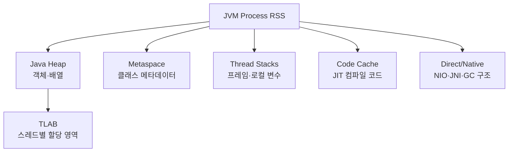

## 1. 프로세스 메모리는 Heap보다 크다

JVM 프로세스의 RSS(Resident Set Size, 실제 상주 메모리)는 Java Heap뿐 아니라 Metaspace, Code Cache, Thread Stack, Direct Buffer, GC 자료구조, JNI 라이브러리를 포함한다. 컨테이너에서는 합계가 메모리 제한을 넘으면 Java `OutOfMemoryError` 전에 프로세스가 종료될 수도 있다.



| 영역 | 증가 원인 | 대표 증상 | 확인 방법 |
|---|---|---|---|
| Heap | 살아 있는 객체·캐시 | GC 후에도 Old 사용량 증가 | GC Log, Heap Dump |
| Metaspace | 클래스·ClassLoader | 재배포 후 클래스 미회수 | ClassLoader 통계, NMT |
| Thread Stack | 스레드 수·`-Xss` | 스레드 증가와 RSS 동반 | Thread Dump, 프로세스 스레드 수 |
| Direct Memory | NIO·Netty 버퍼 | Heap은 안정적인데 RSS 증가 | NMT, 버퍼 메트릭 |
| Code Cache | JIT 컴파일 | 컴파일 중단·성능 저하 | `jcmd Compiler.codecache` |

## 2. TLAB은 빠른 할당 경로다

TLAB(Thread-Local Allocation Buffer, 스레드 로컬 할당 버퍼)은 Heap 안에서 스레드가 포인터를 이동시키며 락 없이 작은 객체를 할당하게 한다. TLAB 밖에 할당된 객체와 마찬가지로 도달 가능성이 사라지면 GC 대상이다.

```bash
# Native Memory Tracking은 JVM 시작 시 활성화해야 상세 추적 가능
java -XX:NativeMemoryTracking=summary -jar app.jar
jcmd <pid> VM.native_memory summary
jcmd <pid> GC.heap_info
jcmd <pid> Thread.print
```

> **실무 함정** — `-Xmx`를 컨테이너 제한과 같게 두면 Native 영역이 쓸 공간이 없다. 스레드 수×Stack 크기, Direct Buffer 상한, Metaspace 변동과 안전 여유를 빼고 Heap 예산을 정한다.

## 3. 진단 순서

1. 컨테이너 제한, RSS, Heap committed/used를 같은 시각으로 맞춘다.
2. Full GC 뒤 Old 사용량이 회복되는지 확인한다.
3. Heap이 아니라면 스레드 수, Direct Buffer, Metaspace, Native Memory Tracking을 본다.
4. 메모리 증가율과 트래픽·배포·클래스 로딩 이벤트를 연결한다.

> **면접 포인트** — Heap OOM, Direct Buffer OOM, Native Thread 생성 실패, 컨테이너 OOMKilled는 원인과 증거가 다르다. “Heap Dump부터”가 아니라 계층을 먼저 분류한다.
