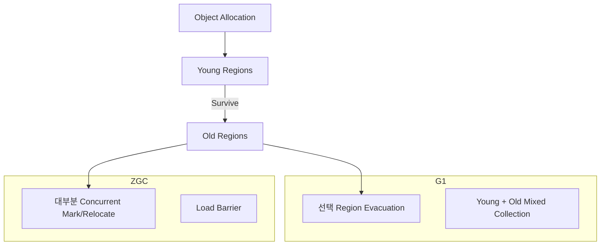

## 1. GC 문제는 세 숫자에서 시작한다

- `Allocation Rate`: 초당 새로 만드는 객체 바이트
- `Live Set`: GC 뒤에도 살아남는 객체 크기
- `Pause/Throughput Goal`: 허용 중단 시간과 애플리케이션 처리량

Heap이 커지면 GC 빈도는 줄 수 있지만 Live Set 스캔과 장애 시 Dump·재시작 비용은 커질 수 있다. Collector 선택은 지연 목표뿐 아니라 CPU와 메모리 여유를 함께 본다.



| 관점 | G1 | ZGC |
|---|---|---|
| 목표 | 예측 가능한 Pause와 처리량 균형 | 매우 낮은 Pause 우선 |
| 구조 | Region별 회수, Young/Mixed Cycle | 동시 Mark·Relocate 중심 |
| 비용 | Evacuation Pause, Remembered Set | 동시 작업 CPU, Barrier, 메모리 여유 |
| 선택 질문 | 수십~수백 ms 목표로 충분한가? | 더 낮은 Tail Latency가 사업상 필요한가? |

## 2. 로그로 원인을 분류한다

```bash
java \
  -Xlog:gc*,safepoint:file=gc.log:time,uptime,level,tags \
  -XX:+HeapDumpOnOutOfMemoryError \
  -jar app.jar
```

Pause 한 건보다 시간축을 본다. Allocation Rate가 갑자기 늘었는지, Old 점유율이 Cycle마다 회복되는지, Evacuation 실패나 Promotion 압력이 있는지, GC Thread가 쓸 CPU가 남아 있는지 확인한다. Safepoint 시간에는 GC 외의 원인도 있으므로 분리한다.

> **실무 함정** — `MaxGCPauseMillis`는 SLA 보장이 아니라 Collector의 목표다. 무리하게 낮추면 Young 영역과 회수 작업 선택이 달라져 GC 빈도와 CPU 비용이 증가할 수 있다.

## 3. 선택과 검증

기본 Collector로 실제 트래픽을 재현해 기준선을 만든 뒤, 같은 Heap·부하·워밍업 조건에서 p99 응답, 처리량, CPU, RSS를 비교한다. ZGC가 Pause를 낮춰도 CPU 포화로 요청 지연이 늘면 전체 SLA는 나빠질 수 있다.

> **면접 포인트** — “ZGC가 더 최신이므로 선택”이 아니라 Pause 예산, Allocation Rate, Live Set, 컨테이너 여유, 장애 복구 시간을 수치로 제시한다.

## 참고

- [Java 25 Garbage Collection Tuning Guide](https://docs.oracle.com/en/java/javase/25/gctuning/index.html)
