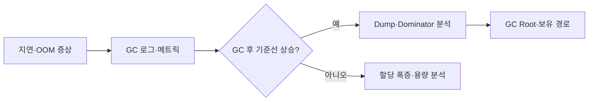

## 1. 정지 시간과 생존량을 함께 본다

긴 Pause 하나만으로 누수를 결론 내리지 않는다. GC 원인, 전후 Heap, Old 생존량, 할당 속도, Full GC 빈도를 같은 시간축의 요청 지연과 비교한다.



| 신호 | 가능한 원인 | 다음 증거 |
|---|---|---|
| 높은 Allocation | 임시 객체 폭증 | JFR Allocation Profile |
| Old 기준선 상승 | 장기 보유·누수 | Class Histogram·Dominator |
| Humongous 증가 | 큰 배열·응답 | 객체 크기·요청 유형 |
| Native RSS 상승 | Direct·Thread·JNI | Native Memory·스레드 수 |

```text
진단 순서: 증상 시각 고정 → 로그 상관분석 → 안전한 증거 수집 → 보유 경로 확인 → 재현
```

> **운영 주의** — 큰 Heap의 Dump는 긴 정지와 디스크 고갈을 만들 수 있다. 복제본 격리, 여유 공간, 자동 업로드·삭제 정책을 먼저 준비한다.

## 2. 원인을 객체 그래프로 확인한다

Shallow Size보다 Retained Size와 GC Root 경로를 본다. Cache라면 제한·만료가 실제로 작동하는지, ThreadLocal이면 Thread Pool 수명과 정리 경로를 확인한다.

> **면접 포인트** — Heap만 보지 말고 Metaspace, Direct Memory, Native Thread까지 프로세스 RSS와 구분한다.

## 참고

- [Oracle Java GC Tuning Guide](https://docs.oracle.com/en/java/javase/25/gctuning/index.html)
