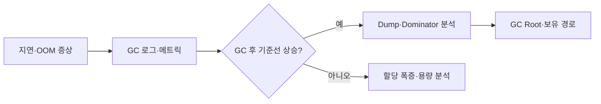

> **검수 경계** — GC 로그·Heap Dump·JFR·NMT의 옵션과 비용은 JDK 버전·실행 옵션·Heap 크기에 따라 달라진다. Dump와 profile은 장애 증거이지 자동으로 누수를 확정하는 결과가 아니다.

## 1. 정지 시간과 생존량을 함께 본다

긴 Pause 하나만으로 누수를 결론 내리지 않는다. GC 원인, 전후 Heap, Old 생존량, 할당 속도, Full GC 빈도를 같은 시간축의 요청 지연과 비교한다.


```mermaid
flowchart LR
    S[지연·OOM 증상] --> L[GC 로그·메트릭]
    L --> H{GC 후 기준선 상승?}
    H -->|예| D[Dump·Dominator 분석]
    H -->|아니오| A[할당 폭증·용량 분석]
    D --> R[GC Root·보유 경로]
```

| 신호 | 가능한 원인 | 다음 증거 |
|---|---|---|
| 높은 Allocation | 임시 객체 폭증 | JFR Allocation Profile |
| Old 기준선 상승 | 장기 보유·누수 | Class Histogram·Dominator |
| Humongous 증가 | 큰 배열·응답 | 객체 크기·요청 유형 |
| Native RSS 상승 | Direct·Thread·JNI | Native Memory·스레드 수 |

```text
진단 순서: 증상 시각 고정 → 로그 상관분석 → 안전한 증거 수집 → 보유 경로 확인 → 재현
```

> **운영 주의** — 큰 Heap의 Dump는 긴 정지와 디스크 고갈을 만들 수 있다. 복제본 격리, 여유 공간, 자동 업로드·삭제 정책을 먼저 준비한다.

## 2. 원인을 객체 그래프로 확인한다

Shallow Size보다 Retained Size와 GC Root 경로를 본다. Cache라면 제한·만료가 실제로 작동하는지, ThreadLocal이면 Thread Pool 수명과 정리 경로를 확인한다.

> **면접 포인트** — Heap만 보지 말고 Metaspace, Direct Memory, Native Thread까지 프로세스 RSS와 구분한다.

## 검수 경계와 실패 흐름

- GC 후 Old 기준선 상승은 leak, 정상적인 promotion, cache warming, 요청량 변화가 모두 가능하다. 여러 GC cycle과 allocation profile·class histogram·GC root 경로를 함께 비교한다.
- 큰 Heap Dump는 stop-the-world 시간, 디스크 공간, 개인정보 노출을 만들 수 있다. replica/isolated node·충분한 여유 공간·암호화·자동 삭제 정책을 먼저 준비한다.
- 높은 allocation rate는 실제 leak이 아닐 수 있고, leak은 allocation이 정상이어도 retained reference로 나타날 수 있다. 짧은 구간의 로그만으로 결론 내리지 않는다.
- 조치 후에는 동일 workload에서 Old baseline·RSS·pause·p99와 재발 여부를 대조하고, 원인 미확인 상태의 무리한 heap 증설을 피한다.

## 공식·1차 출처

- [Java 25 Garbage Collection Tuning Guide](https://docs.oracle.com/en/java/javase/25/gctuning/index.html)
- [Oracle `jcmd` Reference](https://docs.oracle.com/en/java/javase/25/docs/specs/man/jcmd.html)
- [Java Flight Recorder Runtime Guide](https://docs.oracle.com/en/java/javase/25/develop/use-jfr-runtime.html)
- [Oracle Native Memory Tracking](https://docs.oracle.com/en/java/javase/25/vm/native-memory-tracking.html)
