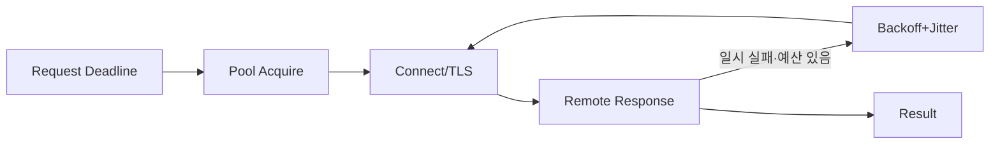

## 1. 호출 예산을 한 번만 쓴다

상위 요청의 Deadline에서 큐 대기, 연결, 원격 처리, 재시도 예산을 차감한다. 각 시도가 독립된 긴 Timeout을 가지면 재시도 횟수만큼 꼬리 지연이 늘어난다.



| 장치 | 보호 대상 | 주의 |
|---|---|---|
| Timeout | 스레드·연결 점유 | 전체 Deadline 전파 |
| Retry | 일시 실패 | 멱등성·폭증 제한 |
| Pool | 연결 재사용 | 획득 Timeout·대상별 격리 |
| Circuit Breaker | 연쇄 장애 | 복구 Probe·Fallback 의미 |

```kotlin
val remaining = requestDeadline - clock.now()
require(remaining.isPositive())
client.call(idempotencyKey = commandId, timeout = remaining.coerceAtMost(perTryLimit))
```

> **실무 함정** — Timeout은 취소 의사일 뿐 서버 작업이 중단됐다는 보장이 아니다. 부작용 API는 멱등 키와 결과 조회를 제공해야 한다.

## 2. 대상별로 격리하고 관측한다

Host별 Pool과 동시성 한도를 두어 느린 한 외부사가 전체 호출을 막지 않게 한다. 성공률 외에 단계별 시간, Pool 대기, 재사용률, 재시도 증폭, 결과 미상을 기록한다.

> **면접 포인트** — 숫자를 임의로 고르지 말고 상위 SLO, 하위 분위수, 재시도 예산으로 Timeout을 도출한다.
