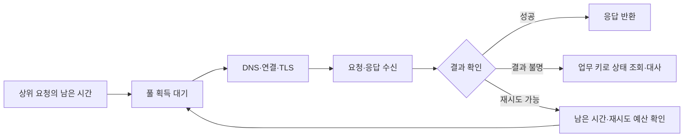

## 1. Connect, Read, Deadline은 서로 다른 대기를 제한한다

상위 요청에 남은 시간이 800ms인데 외부 호출마다 1초 timeout과 3회 재시도를 주면 전체 응답 목표를 지킬 수 없다. 아래 수치는 설계 설명을 위한 가상 입력이다. 먼저 상위 deadline을 전파하고 풀 획득, DNS·연결·TLS, 요청 전송, 첫 응답, 본문 수신, 재시도 대기 각각에 남은 예산을 적용한다.

| 경계 | 제한하려는 대기 | 빠뜨렸을 때 |
|---|---|---|
| 풀 획득 | 사용 가능한 연결·실행 슬롯 대기 | 연결 timeout이 있어도 호출 전 큐에서 오래 기다림 |
| Connect | 새 연결 수립 | 원격이 도달하지 않을 때 자원 점유 |
| Read 또는 응답 대기 | 연결 뒤 응답·본문 수신 | 연결은 성공했지만 응답이 느릴 때 무기한 점유 |
| 전체 Deadline | 큐·연결·원격 처리·재시도 총합 | 시도별 timeout을 합쳐 상위 SLO 초과 |

`read timeout`의 의미는 클라이언트 라이브러리마다 다르다. 소켓의 연속 읽기 사이 유휴 시간인지, 응답 전체 시간인지 API 문서를 확인해야 한다. Java 21 `HttpClient`에는 클라이언트의 `connectTimeout`과 요청의 `timeout`이 있지만 모든 단계별 timeout이 별도 이름으로 제공되는 것은 아니다. 라이브러리 설정값을 추상적인 네 단계와 기계적으로 대응시키지 않는다.


```mermaid
flowchart LR
    A[상위 요청의 남은 시간] --> B[풀 획득 대기]
    B --> C[DNS·연결·TLS]
    C --> D[요청·응답 수신]
    D --> E{결과 확인}
    E -->|성공| F[응답 반환]
    E -->|결과 불명| G[업무 키로 상태 조회·대사]
    E -->|재시도 가능| H[남은 시간·재시도 예산 확인]
    H --> B
```

```text
remaining = parentDeadline - now
if remaining <= 0: return TIMEOUT
perAttemptBudget = min(remaining, perAttemptLimit)
```

## 2. POST 재시도에는 결과 불명을 다루는 계약이 필요하다

`POST /payments`가 서버에서 성공했지만 응답만 유실되면 클라이언트는 실패처럼 보이는 timeout을 받는다. 무조건 다시 보내면 중복 결제가 생길 수 있다. 클라이언트는 동일한 업무 명령에 안정적인 idempotency key를 재사용하고 요청 내용이 바뀌지 않았는지 확인한다. 서버는 키와 요청 해시·처리 결과를 영속화하고 중복 요청에 이전 결과 또는 현재 처리 상태를 돌려준다. 키 보존 기간과 충돌 처리 정책도 계약에 포함한다.

재시도 대상은 일시적인 연결 오류·일부 5xx·429 등으로 제한하고, `Retry-After`가 있으면 반영한다. 각 시도마다 남은 deadline을 재계산하고 backoff와 jitter, 최대 시도 횟수, 동시 재시도 총량을 둔다. timeout으로 결과가 불명확하면 상태 조회·대사 경로를 거친다. 클라이언트 취소는 이미 시작된 서버 작업의 취소 보장이 아니다.

## 3. 풀 고갈은 원인과 대기열을 함께 본다

Java `HttpClient` 문서는 클라이언트 인스턴스마다 연결 풀이 보통 공유되지 않으므로 요청마다 새 클라이언트를 만들면 재사용 이점이 줄 수 있다고 설명한다. 특정 라이브러리에서 풀 고갈이 발생했다면 **활성·유휴 연결, 획득 대기자, 획득 지연, 원격 응답 지연, 본문 소비·닫기 여부**를 함께 본다. 연결 수만 올리면 느린 외부 서비스에 더 많은 동시 요청을 보내 장애를 확대할 수도 있다.

대상별 동시성 한도와 짧은 풀 획득 대기, 실패 시 빠른 거절을 고려한다. 느린 응답의 원인이 원격 지연인지, 본문 스트림 미종료인지, DNS·TLS 재연결인지 구분한다. `sendAsync`의 future를 쓴다면 큐와 취소·완료 처리를 관측한다. 서킷 브레이커는 실패한 대상에 대한 불필요한 재호출을 줄일 수 있지만, fallback이 업무적으로 안전한지는 별도로 결정해야 한다.

> **답변 점검** — 세 질문 모두 한 요청의 남은 시간, POST의 UNKNOWN 상태, 풀 대기의 실제 위치를 연결한다. timeout 수치는 서비스의 SLO·외부사 지연 분포와 부하 시험을 근거로 정한다.

### 근거 자료

- [Java SE 21 — HttpClient](https://docs.oracle.com/en/java/javase/21/docs/api/java.net.http/java/net/http/HttpClient.html): 연결 timeout·클라이언트 재사용·동기/비동기 호출.
- [Java SE 21 — HttpRequest.Builder](https://docs.oracle.com/en/java/javase/21/docs/api/java.net.http/java/net/http/HttpRequest.Builder.html): 요청 timeout.
- [AWS Builders' Library — Making retries safe with idempotent APIs](https://aws.amazon.com/builders-library/making-retries-safe-with-idempotent-APIs/): 멱등성 계약과 안전한 재시도.
- [RFC 6585 — Additional HTTP Status Codes](https://www.rfc-editor.org/rfc/rfc6585.html): 429와 `Retry-After`.
