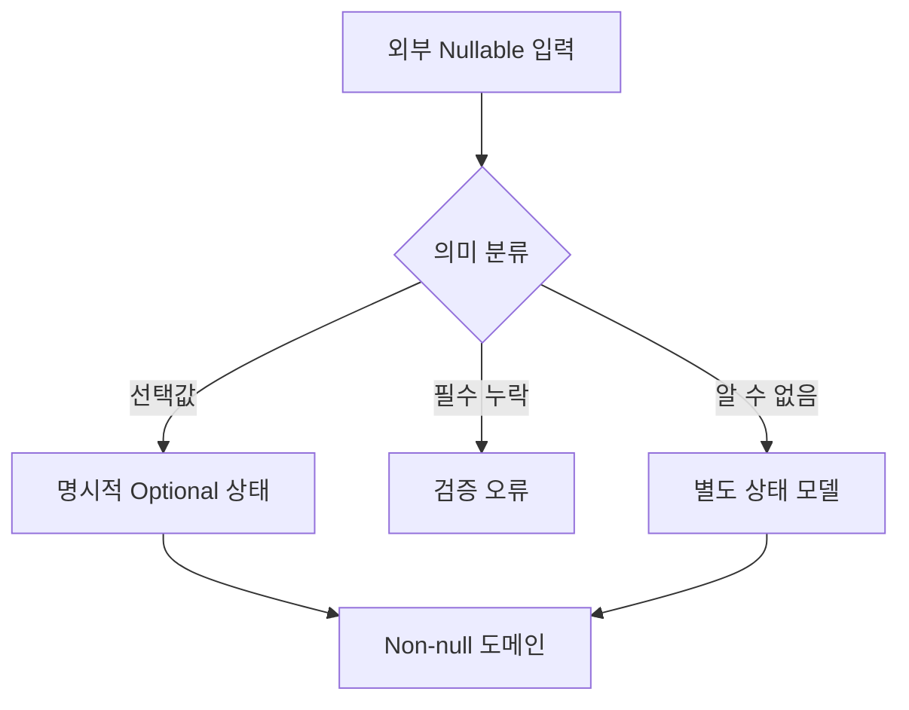

## 1. Null의 의미를 리뷰한다

문법적인 NPE 방지만으로 충분하지 않다. 값이 선택인지, 아직 로드되지 않았는지, 외부 계약 위반인지 분류하고 도메인 안에는 유효한 상태만 진입시킨다.



| 리뷰 냄새 | 위험 | 개선 |
|---|---|---|
| `!!` | 런타임 폭발 | 경계 검증·타입 변경 |
| 무조건 기본값 | 데이터 오류 은폐 | 사유별 분기 |
| 깊은 Safe-call | 필수 단계 누락 | 중간 불변식 확인 |
| Nullable 전파 | 모든 호출자가 방어 | 변환 경계 집중 |

```kotlin
fun OrderRequest.toCommand(): CreateOrder = CreateOrder(
    customerId = requireNotNull(customerId) { "customerId is required" },
    note = note?.trim()?.takeIf { it.isNotEmpty() }
)
```

> **리뷰 원칙** — 기본값은 업무적으로 참일 때만 사용한다. 편의를 위해 0이나 빈 문자열로 바꾸면 이후에는 누락과 실제 값이 구별되지 않는다.

## 2. 상태를 타입으로 올린다

여러 의미의 Null은 Sealed Type이나 명시적 상태로 바꾼다. DB Nullable, API Optional, 도메인 선택값의 의미가 서로 같다는 가정을 리뷰에서 확인한다.

> **면접 포인트** — Null 안전성은 언어 기능이 아니라 계약 경계와 잘못된 상태를 표현하지 못하게 하는 모델링 문제다.
