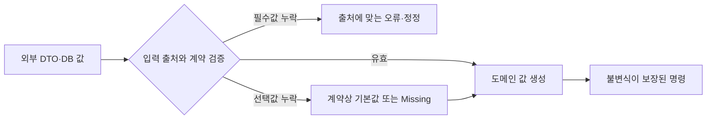

## 1. `value ?: 0`을 허용할지 업무 의미로 판단한다

Kotlin의 Elvis 연산자는 왼쪽이 `null`일 때 오른쪽 값을 돌려줄 뿐, `0`이 올바른 업무 값인지 판단하지 않는다. 예를 들어 선택 입력인 `discountAmount`가 누락됐을 때 계약상 할인 없음이라면 `0`이 타당할 수 있다. 반면 재고 수량 조회가 실패해 `null`이 됐는데 `0`으로 바꾸면 품절로 오판하고 원래의 오류를 숨긴다. 리뷰에서는 필드별로 **누락 가능 여부, 0의 의미, 실패 시 정책, 데이터 원천**을 확인한다.

```text
선택 할인액 누락 → 계약상 할인 없음 → 0으로 변환 가능
필수 결제 금액 누락 → 요청 검증 오류 → 0으로 변환 금지
재고 서비스 응답 실패 → 결과 불명 → 품절(0)로 변환 금지
```

`!!`나 깊은 safe-call 체인도 같은 질문을 피하지 못한다. `!!`는 실행 시 예외로 바뀔 수 있고, `?.`가 연쇄되면 어느 필수 단계가 누락됐는지 사라질 수 있다. 경계에서 이유가 있는 오류로 변환하고 도메인 안에는 유효한 상태만 들인다.

| 입력 상태 | 예시 | 경계에서의 처리 |
| --- | --- | --- |
| 계약상 선택값 누락 | 할인액 미입력 | 계약이 허용할 때만 기본값 적용 |
| 필수값 누락 | 결제 금액 없음 | 필드 오류로 거절 |
| 의존성 결과 불명 | 재고 서비스 응답 실패 | 수량 0으로 변환하지 않고 실패·재조회 경로로 보냄 |

## 2. 외부 DTO와 도메인 사이의 변환 책임

HTTP 요청, 외부 API, DB 레코드처럼 신뢰 수준이 다른 입력은 각 경계의 변환기가 계약을 검사한다. HTTP DTO의 필수 누락은 보통 클라이언트 입력 오류로 응답하고, 외부 API의 계약 위반은 의존성 오류로 기록하며, 오래된 DB 행은 마이그레이션·데이터 정정 대상으로 다룬다. 같은 `null`이라도 오류 종류가 다르므로 모든 곳에서 `requireNotNull`만 던져 500 응답으로 만들지 않는다.

```kotlin
sealed interface CreateOrderInput {
    data class Valid(val customerId: String, val note: String?) : CreateOrderInput
    data class Invalid(val field: String) : CreateOrderInput
}

fun OrderRequest.validate(): CreateOrderInput {
    val id = customerId?.takeIf { it.isNotBlank() }
        ?: return CreateOrderInput.Invalid("customerId")
    return CreateOrderInput.Valid(id, note?.trim()?.takeIf { it.isNotEmpty() })
}
```

컨트롤러는 `Invalid`를 4xx로 매핑하고, `Valid`만 도메인 명령으로 바꾼다. 위 코드는 설명용이며 실제 오류 코드·필드명 노출 정책은 API 계약에 맞춘다. Kotlin의 non-null 타입은 이후 코드의 null 접근을 줄여도 외부 JSON 계약이나 Java 상호운용 경계의 검증을 자동으로 대신하지 않는다.


```mermaid
flowchart LR
    A[외부 DTO·DB 값] --> B{입력 출처와 계약 검증}
    B -->|필수값 누락| C[출처에 맞는 오류·정정]
    B -->|선택값 누락| D[계약상 기본값 또는 Missing]
    B -->|유효| E[도메인 값 생성]
    D --> E
    E --> F[불변식이 보장된 명령]
```

## 3. 미입력·알 수 없음·해당 없음을 구분한다

세 상태를 모두 `null`로 저장하면 업데이트 API에서 필드 미전송과 명시적 초기화를 구분할 수 없고, 통계에서는 '해당 없음'이 '측정 실패'와 섞인다. JSON에서는 필드 부재와 `null` 값 자체가 다르다. PATCH에서의 동작은 미디어 타입 계약에 달려 있다. JSON Merge Patch에서는 `null`이 멤버 제거를 뜻하지만, JSON Patch에서는 `remove` 연산과 `replace`로 `null` 값을 넣는 연산이 구분된다. 입력 계약에서 `Missing`, `Unknown`, `NotApplicable`, `Known(value)` 같은 명시적 상태를 두거나 별도 상태 코드와 값 필드를 조합한다. 모든 필드에 복잡한 타입이 필요한 것은 아니며, 실제로 구분해 행동이 달라지는 경우에 도입한다.

> **답변 점검** — 세 질문 모두 문법적 NPE 방지에서 끝내지 않고 입력 계약, 오류 처리, 도메인 불변식, 저장·조회 의미까지 연결한다.

### 근거 자료

- [Kotlin — Null safety](https://kotlinlang.org/docs/null-safety.html): nullable 타입·Elvis·`!!`의 언어 동작.
- [Kotlin — Sealed classes and interfaces](https://kotlinlang.org/docs/sealed-classes.html): 상태 모델과 `when`의 완전성 검사.
- [JSON Schema — null](https://json-schema.org/understanding-json-schema/reference/null): `null` 값과 필드 부재의 차이.
- [RFC 7396 — JSON Merge Patch](https://www.rfc-editor.org/rfc/rfc7396.html): `null`의 제거 의미.
- [RFC 6902 — JSON Patch](https://www.rfc-editor.org/rfc/rfc6902.html): `remove`와 `replace` 연산.
