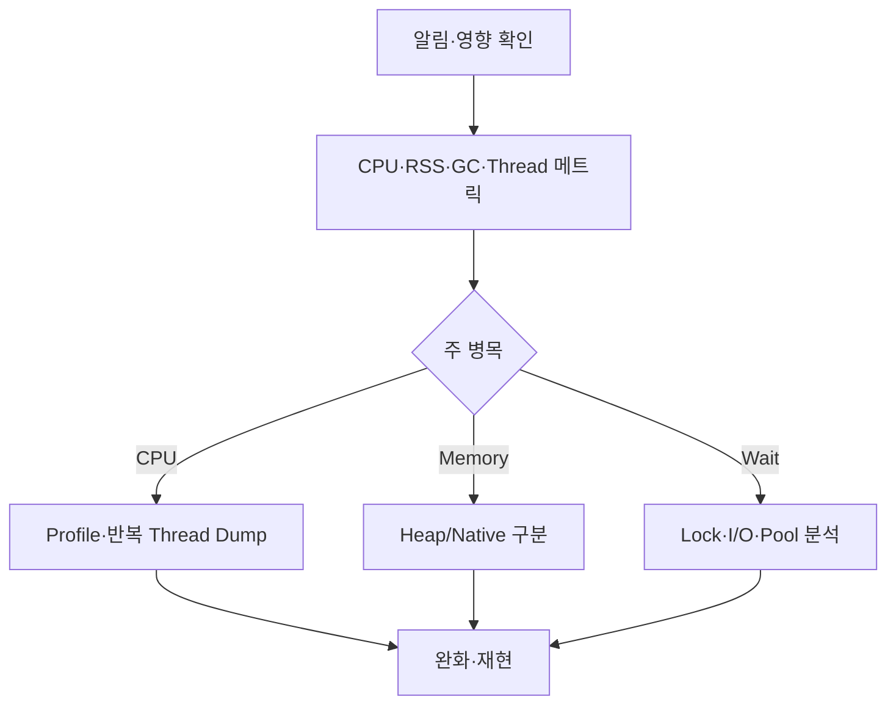

## 1. 복구와 증거를 함께 설계한다

장애 시각, 영향 인스턴스, 배포·트래픽 변화를 먼저 고정한다. 자동 재시작 전에 비용이 낮은 메트릭과 여러 번의 Thread Dump를 수집하고, 위험한 Heap Dump는 격리된 복제본에서 판단한다.



| 증상 | 주요 가설 | 증거 |
|---|---|---|
| 높은 CPU | Loop·직렬화·GC | Profile·GC Time |
| 높은 RSS | Heap·Direct·Thread | Heap committed·Native |
| 낮은 CPU·지연 | Lock·I/O·Pool | Thread State·Queue |
| 간헐 정지 | Safepoint·GC | Pause 로그·JFR |

```text
timeline = deploy + traffic + host metrics + JVM events + request traces
compare at least several samples before declaring a stuck thread
```

> **면접 전략** — “재시작한다”와 “Dump를 뜬다”의 양자택일이 아니다. 사용자 영향 완화와 재발 방지에 필요한 최소 증거를 병렬로 확보한다.

## 2. 컨테이너 한계를 포함한다

프로세스 메모리는 Heap 외 Metaspace, Code Cache, Direct Buffer, Native Library와 Thread Stack을 포함한다. JVM 설정뿐 아니라 컨테이너 Limit과 종료 사유를 확인한다.

> **면접 포인트** — 관측→가설→안전한 증거→완화→재현과 회귀 방지의 순서로 답한다.
