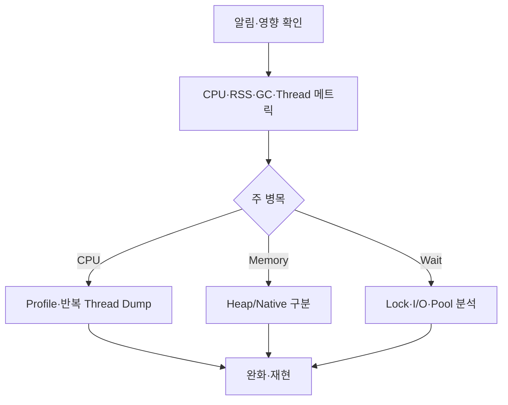

> **검수 경계** — 장애 대응 순서와 명령의 안전성은 JDK·컨테이너·권한·운영 도구에 따라 달라진다. CPU 100%, RSS, Dump와 Thread Dump 수치는 예시이며 사용자 영향과 증거 수집 비용을 함께 판단한다.

## 1. 복구와 증거를 함께 설계한다

장애 시각, 영향 인스턴스, 배포·트래픽 변화를 먼저 고정한다. 자동 재시작 전에 비용이 낮은 메트릭과 여러 번의 Thread Dump를 수집하고, 위험한 Heap Dump는 격리된 복제본에서 판단한다.


```mermaid
flowchart TD
    A[알림·영향 확인] --> M[CPU·RSS·GC·Thread 메트릭]
    M --> B{주 병목}
    B -->|CPU| P[Profile·반복 Thread Dump]
    B -->|Memory| H[Heap/Native 구분]
    B -->|Wait| W[Lock·I/O·Pool 분석]
    P --> R[완화·재현]
    H --> R
    W --> R
```

| 증상 | 주요 가설 | 증거 |
|---|---|---|
| 높은 CPU | Loop·직렬화·GC | Profile·GC Time |
| 높은 RSS | Heap·Direct·Thread | Heap committed·Native |
| 낮은 CPU·지연 | Lock·I/O·Pool | Thread State·Queue |
| 간헐 정지 | Safepoint·GC | Pause 로그·JFR |

```text
timeline = deploy + traffic + host metrics + JVM events + request traces
compare at least several samples before declaring a stuck thread
```

> **면접 전략** — “재시작한다”와 “Dump를 뜬다”의 양자택일이 아니다. 사용자 영향 완화와 재발 방지에 필요한 최소 증거를 병렬로 확보한다.

## 2. 컨테이너 한계를 포함한다

프로세스 메모리는 Heap 외 Metaspace, Code Cache, Direct Buffer, Native Library와 Thread Stack을 포함한다. JVM 설정뿐 아니라 컨테이너 Limit과 종료 사유를 확인한다.

> **면접 포인트** — 관측→가설→안전한 증거→완화→재현과 회귀 방지의 순서로 답한다.

## 검수 경계와 실패 흐름

- CPU 포화 때 profile·Thread Dump 자체가 추가 비용을 만들 수 있으므로 영향 인스턴스를 격리하고 짧은 샘플을 여러 시점에 확보한다. 단일 snapshot으로 stuck thread를 확정하지 않는다.
- Heap이 안정적이어도 Direct/Native, Metaspace, Code Cache, Thread Stack과 cgroup limit 때문에 OOMKilled가 날 수 있다. JVM·host·container 신호의 시간대를 맞춘다.
- 재시작은 사용자 영향 완화일 수 있지만 증거를 잃을 수 있다. 자동 재시작 전후에 가능한 최소 메트릭·로그·JFR/Thread Dump를 보존하고, 재발 방지용 재현 workload를 만든다.
- Dump·JFR에는 요청 정보와 개인정보가 포함될 수 있으므로 접근 권한·보존·암호화·폐기 정책을 적용한다.

## 공식·1차 출처

- [Java Troubleshooting Guide](https://docs.oracle.com/en/java/javase/25/troubleshoot/)
- [Oracle `jcmd` Reference](https://docs.oracle.com/en/java/javase/25/docs/specs/man/jcmd.html)
- [Java Flight Recorder Runtime Guide](https://docs.oracle.com/en/java/javase/25/develop/use-jfr-runtime.html)
- [Docker Runtime Resource Constraints](https://docs.docker.com/engine/containers/resource_constraints/)
