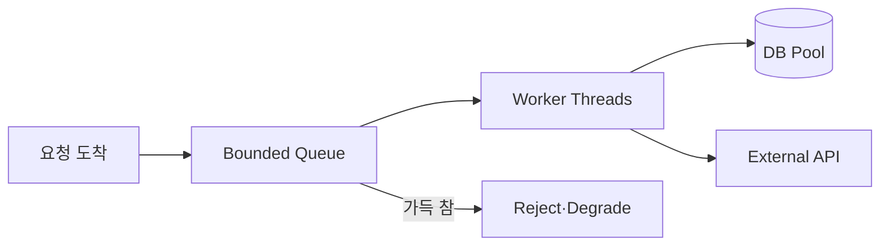

## 1. Thread 수가 처리율을 무한히 늘리지 않는다

CPU 작업은 Core보다 많은 Runnable Thread가 Context Switch를 늘린다. I/O 작업은 대기 중 다른 Thread가 진행할 수 있지만 DB 연결, 외부 API 동시성 등 더 작은 하위 한도를 넘으면 Queue만 이동한다.



| 변수 | 너무 작을 때 | 너무 클 때 |
|---|---|---|
| Thread | CPU·I/O 유휴 | 전환·메모리·하위 포화 |
| Queue | 짧은 Burst 거절 | 오래된 요청·OOM |
| Task Timeout | 조기 실패 | 자원 장기 점유 |
| Pool 분리 | 자원 비효율 | 장애 격리 실패 시 전파 |

```text
concurrency ≈ throughput × average_service_time
starting_threads ≈ cores × (1 + wait_time / compute_time)
```

> **설계 함정** — 공식은 시작점일 뿐이다. 꼬리 지연, Lock 경쟁, 하위 Pool과 컨테이너 CPU Quota를 실제 부하로 측정한다.

## 2. 포화를 명시적으로 드러낸다

활성 Thread, Queue 길이와 Age, 거절률, 작업 시간, 하위 호출 대기를 관측한다. 우선순위가 다른 작업은 Pool을 격리하고 이미 Deadline을 넘긴 작업은 실행 전에 폐기한다.

> **면접 포인트** — Thread 수 하나보다 Admission Control, Bounded Queue, Deadline과 실패 응답까지 포화 정책으로 설명한다.
