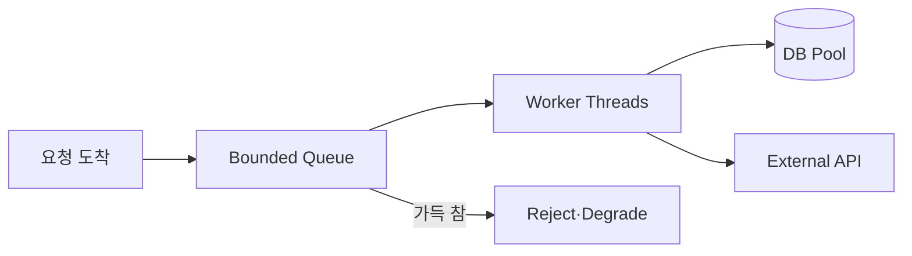

> **검수 경계** — Thread 수·Queue 상한·거부 정책은 CPU quota, I/O 분포, DB/외부 API 동시성, timeout과 queueing에 따른 가상 설계 입력이다. Little’s Law와 시작 공식은 실제 부하·p99·하위 시스템 한계로 검증한다.

## 1. Thread 수가 처리율을 무한히 늘리지 않는다

CPU 작업은 Core보다 많은 Runnable Thread가 Context Switch를 늘린다. I/O 작업은 대기 중 다른 Thread가 진행할 수 있지만 DB 연결, 외부 API 동시성 등 더 작은 하위 한도를 넘으면 Queue만 이동한다.


```mermaid
flowchart LR
    R[요청 도착] --> Q[Bounded Queue]
    Q --> T[Worker Threads]
    T --> D[(DB Pool)]
    T --> H[External API]
    Q -->|가득 참| X[Reject·Degrade]
```

| 변수 | 너무 작을 때 | 너무 클 때 |
|---|---|---|
| Thread | CPU·I/O 유휴 | 전환·메모리·하위 포화 |
| Queue | 짧은 Burst 거절 | 오래된 요청·OOM |
| Task Timeout | 조기 실패 | 자원 장기 점유 |
| Pool 분리 | 자원 비효율 | 장애 격리 실패 시 전파 |

```text
concurrency ≈ throughput × average_service_time
starting_threads ≈ cores × (1 + wait_time / compute_time)
```

> **설계 함정** — 공식은 시작점일 뿐이다. 꼬리 지연, Lock 경쟁, 하위 Pool과 컨테이너 CPU Quota를 실제 부하로 측정한다.

## 2. 포화를 명시적으로 드러낸다

활성 Thread, Queue 길이와 Age, 거절률, 작업 시간, 하위 호출 대기를 관측한다. 우선순위가 다른 작업은 Pool을 격리하고 이미 Deadline을 넘긴 작업은 실행 전에 폐기한다.

> **면접 포인트** — Thread 수 하나보다 Admission Control, Bounded Queue, Deadline과 실패 응답까지 포화 정책으로 설명한다.

## 검수 경계와 실패 흐름

- I/O 대기 때문에 Thread를 늘려도 DB connection pool·외부 API rate limit·CPU quota가 먼저 포화되면 queue만 커진다. active threads·queue age·downstream in-flight를 함께 관측한다.
- 무제한 Queue는 거절을 늦추고 메모리·대기시간을 키운다. bounded queue, deadline 전 폐기, 우선순위·격리 pool과 명시적인 overload 응답을 정한다.
- `CallerRuns`는 호출자 스레드를 막아 producer에 backpressure를 줄 수 있지만, 요청 thread pool을 함께 고갈시키거나 재진입·응답 timeout을 만들 수 있다. 동기 경계와 비동기 경계를 분리한다.
- timeout 후에도 하위 작업이 계속 실행되면 유령 부하가 누적된다. 취소 전파·idempotency·retry budget·graceful shutdown과 queue drain을 설계한다.

## 공식·1차 출처

- [Java `ThreadPoolExecutor` API](https://docs.oracle.com/en/java/javase/21/docs/api/java.base/java/util/concurrent/ThreadPoolExecutor.html)
- [Java `RejectedExecutionHandler` API](https://docs.oracle.com/en/java/javase/21/docs/api/java.base/java/util/concurrent/RejectedExecutionHandler.html)
- [Google SRE: Handling Overload](https://sre.google/sre-book/handling-overload/)
