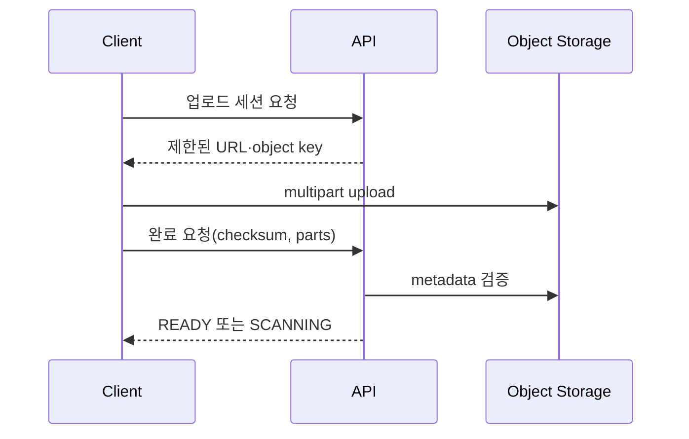

## 1. 제어 경로와 데이터 경로를 분리한다

API는 파일 메타데이터, 크기·형식 정책, 업로드 세션과 권한을 관리한다. 큰 Byte Stream은 가능하면 Client와 객체 저장소가 직접 주고받아 애플리케이션 Heap과 연결을 보호한다.



| 결정 | 장점 | 보호 장치 |
|---|---|---|
| 직접 업로드 | API 부하 감소 | 짧은 만료·Key 제한 |
| 서버 Proxy | 중앙 검증 단순 | Streaming·크기 상한 |
| Multipart | 재개·병렬화 | 미완료 Upload 청소 |
| Range 다운로드 | 재개·Seek | 권한·Cache Key |

```text
object_key = tenant_id + upload_session_id + random_suffix
accept completion only when size, part list, checksum, and owner match
```

> **보안 경계** — 파일명과 Content-Type을 신뢰하지 않는다. 저장 Key와 표시 이름을 분리하고 악성 코드 검사 전에는 비공개 상태로 둔다.

## 2. 흐름 제어와 수명주기

서버 경유 시 작은 Buffer와 Backpressure로 읽기·쓰기를 연결한다. 업로드 세션 만료, 고아 Part 정리, 검사 실패, 삭제 보존 정책과 감사 로그를 운영 기능으로 둔다.

> **면접 포인트** — 업로드 성공 응답보다 부분 실패, 중복 완료, 무결성, 권한 만료와 고아 데이터 비용까지 설명한다.
