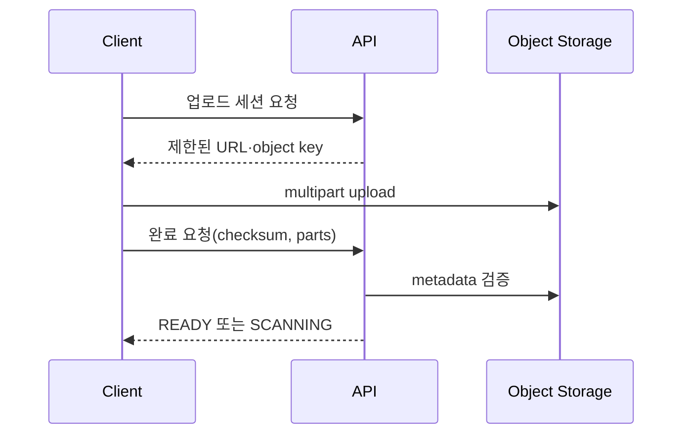

> **검수 경계** — 파일 크기·Part 크기·URL TTL·Range·checksum·보존기간은 객체 저장소와 클라이언트 계약에 따른 입력이다. Presigned URL·Multipart·Range의 실제 제약과 무결성 필드는 사용하는 저장소 버전 문서로 확인한다.

## 1. 제어 경로와 데이터 경로를 분리한다

API는 파일 메타데이터·크기·형식 정책·업로드 세션·권한을 관리한다. 큰 Byte Stream은 가능하면 Client와 객체 저장소가 직접 주고받아 애플리케이션 Heap과 연결을 보호하지만, URL 탈취·악성 콘텐츠·관측 공백을 별도로 보완한다.


```mermaid
sequenceDiagram
    participant C as Client
    participant A as API
    participant O as Object Storage
    C->>A: 업로드 세션 요청
    A-->>C: 제한된 URL·object key
    C->>O: multipart upload
    C->>A: 완료 요청(checksum, parts)
    A->>O: metadata 검증
    A-->>C: READY 또는 SCANNING
```

| 결정 | 장점 | 보호 장치 |
|---|---|---|
| 직접 업로드 | API 부하 감소 | 짧은 만료·Key 제한·완료 후 소유권 검증 |
| 서버 Proxy | 중앙 검증 단순 | Streaming·크기 상한 |
| Multipart | 재개·병렬화 | 미완료 Upload 청소 |
| Range 다운로드 | 재개·Seek | 권한·Cache Key |

```text
object_key = tenant_id + upload_session_id + random_suffix
accept completion only when size, part list, checksum, and owner match
```

> **보안 경계** — 파일명과 Content-Type을 신뢰하지 않는다. 저장 Key와 표시 이름을 분리하고 악성 코드 검사 전에는 비공개 상태로 둔다.

## 2. 흐름 제어와 수명주기

서버 경유 시 작은 Buffer와 Backpressure로 읽기·쓰기를 연결한다. 업로드 세션 만료, 고아 Part 정리, 검사 실패, 삭제 보존 정책과 감사 로그를 운영 기능으로 둔다.

> **면접 포인트** — 업로드 성공 응답보다 부분 실패, 중복 완료, 무결성, 권한 만료와 고아 데이터 비용까지 설명한다.

## 검수 경계와 실패 흐름

- Presigned URL은 권한을 위임하는 bearer credential이므로 짧은 TTL·method/content-length/content-type 제한·tenant별 object key·HTTPS·재사용 정책을 명시한다. URL을 가진 주체가 업로드할 수 있다는 경계를 숨기지 않는다.
- Multipart 중 일부 Part만 성공하거나 완료 응답이 유실될 수 있다. upload session·part 번호·checksum·owner를 원장에 기록하고, 완료 요청은 멱등하게 재검증하며 만료된 고아 upload를 청소한다.
- 객체 저장 성공 후 메타데이터 DB 기록이나 악성 코드 검사가 실패하면 READY로 노출하지 않는다. `UPLOADING → SCANNING → READY/REJECTED` 상태와 재처리·대사 작업을 둔다.
- Range 응답은 권한 검사 후 `Content-Range`·ETag/버전·부분 checksum을 검증하고, 삭제·버전 변경 중의 캐시와 재개 요청이 다른 객체를 섞지 않도록 object version을 고정한다.

## 공식·1차 출처

- [Amazon S3 Multipart Upload](https://docs.aws.amazon.com/AmazonS3/latest/userguide/mpuoverview.html)
- [Amazon S3 Presigned URLs](https://docs.aws.amazon.com/AmazonS3/latest/userguide/using-presigned-url.html)
- [RFC 9110 — Range Requests](https://www.rfc-editor.org/rfc/rfc9110#name-range-requests)
- [OWASP File Upload Cheat Sheet](https://cheatsheetseries.owasp.org/cheatsheets/File_Upload_Cheat_Sheet.html)
