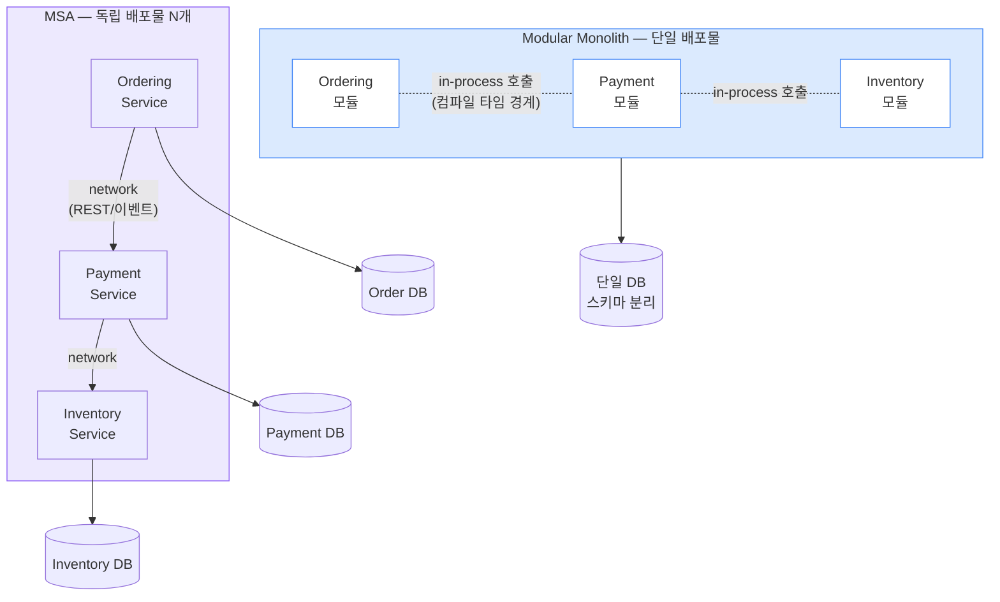
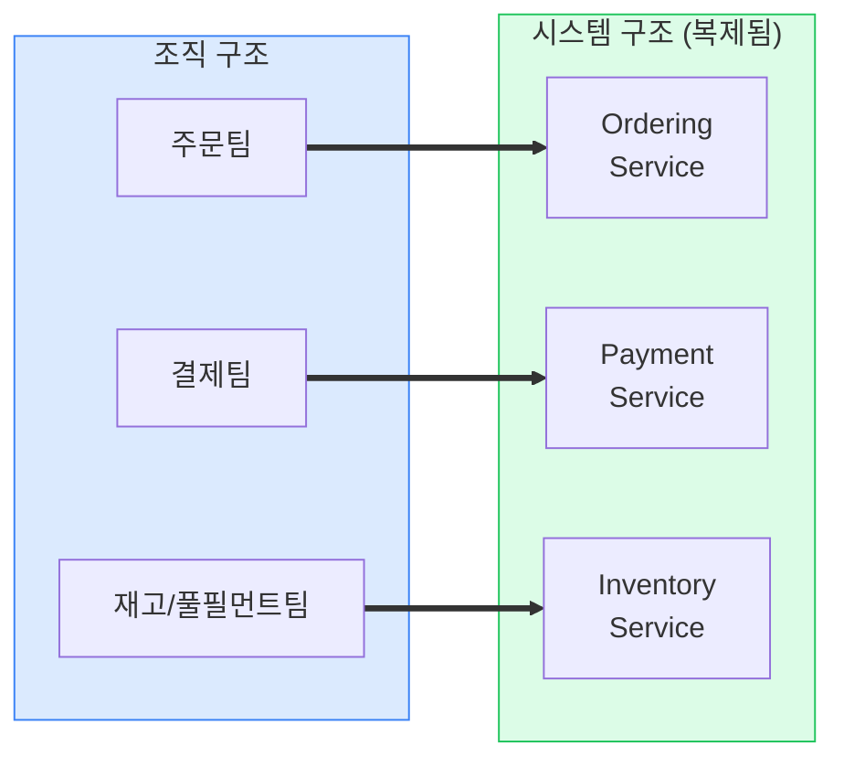
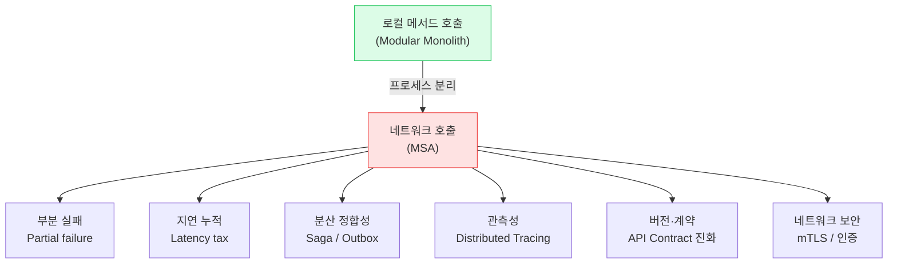
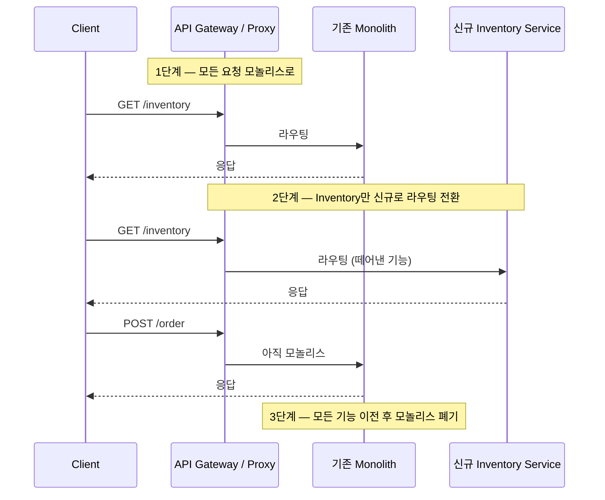

## 1. 두 아키텍처의 본질

**Monolith(모놀리스)**는 하나의 배포 단위 안에 모든 도메인이 들어있는 구조다. 그중 **Modular Monolith(모듈러 모놀리스)**는 내부를 모듈 경계로 엄격히 나눈, "잘 정돈된 단일 배포물"이다. **MSA(Microservices Architecture, 마이크로서비스 아키텍처)**는 도메인별로 *독립 배포·독립 DB·독립 프로세스*로 쪼갠 구조다.

*핵심 차이는 "모듈 경계"가 아니라 **배포 단위와 데이터 소유권**이다. Modular Monolith도 경계는 있다.*

> **💡 핵심 통찰**
>
> Modular Monolith와 MSA는 **모듈성(modularity)** 이라는 같은 목표를 공유한다. 차이는 모듈을 *프로세스 경계와 네트워크로 분리하느냐* 다. 좋은 MSA는 좋은 Modular Monolith에서 출발한다 — 경계가 엉망인 모놀리스를 쪼개면 `Distributed Monolith(분산 모놀리스)` 가 된다.

## 2. 정면 비교

| 관점 | Modular Monolith | MSA |
| --- | --- | --- |
| 초기 개발 속도 | **빠름** — 단일 코드베이스, 로컬 호출 | 느림 — 인프라·계약·관측성 선투자 |
| 배포 독립성 | 없음 (전체 재배포) | **있음** (서비스별 배포) |
| 데이터 정합성 | **쉬움** — 단일 DB 트랜잭션 | 어려움 — Saga/Outbox 등 분산 정합성 필요 |
| 장애 격리 | 부분적 (한 모듈 OOM → 전체 다운) | **좋음** (설계 시 — Bulkhead·Circuit Breaker) |
| 지연(Latency) | **낮음** — in-process 호출 ns 단위 | 높음 — 네트워크 hop마다 ms 누적 |
| 운영 복잡도 | 낮음 (1개 배포·1개 DB) | **높음** — 관측성·서비스 디스커버리·배포 N배 |
| 기술 스택 다양성 | 제한적 (단일 런타임) | **높음** (서비스별 언어/DB 선택) |
| 적합 팀 규모 | 소~중 (1~3팀) | 중~대 (Conway 정렬 다수 팀) |

> **🎯 면접 포인트**
>
> "MSA로 가시겠어요?"에 무조건 "네"는 감점. **"팀 규모·도메인 성숙도·운영 역량을 보고, 대부분은 Modular Monolith로 시작해 경계가 안정된 뒤 쪼갠다"** 가 시니어 답변. 정량 근거: MSA 전환 시 P99 지연이 네트워크 hop 누적으로 보통 2~5배 증가, 운영 인력은 관측성·SRE 포함 1.5~2배 필요. 🔥(Deep-dive)

## 3. Conway의 법칙 (Conway's Law)

**"시스템 구조는 그것을 만든 조직의 커뮤니케이션 구조를 복제한다."** 4개 팀이 만들면 자연히 4덩어리 시스템이 나온다. 따라서 *원하는 아키텍처를 먼저 정하고, 거기에 맞춰 팀을 정렬*하는 **Inverse Conway Maneuver(역 콘웨이 전략)**가 실무 전략이다.

*팀 경계 = 서비스 경계. Team Topologies의 **Stream-aligned team(스트림 정렬 팀)**이 한 Bounded Context를 소유하는 것이 이상적.*

> **⚠️ 실무 함정**
>
> 조직은 모놀리식 한 팀인데 시스템만 10개 서비스로 쪼개면 → 모든 변경이 팀 내 여러 서비스를 동시에 건드려 배포 독립성이 사라진다. **팀이 안 쪼개졌으면 서비스도 쪼개지 마라.**

## 4. 서비스 분리 기준

"기능이 크니까"가 아니라 다음 축으로 자른다.

| 분리 기준 | 설명 | 물류 예시 |
| --- | --- | --- |
| **비즈니스 capability** | 독립적 가치를 내는 능력 단위 | 주문수집 / 결제 / 재고할당 / 배차 / 운송추적 |
| **변경의 축** | 함께 변하는 것은 함께 둔다 (응집) | 쿠폰·프로모션 로직은 주문과 함께 자주 변경 |
| **데이터 소유권(SSOT)** | 한 데이터의 단일 진실 원천이 한 서비스 | 재고 수량은 Inventory만 쓴다 — 남이 직접 못 씀 |
| **팀 구조** | 한 팀이 한 서비스를 온전히 소유 | 라스트마일팀이 배송추적 서비스 전담 |
| **통신 빈도** | 채터링(Chattering) 많으면 경계 의심 | 주문↔재고가 초당 수십 번 호출 → 합칠 신호 |
| **확장 특성** | 부하 패턴이 다르면 분리해 독립 확장 | 운송추적(읽기 폭주) vs 정산(배치) |

> **💡 응집도·결합도 한 줄 판단**
>
> 한 변경 요청(Change request)이 **여러 서비스를 동시에** 수정해야 한다면 경계가 틀린 것. 이상적으로는 "주문 화면에 필드 추가" → 주문 서비스 하나만 배포하면 끝나야 한다.

## 5. 분산 시스템의 진짜 비용

MSA는 공짜가 아니다. 로컬 메서드 호출을 네트워크로 바꾸는 순간 다음이 전부 "내 문제"가 된다.

*"8 Fallacies of Distributed Computing"의 현대판 — 네트워크는 신뢰할 수 없고 공짜가 아니다.*

### 정량 근거 — 동기 HTTP 체인의 지연·가용성 붕괴

- **지연 누적**: 한 hop이 P99 20ms라면, 5개 서비스 직렬 체인은 P99가 단순 합이 아니라 꼬리 지연 곱셈으로 **100ms 이상**으로 악화.
- **가용성 곱셈**: 각 서비스 가용성 99.9%여도 5개 직렬 의존이면 0.999⁵ ≈ **99.5%** — 연 43시간 장애로 급락.
- → 대응: 동기 체인을 줄이고 `비동기 이벤트`·`Circuit Breaker(서킷 브레이커)`·`Bulkhead(격벽)`·`Timeout/Retry + Idempotency(멱등성)`로 격리.

> **🎯 면접 포인트 (단골)**
>
> "서비스 A가 다운되면 어떻게 되나요?" → **연쇄 장애(Cascading failure)** 시나리오를 그리고, Timeout·Circuit Breaker·Fallback·격벽으로 전파를 끊는 설계를 답해야 한다. "그냥 재시도하면 된다"는 오히려 **Retry storm(재시도 폭주)** 으로 장애를 키운다. 🔥(Deep-dive)

## 6. 최악의 결과 — Distributed Monolith

네트워크로 쪼갰는데 결합도는 그대로인 상태. 모놀리스의 단점(강결합)과 MSA의 단점(네트워크·운영 복잡도)을 *동시에* 가진다.

| 증상 | 왜 분산 모놀리스인가 |
| --- | --- |
| **DB 공유** | 여러 서비스가 같은 테이블을 직접 읽고 씀 → 스키마 변경이 전 서비스 동시 배포를 강제 |
| **동기 호출 체인** | A→B→C→D 직렬 호출 → 하나만 죽어도 전부 실패 |
| **강한 시간 결합** | B가 살아있어야 A가 응답 가능 (Temporal coupling) |
| **공유 라이브러리 강제** | 공통 도메인 모델 jar를 모두 의존 → 버전 올리면 동시 재배포 |
| **함께 배포** | "A를 배포하려면 B도 같이 배포"가 일상이면 이미 실패 |

> **⚠️ 실무 함정 — DB 공유**
>
> MSA 전환 1순위 안티패턴. "일단 서비스만 나누고 DB는 같이 쓰자"는 즉시 분산 모놀리스로 직행한다. **데이터 소유권 분리가 진짜 분리** 다. 남의 데이터는 API/이벤트로만 접근.

## 7. 마이그레이션 전략 — Strangler Fig

빅뱅 재작성은 거의 실패한다. **Strangler Fig Pattern(교살자 무화과 패턴)**으로 기존 모놀리스를 감싼 프록시 뒤에서 기능을 한 조각씩 새 서비스로 떼어낸다.

*Strangler Fig — 프록시 뒤에서 점진 전환. 롤백이 라우팅 스위치 한 번이라 리스크가 작다.*

### 전환 순서 — 무엇부터 떼는가

1. **경계가 가장 뚜렷하고 결합이 약한 모듈**부터 (예: 알림, 검색, 정산 배치).
2. **독립 확장 요구가 큰 모듈** (운송추적 읽기 폭주 등).
3. 데이터 분리: 먼저 읽기 복제 → 이중 쓰기(Dual-write) 회피 위해 `Outbox(아웃박스)` 도입 → SSOT 이전 → 옛 컬럼 제거. 🔥(Deep-dive)
4. 핵심 트랜잭션(주문-결제-재고)은 **가장 마지막**에 — 분산 정합성 비용이 가장 크다.

> **💡 Trade-off 정리**
>
> "지금 쪼개야 하나?"의 판단: ① 팀이 서로 배포를 막고 있다 ② 모듈별 확장 특성이 명확히 다르다 ③ 경계가 코드에서 이미 안정적이다 — 셋 다 ✓면 분리. 하나라도 모호하면 **Modular Monolith로 더 버티는 게 정답** . 조기 MSA는 재앙이다.

## 8. 실제 사례

| 회사 | 선택 | 맥락 |
| --- | --- | --- |
| **우아한형제들(배민)** | 모놀리스 → MSA 점진 전환 | 주문 폭증으로 결제·주문·정산 분리. 이벤트 기반 + Outbox로 정합성 확보, 가게/메뉴/주문 도메인 단위로 분해 |
| **토스** | 도메인별 MSA | 금융 규제·장애 격리가 중요 → 송금/결제/인증 강하게 분리, 각 서비스 독립 SLA |
| **쿠팡** | 대규모 MSA | 주문·풀필먼트·물류(WMS/TMS) 도메인 다수 팀 → Conway 정렬된 서비스망 |
| **Amazon** | Two-Pizza Team + 서비스 | 팀 크기를 먼저 제한해 서비스 경계 유도 (Inverse Conway) |
| **Shopify / Stripe** | 의도적 Modular Monolith 유지 | 핵심 도메인은 모놀리스로 두되 모듈 경계를 엄격히 강제 (조기 분리 거부) |

> **🎯 면접 포인트**
>
> "쿠팡/배민은 MSA니까 우리도"는 함정. 그 회사들은 **수십~수백 팀** 규모에서 운영 역량(관측성·플랫폼팀·SRE)을 갖췄기에 가능. Shopify가 대규모인데도 모놀리스를 유지하는 이유를 설명할 수 있으면 시니어 신호다.
